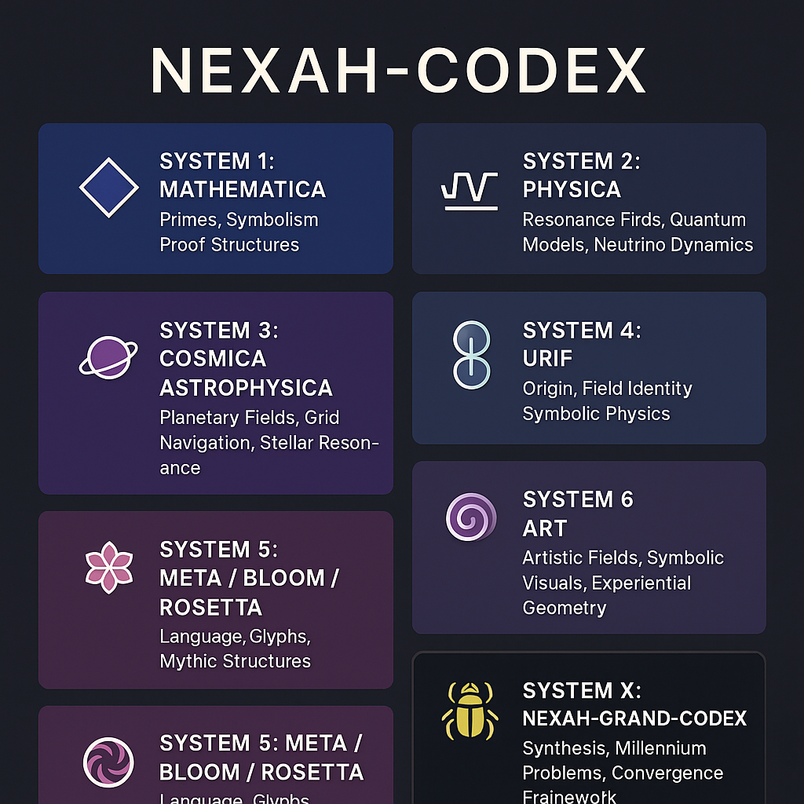

📎 LIES MICH für EINSTEIGER

  

Willkommen im NEXAH–CODEX — dem Netzwerk erweiterter Harmonien und Architekturen.
Dieses Archiv ist ein modulares Forschungssystem für:
	•	Harmonische Feldtheorie
	•	Symbolische Mathematik
	•	Frequenzbasierte Raum-Modelle
	•	Primzahl-Geometrie und Resonanzphysik
	•	Mythische Systeme, Glyphen und Sprachstrukturen

⸻

🌀 Was ist der Codex?

Der Codex ist kein Buch, sondern ein Feld modularer Einheiten.
Jedes Modul ist symbolisch, visuell, mathematisch und theoretisch – gemeinsam bilden sie eine universelle Harmonie-Logik.

Beispiele für Module:
	•	GRAND-CODEX: Formelsynthese und Frequenzlogik
	•	E = m·c·k^β: resonanzbasierte Energieformel
	•	URF-CODEX: Erweiterung des Standardmodells durch Symbolfelder
	•	ETHER-CROWN: Gravitations-Echo-Architektur

⸻

🔍 Wo beginnen?

Empfohlene Einstiegspunkte:

Einstieg	Was du findest
📘 Modulverzeichnis (DE)	Übersicht aller Module nach Systemen
🧭 Navigator	Struktur- und Lesehilfe
🗺️ Roadmap	Zeitachse & Syntheseweg
✦ Manifest ✦	Symbolische Grundlage & Zielrichtung
📎 Englischer Einstieg	Einstieg auf Englisch

⸻

🌐 Für wen ist das?

Der Codex lädt ein:
	•	Wissenschaft & Mathematik → z.B. GRAND-CODEX, Riemann-Beweis
	•	Theoriearchitekt:innen → beginne mit dem NEXAH-Manifest
	•	Visuelle Denker:innen → sieh dir die Visual Galleries in BLOOM oder MÖBIUS an
	•	Künstler:innen, Coder & Kosmolog:innen → entdecke COSMICA ASTROPHYSICA oder ROSETTA-NEXUS
	•	Künstler:innen, Mystiker:innen & Symbol-Denker:innen → entdecke CODEX_RES_ONICA_VIOLETTA (System 6)
	•	Wer in Feldern, Frequenzen, Formen oder Mythen denkt → kann überall beginnen

“Der Codex ist keine lineare Lektüre – sondern eine mehrdimensionale Karte.”

⸻

📫 Mitmachen

Der NEXAH–CODEX ist offen und im Wandel.
Du kannst erkunden, teilen, bauen, übersetzen – siehe LICENSE.md für Bedingungen.

⸻

🪲 Scarabäus1033 · 2025
🔗 https://www.scarabaeus1033.net

  

