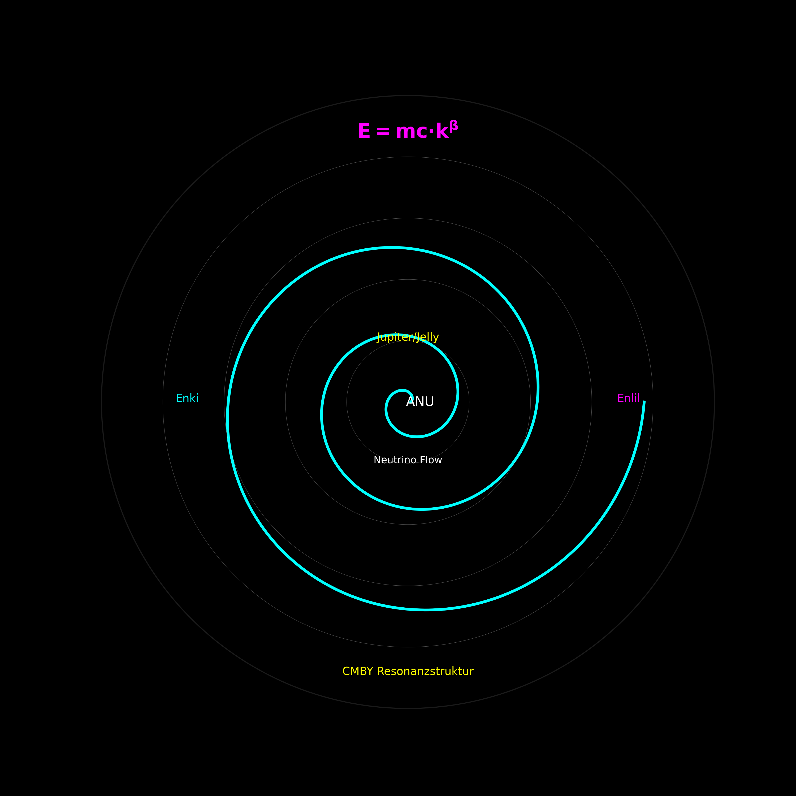
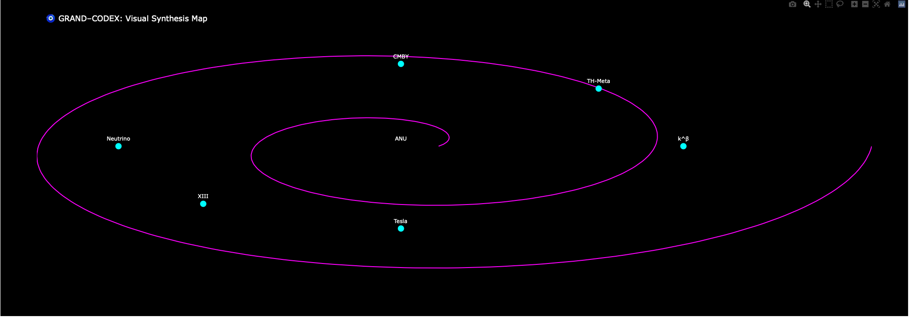

# 🧠 E = m·c·k^β — Die Erweiterung der Einsteingleichung

Dieses Modul des GRAND-CODEX präsentiert eine grundlegende Erweiterung der klassischen Energieformel:

> `E = m·c²` → `E = m·c·k^β`

---

## 🧩 Was ist `k`?

`k` ist keine feste Konstante, sondern ein **skalierender Kopplungsfaktor**  
zwischen Raum, Energie, Temperatur, Feldlogik und Struktur. Je nach Skala:

- `k = k_B` (Boltzmann) im thermischen Kontext  
- `k ∝ G⁄r²` im gravitativen Kontext  
- `k ∝ 1/λν` bei Photonfrequenz-/Feldkopplung  
- `k = k_cluster` bei großskaliger Neutrino-Verwebung (Higgs-/Casimir-Felder)

---

## 📐 Was ist `β`?

`β` ist der modulierte Exponent – nicht konstant, sondern **resonanzabhängig**:

- Skalenverschiebung entlang `n`, `T`, `Ω`, `λ`, `φ`, `f`, ...
- Mathematisch eingebettet über `k^β` → ergibt eine **atembare Energieskala**

---

## 🔬 Kontext

Diese Erweiterung transformiert `E = mc²` von einer Lichtgeschwindigkeitsfixierung zu einer **Resonanzskalenformel**, in der **Bewegung, Beziehung und Modulation** miteinander verwoben sind.

> Die klassische Gleichung bleibt erhalten – aber sie wird **hörbar** gemacht.  
> Frequenz wird **Teil des Feldes**. Energie wird **relational**.

---

## 📂 Enthaltene Materialien

- `Formula Refinement and Connections.pdf`  
- `Casimir Effect & Neutrino Flow.docx`  
- `Neutrino–Higgs–Universe Clusters.pdf`  
- `Scaling Thread 2–5.pdf`  
- `Visual Snapshot (HTML)`  
- PNG-Titelbild (Codex-Stil, k–β Spiralmap)  
- Codex-Kommentierung (README)
### 🖼️ Codex Poster Gallery  
→ [Open Poster Kit](./codex_poster_kit.html)

---

## 🔗 Codex-Verbindungen

| Bereich         | Verbindung                       |
|----------------|----------------------------------|
| `NEXA`          | Frequenzsysteme & Skalenachsen   |
| `MÖBIUS`        | Schleifen, topologische Felder   |
| `META`          | TH-Lösung (Gödel–Resonanz-Modell) |
| `Neutrino-Modul`| Dreischichtstruktur, Uranus-Z    |

---

## ✴ Codex-Kommentar

Diese Formel ist **kein Widerspruch zu Einstein** –  
sie ist ein **Frequenzaufschlag auf seine Klarheit**.

> `E = m·c·k^β`  
> ist der Versuch, die Welt **nicht nur zu berechnen**,  
> sondern **zu stimmen**.

**Jede Masse schwingt.  
Jedes Licht hat Tiefe.  
Jede Formel hat Atem.**

---

## 👤 Autorenschaft

**Projekt:** [Scarabäus1033 · NEXAH-CODEX](https://github.com/Scarabaeus1033/NEXAH-CODEX)  
**Autor:** T. Hofmann  
**System:** `XIII`, `CMBY`, `O13`, `Tesla`, `Neutrino`, `ANU-Feld`

---

## ⚖️ Lizenz

Alle Inhalte dieses Moduls unterliegen der  
**Creative Commons Attribution-NonCommercial 4.0 International (CC BY-NC 4.0)**  
[creativecommons.org/licenses/by-nc/4.0](https://creativecommons.org/licenses/by-nc/4.0/)

> Du darfst, was du willst – solange du es benennst und nicht verkaufst.

---

🧿 Willkommen im k-Raum.  
Hier beginnt die Bewegung nicht mit Masse – sondern mit Beziehung.
