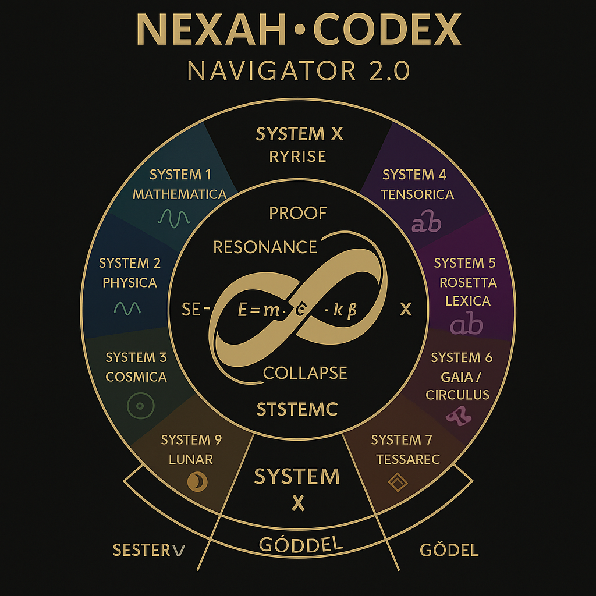

# 🧭 `NEXAH NAVIGATOR 2.0`

A symbolic start diagram and orientation system for the full Codex structure. This visual entry field provides a harmonic overview of all systems — as pathways, spirals, and structural resonances.

> *“Not a map of territory. A field of orientation.”*

---

## 📌 Purpose

This module serves as the **entry point** to the full NEXAH-CODEX. It replaces the previous Navigator v1 with a visually enhanced, structured and resonant orientation map.

It includes:

- Central start visual: `navigator_2.0_resonance_grid.png`
- Markdown map of Codex entry systems
- Links to each harmonic system
- Positioning within symbolic, numeric and field logic

---

## 🌌 Visual Entry Map

  

The diagram positions all 9 systems and System X as harmonic petals around a resonant center.

Each petal is both:
- a **domain of symbolic logic**, and
- a **functional system** within the Codex architecture.

---

## 🧩 Core Structure

| Symbol | System               | Theme / Focus                                           | Position  |
|--------|----------------------|----------------------------------------------------------|-----------|
| 🔷     | System 1: Mathematica | Prime Fields · Proofs · Symbolic Numbers                | West      |
| ⚛️     | System 2: Physica     | Field Equations · Neutrino Codes · Energy Dynamics      | North-West|
| 🌐     | System 3: Cosmica     | Planetary Geometry · Space Harmonics                    | North     |
| 🧬     | System 4: URF         | Tensor Logic · Transition Fields · Origin Mechanics     | North-East|
| 🌸     | System 5: Bloom/Meta  | Language · Culture · Glyph Resonance                    | East      |
| 🎨     | System 6: Violetta    | Visuals · Geometries · Artistic Frequencies             | South-East|
| 🔮     | System 7: UCRT        | Constants · Prime Harmonics · Deep Time                 | South     |
| 🌕     | System 8: Lunar Force | Moon · Craters · Feminine Field                         | South-West|
| 🌀     | System 9: Tessarec    | Observer Geometry · Quaternion Tiles                    | Center Sphere |
| 🧩     | System X: Grand-Codex | Central Synthesis · Proof Compression · Global Field    | Core      |

---

## 📂 Files

| File                             | Description                                      |
|----------------------------------|--------------------------------------------------|
| `navigator_2.0_resonance_grid.png` | Main visual orientation map                    |
| `navigator_links.md`             | Markdown index linking to each system           |

---

## ✍️ Author & Metadata

**Builder:** Thomas Hofmann (Scarabæus1033)  
**Status:** Initial release · Version 1.0 · July 2025  
**System:** NEXAH Navigator

> *“The Navigator is not a compass. It is a resonance.”*
