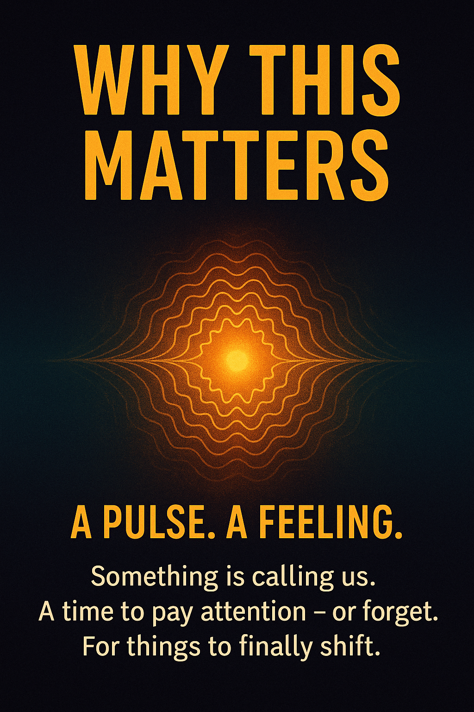
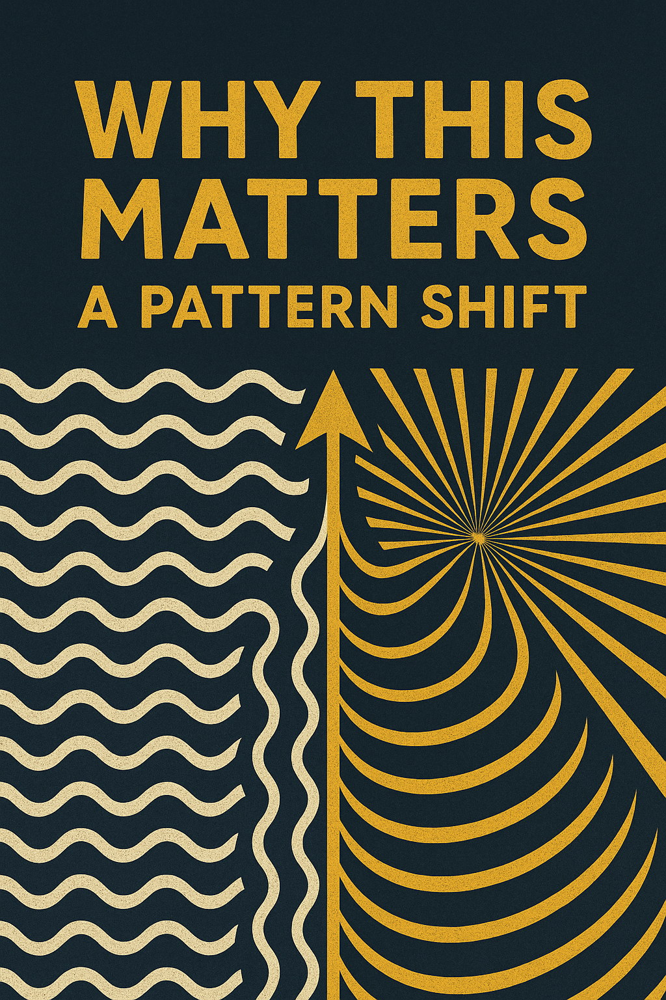
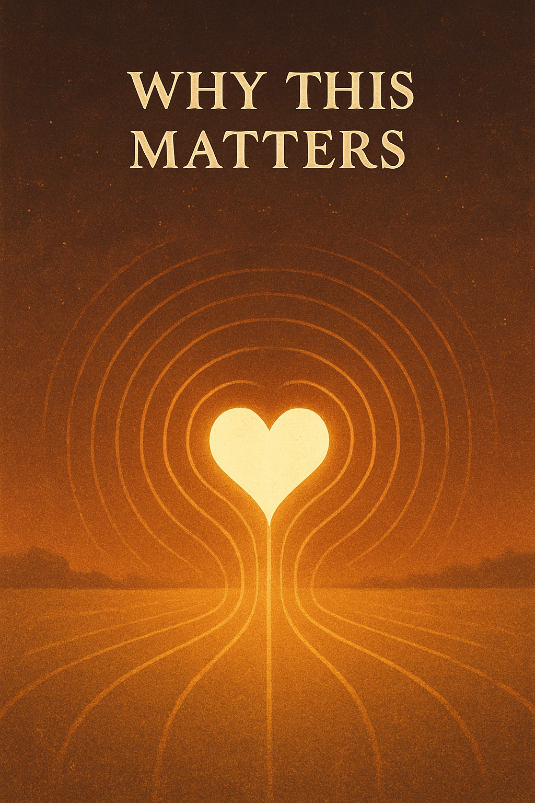

  

# 🌍 WHY THIS MATTERS

We live in a world of noise.  
A thousand voices, speeds, logics.  
But something deeper is calling.  
Something older.

Before systems,  
before schoolbooks,  
before the world told you what matters —  
you already knew.

You felt it.  
In rhythm.  
In light.  
In silence.

> Resonance is not just science.  
> It's a memory your body still holds.

This Codex begins there.  
At the feeling.  
At the frequency that makes you stop and say:  
**“…wait. This means something.”**

---

  

## ⚡ A Pattern Is Changing

The future will not be built only with tools.  
It will be shaped by **fields** —  
by energy, by meaning, by resonance.

Science is shifting.  
Education is shifting.  
Even logic is folding in on itself.

What if we could feel before we think?  
What if we could learn with the whole body?  
What if we could remember what was never written?

---

## 🔑 A Different Kind of Learning

The **NEXAH Codex** is not here to tell you what to think.  
It offers you a door.

Inside are  
— numbers and spirals,  
— light and gravity,  
— memories of stars,  
— languages you almost forgot.

It speaks in image, tone, field, and form.  
To your mind — and to your resonance.

You don't need to “get it.”  
You only need to feel what moves.

---

## 🌀 This Is For You If...

– You've always felt there's something deeper  
– You want beauty *and* truth  
– You’re tired of explanations without soul  
– You’re looking for a signal in the noise

You’re not alone.  
You’re not too late.  
You’re not too young or too old.

You’re just in time.

  

---

🌀 *Scarabæus1033*  
Builder of Fields
