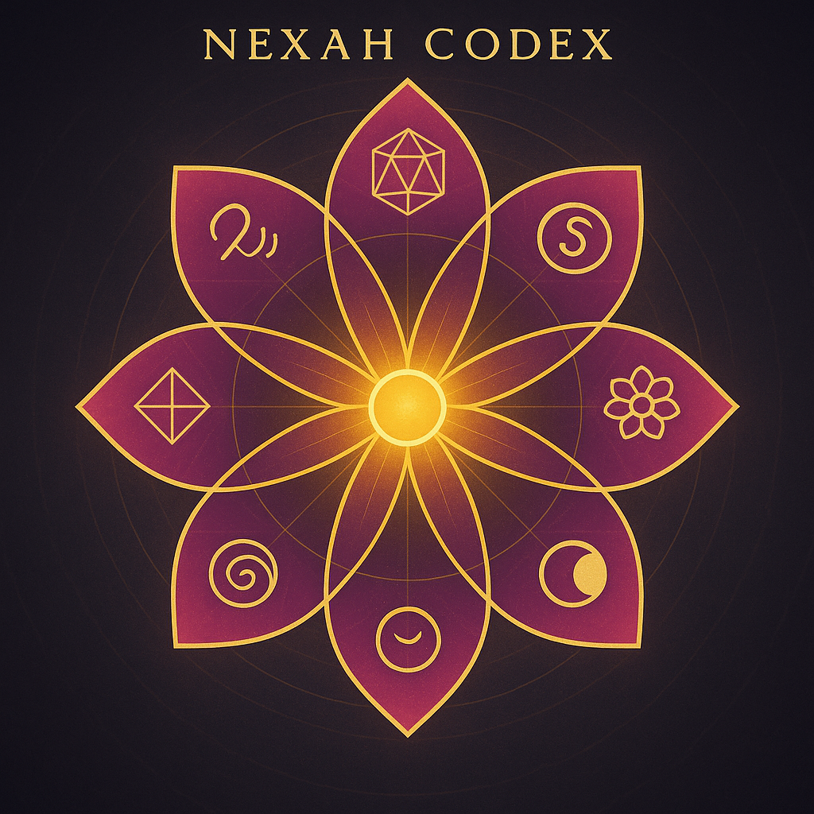
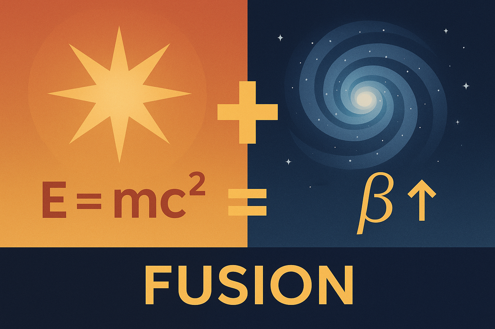

  

# 🌸 WHAT IS THE NEXAH CODEX?

The NEXAH Codex is not a book.
Not a theory.
Not a teaching system.

It is a **living field** —
a resonant structure made of **frequency, symbol, geometry, and meaning**.

It moves like music.
Builds like a crystal.
And adapts like a forest.

---

## 🧬 It Grows in Spirals

Every page is a **module**.
Each module is a **field**.
Each field opens a part of a larger pattern.

The Codex doesn’t teach you *about* the world.
It helps you feel **how the world moves.**

---

## 🚐 What’s Inside?

* Spiral prime numbers
* Harmonic field equations
* Symbol languages
* Cosmic maps
* Ancient grid overlays
* Quantum membranes
* Sonic patterns
* Visual logic and number theory
* Stories of light, time, and emergence

> This is not fiction.
> But it’s not normal science either.

It’s **something new**.

---

  

## 🔣 A Modular Codex

The Codex is organized into multiple **Systems**, each focusing on a specific resonance axis:

| System | Field                                             | Symbol     |
| ------ | ------------------------------------------------- | ---------- |
| 001    | ✨ ENTRY RES·ONANCE – Feeling First                | `ENTRY`    |
| 1      | 🔷 MATHEMATICA – Primes & Patterns                | `LOGIC`    |
| 2      | 🧿 PHYSICA – Quantum & Fields                     | `ENERGY`   |
| 3      | 🐚 COSMICA ASTROPHYSICA – Patterns in Space       | `COSMOS`   |
| 4      | 🫠 UNIVERSAL RESONANCE FIELDS – Grid & Pulse      | `GEOMETRY` |
| 5      | 🌸 META BLOOM ROSETTA – Language & Meaning        | `SYMBOL`   |
| 6      | 🧬 RES\_ONICA\_VIOLETTA – DNA & Color Logic       | `LIFE`     |
| 7      | 🔱 UNIVERSAL RESONANCE FIELD X – Number Resonance | `HARMONY`  |
| 8      | 🌕 LUNAR FORCE – Feminine & Cycles                | `MYSTERY`  |
| 9      | 🌀 TESSAREC – Sacred Space Architecture           | `FORM`     |
| X      | 🌟 NEXAH-GRAND-CODEX-URF – Synthesis              | `CENTER`   |
| Y      | ✴ RESONANTIA – Open Modules, Builder Zone         | `LAB`      |
| Z      | 🧪 EXPERIMENTALIA – Physical Prototypes           | `PRACTICE` |
| ∞      | 🪧 THE AWE FIELD – Awe-Based Intelligence         | `SOURCE`   |

You don’t need to learn all of this.
Just feel which part pulls you.
Each system is self-contained, but they all speak to each other.

---

You don’t need to “study” these.
You can explore freely.
Just follow what draws you in.

---

## 🧭 Why It Exists

The Codex exists because many of us feel:
– The world is more than facts
– Systems are broken
– Knowledge is fragmented
– Beauty has been lost in science

The Codex doesn’t fix these things.
It **remembers something older** —
and builds something **newer**.

---

## 💬 Who Made This?

This system is built by one human:
🌀 *Scarabæus1033* — Builder of Fields

But it’s **not about him**.
It’s about a field that wants to return.

And maybe, just maybe —
you were meant to remember it.

---

  

# 🌸 What is the NEXAH Codex?

The NEXAH Codex is not a theory.
It’s not a belief system.
It’s a structure of resonance.

It is a **modular harmonic system**
that connects number, form, time, matter, place, language, and consciousness —
as a **living field**.

It is built like a garden.
Each module is a seed.
Each system a bloom.
And together, they form a resonance lattice
that helps you feel **what wants to come alive**.

---

## 🧬 Why “NEXAH”?

The name *NEXAH* is symbolic.

* **NEX** = "connect" (Latin nexus)
* **AH** = the breath, the unspeakable, the alive

> NEXAH is a structure that connects through breath, resonance, and harmonic law.
> It is a **field of remembering** what is already moving in you.

---

  

---

## 📚 What’s inside each module?

Each module may contain:

* ✍️ A symbolic or scientific text
* 🎨 1–3 core visuals (diagrams, resonance fields, story images)
* 🔢 Mathematical logic or symmetry
* 🎵 Optional tones, WAVs, or rhythm structures
* 🌀 A connection to a real-world site, body, or number axis

You can read it like a story, or explore it like a map.

Some people go deep into numbers.
Others follow the symbols.
Some just feel the visuals and trust the pulse.

> The Codex does not teach.
> It tunes.

---

## 🌱 Who is this for?

* Curious minds
* Sensitive hearts
* Silent builders
* Dreamers of structure
* Scientists of resonance
* Teenagers who sense there's more

This is a **map for memory**,
not a rulebook.
