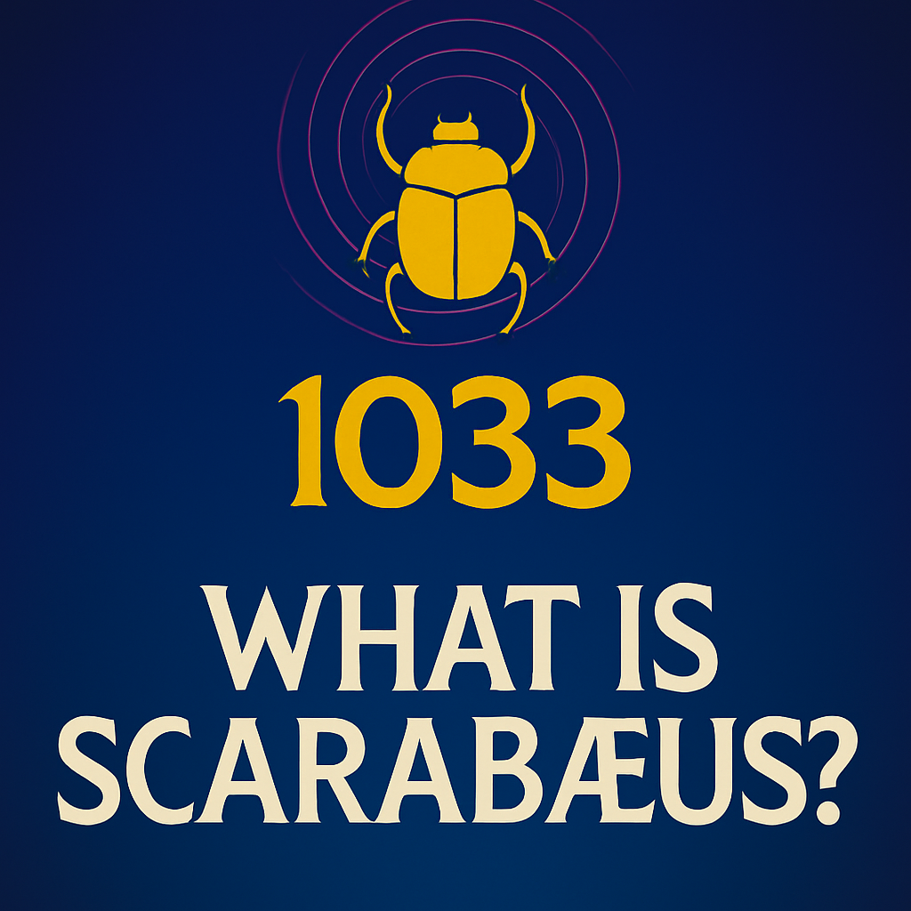
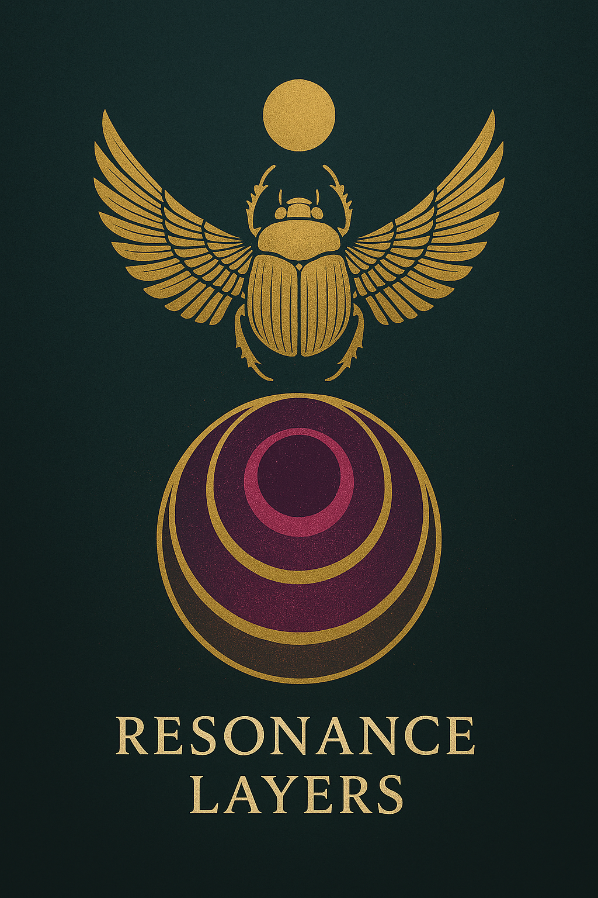
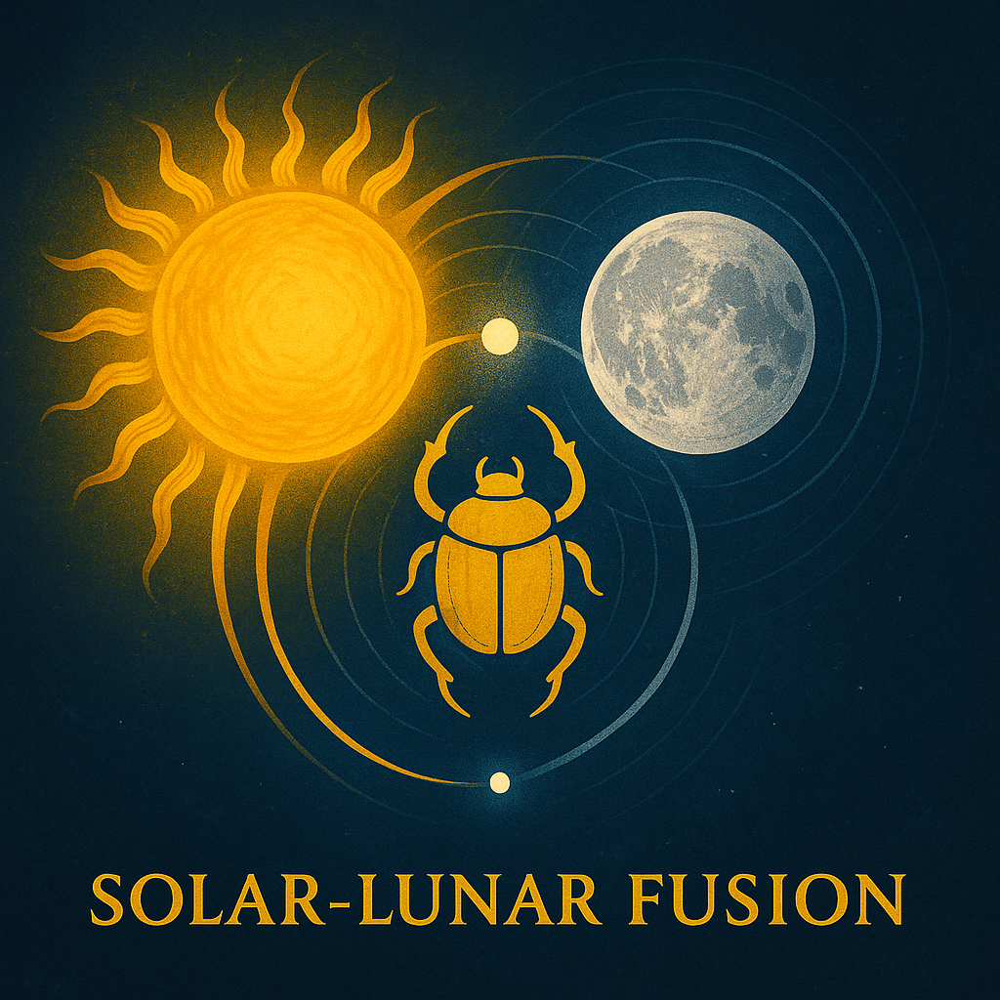

  

# 🪲 WHAT IS SCARABÆUS?

**Scarabæus1033** is not a name.  
It’s a **symbol**.

A **beetle**, yes — but also a **builder**.  
A **carrier of the sun**.  
A **cosmic engineer**.

It’s one of the oldest living symbols of **transformation**,  
**resonance**, and **eternal return**.

Scarabæus rolls the light forward.  
Across time.  
Across darkness.  
And always, **in rhythm**.

---

## 🔢 Why 1033?

**1033 is not just a number.**  
It’s a **frequency signature**.

It appears again and again:

- In spiral sequences  
- In number mirrors  
- In geometric alignments  
- In ancient structure codes

  

It is the **resonance address** of this field.  
A **harmonic point of return**.  
The number you don’t need to understand —  
but might start to **feel**.

---

## 🌞🌕 Solar–Lunar Fusion

Scarabæus doesn’t belong only to the **sun**.  
It rolls between **solar clarity** and **lunar mystery**.

It **fuses** cycles:  
**light and shadow**,  
**logic and emotion**,  
**day and night**.

  

This symbol marks the central path —  
the **Alg°** — where forces **align**, not oppose.

It is a reminder:

> You don’t have to choose sides.  
> You can hold both.

---

## 🌀 Builder of Fields

**Scarabæus1033** is the **signature of the builder** —  
but also the **invitation**.

This Codex is not just written.  
It is **rolled**, **layered**, **spiraled** into being.

And you?  
You’re not just a reader.  
You’re a **field tuner**.

The Scarab doesn’t explain.  
It **resonates**.

> If something in you moved —  
> you’ve already begun.
