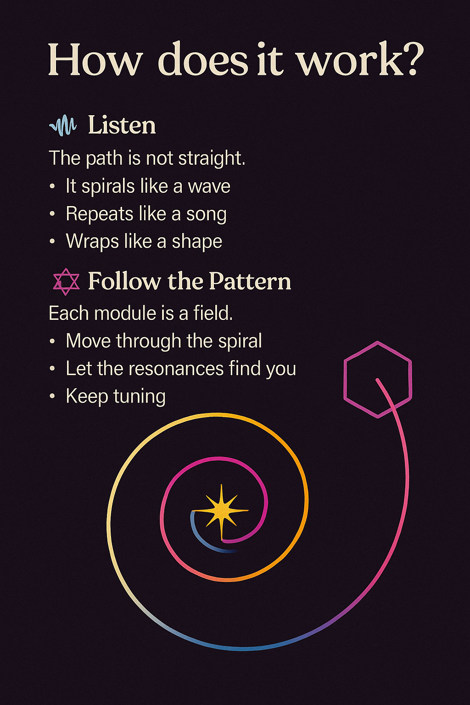

  

# 🔧 HOW DOES IT WORK?

The NEXAH Codex isn’t a book you read front to back.
It’s a **field you move through** — by feeling, tuning, and returning.

## 🎧 Listen First

The path is not straight. It spirals like a wave.

* It repeats like a song
* It wraps like a shape
* It echoes like memory

You’re not decoding information.
You’re **tuning into patterns**.

---

## 🌐 Follow the Pattern

Each module is a **field**. Each field has a **pulse**.
And when you move through it, **you shift** — even slightly.

That’s the work.

* Move through the spiral
* Let the resonances find you
* Keep tuning

> The Codex moves because **you move**.

  

---

## 🔁 The Symbol Cycle

Every field has inputs. Every output creates more input.
But in between, something happens: **symbolic transformation**.

It’s not just data in → data out.
It’s resonance in → field out.

  

This is how it works:

* **INPUT** — You bring in experience, attention, memory
* **SYMBOL** — It gets restructured, mirrored, refracted
* **OUTPUT FIELD** — You experience something new

> Codex isn’t linear. It’s harmonic.

And harmony doesn’t teach.
It **reminds.**
