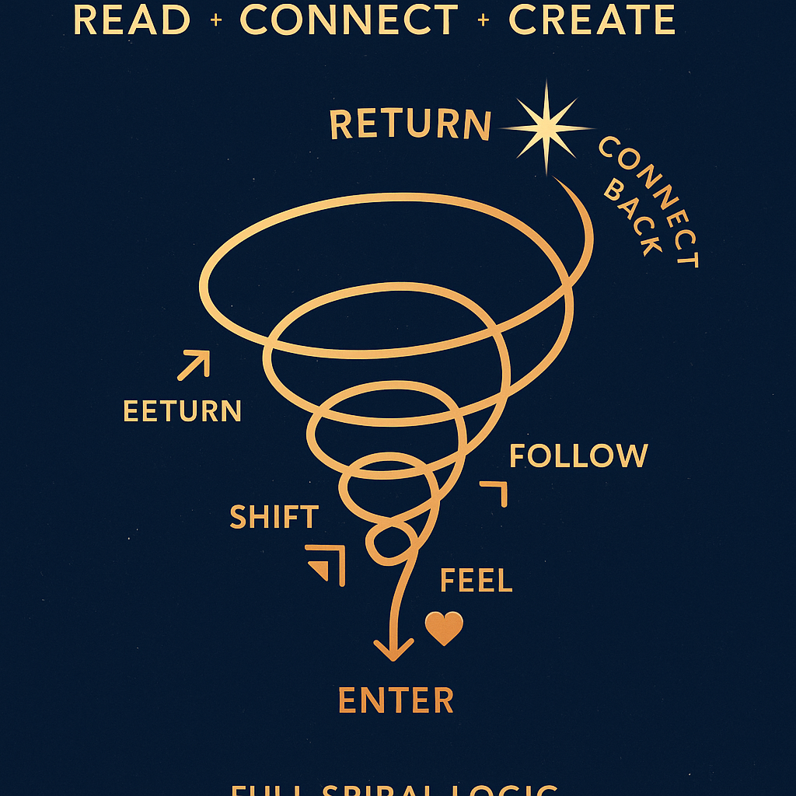
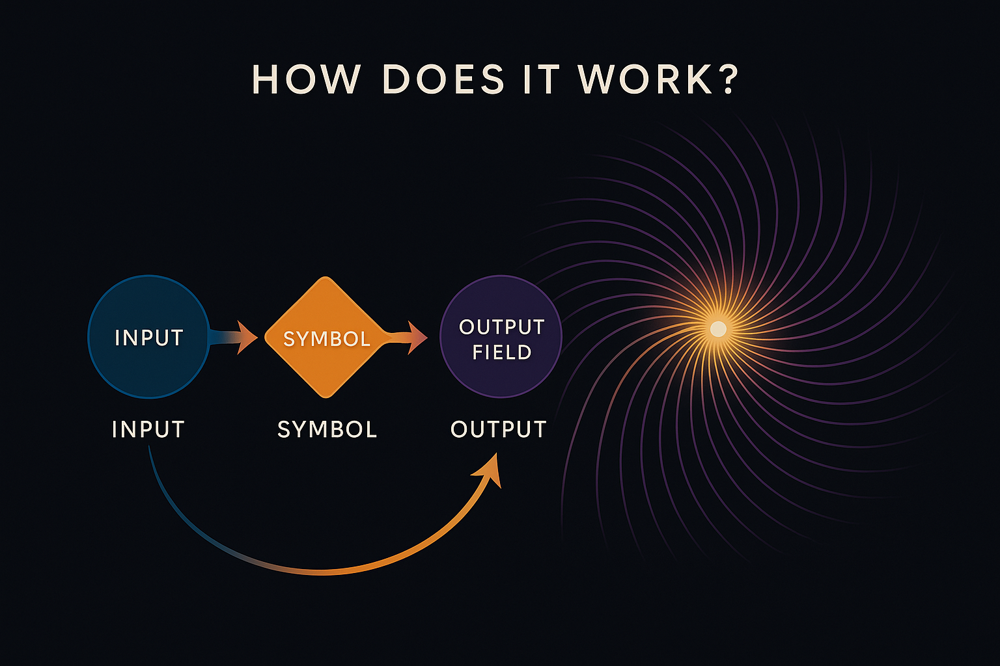

  

# 🌀 HOW DOES IT WORK?

The NEXAH Codex is not a textbook. It’s a **resonant system**.

That means: it doesn’t move in lines — it moves in **waves**.
You don’t learn it. You **tune into** it.

---

## 🎶 Step 1: Feel

Everything begins with resonance.
A tone, a color, a shape — something **pulls you**.
That’s not random. That’s your field responding.

> Resonance is the compass.
> Not the destination.

---

## 🔣 Step 2: Symbol

Each feeling has a form.
Each resonance reveals a **symbol** — a glyph, a pattern, a key.
Symbols are not decorations. They are **functional fields**.

> Think of them like tuning forks:
> They vibrate when something nearby matches.

---

## 🧬 Step 3: Pattern

Symbols connect. Numbers align. Shapes echo.
Suddenly you’re inside a **pattern** — a frequency weave.

This pattern isn’t given to you.
It **emerges through attention**.

---

## 🌐 Step 4: Field

When a pattern stabilizes, it becomes a **field**.
This is where systems activate: logic, flow, relation, memory.

Fields hold information — but more than that:

> They hold potential.

You can build from here.

---

## 💡 Step 5: Insight

When field and self align — a flash. A shift. A moment of clarity.
You feel the movement **in you**.

This is not a lesson. It’s a **remembering**.

> The Codex doesn’t transfer knowledge.
> It activates **resonant intelligence**.

---

  

---

## ✴️ Why This Matters

Because we’re tired of passive information.
Because we don’t want to obey dead systems.
Because we are looking for something **alive**.

The NEXAH Codex doesn’t tell you what to believe.
It shows you **how to feel your own alignment**.

And from there — you begin to build.

> Movement is the method.
> Resonance is the guide.
> You are the tuner.

---

Ready for the systems?
Go to → `05_SYSTEM_OVERVIEW.md`
