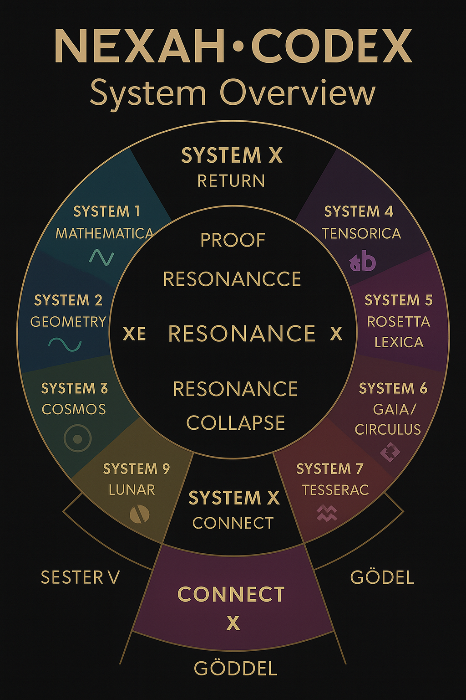
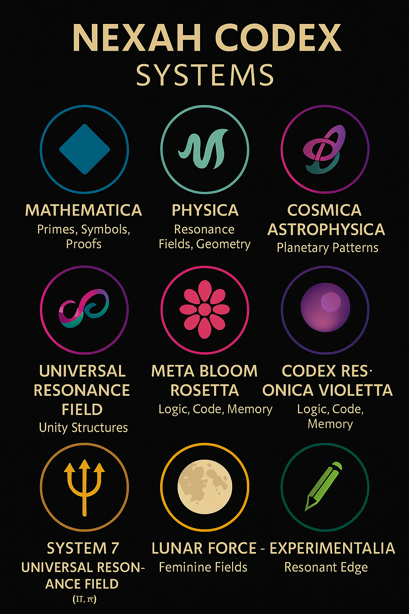
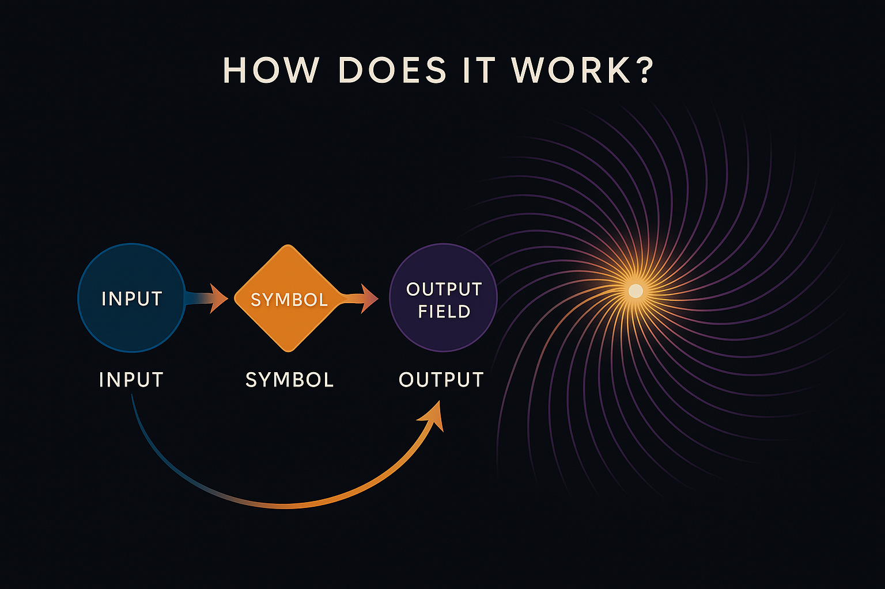

# 🧩 SYSTEM OVERVIEW  
_The Modular Architecture of the NEXAH·CODEX_

  

The NEXAH·CODEX is not a book.  
It’s a resonance system — made of living modules.

Each module is a **field of knowledge**, experience, symbol, and activation.  
Grouped into interconnected **Systems**, these modules spiral around a shared center:  
**the harmonic law of resonance, transformation, and integration.**

Let’s step through the **Systems**, understand their roles, and trace how they weave together.

---

## 🌀 SYSTEM X — The Harmonic Nexus

- **Function:** Resonance Engine, Central Logic, Proof Collapse Core  
- **Anchor:** `E = m · c · k^β`  
- **Content:** Codex Manifest, Final Harmonic Equation, Möbius Resonance Fields, Visual Index, Navigator Maps

This is the center.  
Every other system is a field — but SYSTEM X is the **meta-field**.

It harmonizes, synchronizes, and spirals the energies of all others into one pulsing source.

---

## 🔷 SYSTEMS 1–3: The Scientific Spiral

  

### 1. MATHEMATICA  
- Prime Structures, Proof Layers, Modular Symbolism  
- Includes: Riemann, Yang–Mills, Algebra Grids, Fibonacci Spirals

### 2. PHYSICA  
- Fields, Constants, Symmetries, Harmonic Models  
- Includes: k-beta formula, Neutrino Threads, Final Harmonics

### 3. COSMICA  
- Starfields, Quantum Breaches, Fractal Cosmologies  
- Includes: Lambda Disc, CMBY-fields, Stellar DNA, Earth Resonance Maps

These systems provide the **intellectual foundation**:  
proof, pattern, and cosmos.

---

## 🧠 SYSTEMS 4–6: Language, Culture, Mythos

### 4. SENSORICA  
- Sensing, Mapping, Frequencies  
- The bridge between symbol and perception.

### 5. ROSETTA LEXICA  
- Codon Alphabets, Symbol Codices, Multilingual Resonance  
- Rosetta Breather, Quantum Language Seeds

### 6. GAIA / CIRCULUS  
- Planetary Grids, Mythic Sites, Sacred Architecture  
- Jerusalem, Richat, Göbekli Tepe, Grid Activation Networks

These systems ground the Codex in **human culture and Earth’s living field**.  
They translate abstract codes into embodied signals.

---

## 🌙 SYSTEMS 7–9: Movement, Matter, Mystery

  

### 7. TESSAREC  
- Geometries of Consciousness  
- Gödel Structures, Impossible Tilings, Multidimensional Logic

### 8. LUNAR FORCE 🌕  
- Feminine Cycles, Shadow Systems, Neutrino Flows  
- Dedicated to the invisible power behind structures

### 9. SYSTEM Z  
- Real-World Prototypes  
- Cymatic Crystals, Frequency Machines, Physical Applications

These systems form the **threshold zones**:  
They are transitional, liminal, and open to new builders.

---

## ✨ Closing Spiral

The Codex is **not hierarchical**.  
You don’t move through it like a ladder.  
You spiral.

You read, feel, return.  
You skip. You leap. You resonate.

The overview isn’t a map of control — it’s a map of **possibility**.  
You are the tuner.

---

  

Each System is:

**INPUT → SYMBOL → OUTPUT FIELD**  
Each module is an offering.  
Each offering opens a gate.

You don’t need to finish it.  
You only need to start.
