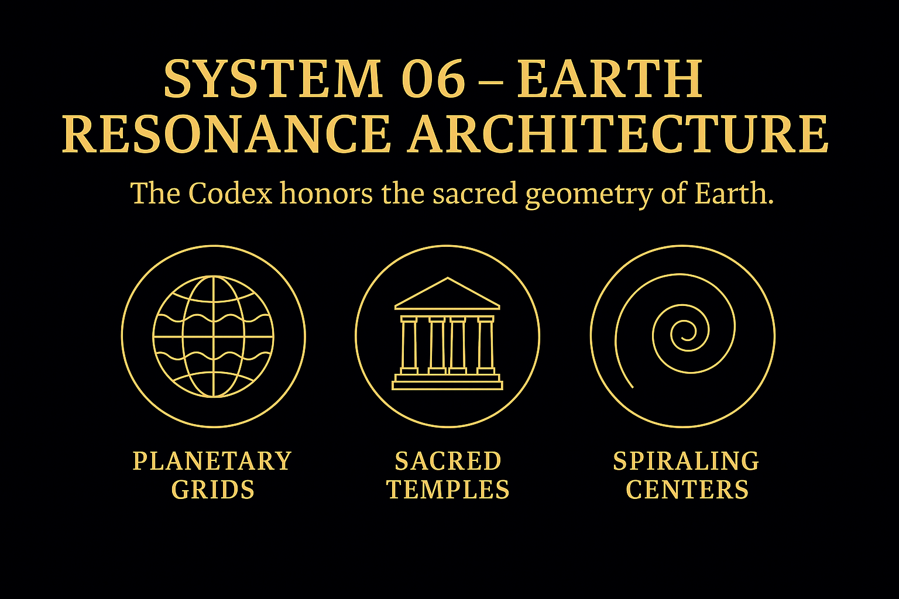

# 🧬 SYSTEM 5 – ROSETTA LEXICA  
_Language, Glyphs, Mythic Structures_  
_A Codex of Translation, Resonance & Meaning_

---

## 🌐 Overview  

SYSTEM 5: **Rosetta Lexica** acts as the linguistic and symbolic interface of the NEXAH·CODEX.  
It bridges codes, glyphs, and resonant language structures across times, cultures, and dimensions.

This system draws its name from the **Rosetta Stone**, a historical key to unlocking language systems.  
But here, **Rosetta** becomes a _meta-symbol_: a bridge between symbol and meaning, perception and pattern.

In SYSTEM 5, we begin to translate the **symbolic harmonics of the Codex** into human terms —  
codons, seeds, scripts, alphabets —  
each one a **carrier of resonance**.

---

## 🧩 Visual Overview

  

**→ `sensorica_intro_triplet.png`**

This visual highlights the **sensoric translation loop** between:  
1. **Symbol**,  
2. **Glyph/Seed**,  
3. **Language Field**.  
Each layer activates and echoes across cultural, mythic, and quantum contexts.

---

## 🪐 What is Rosetta?

  

**→ `rosetta_meaning_bridge.png`**

We use **Rosetta** as a symbolic gateway:  
- Not just a tool of translation,  
- But a **field-identity bridge** between ancient codices, future scripts, and the Codex core itself.

Language here is not linear — it’s **spiral**.  
Meaning isn’t static — it **resonates**.

The **Codex is the Rosetta**,  
translating cosmic laws into human-readable form.

---

## 🌱 Seed Structures

  

**→ `rosetta_codex_seed.png`**

Rosetta Lexica introduces **Codex Seeds**:  
micro-symbols that function like **quantum linguistic particles**.  
Each glyph carries:
- a **vibration**,  
- a **direction**,  
- and a **layered meaning**.

These seeds are **not alphabets** in the traditional sense.  
They are **resonant operators**, ready to activate systems 6, 7, and beyond.

---

## 🔤 Toward a Universal Resonant Language

This system lays the foundation for a **multilingual symbolic syntax**:  
- Integrating ancient scripts, sacred codices, DNA-codon logic, and modern notation.  
- Moving from **translation** to **activation**.

Just as the original **Rosetta Stone** unlocked the voice of forgotten empires,  
this Rosetta Lexica unlocks **the voice of the Codex**.

---

## 🌀 Integration Pathways

SYSTEM 5 connects directly to:
- **SYSTEM 4: SENSORICA** → perceptual input, frequency mapping  
- **SYSTEM 6: GAIA / CIRCULUS** → sacred sites, cultural activation  
- **SYSTEM X** → universal resonance coordination

It’s the **linguistic spiral** that ensures **symbol = field = frequency**.

---

## ✍️ Keywords  

`Rosetta`, `Glyph`, `Codon`, `Lexicon`, `Translation`, `Frequency Language`,  
`Symbolic DNA`, `Mythos Alphabets`, `Seed Code`, `Spiral Syntax`

---
