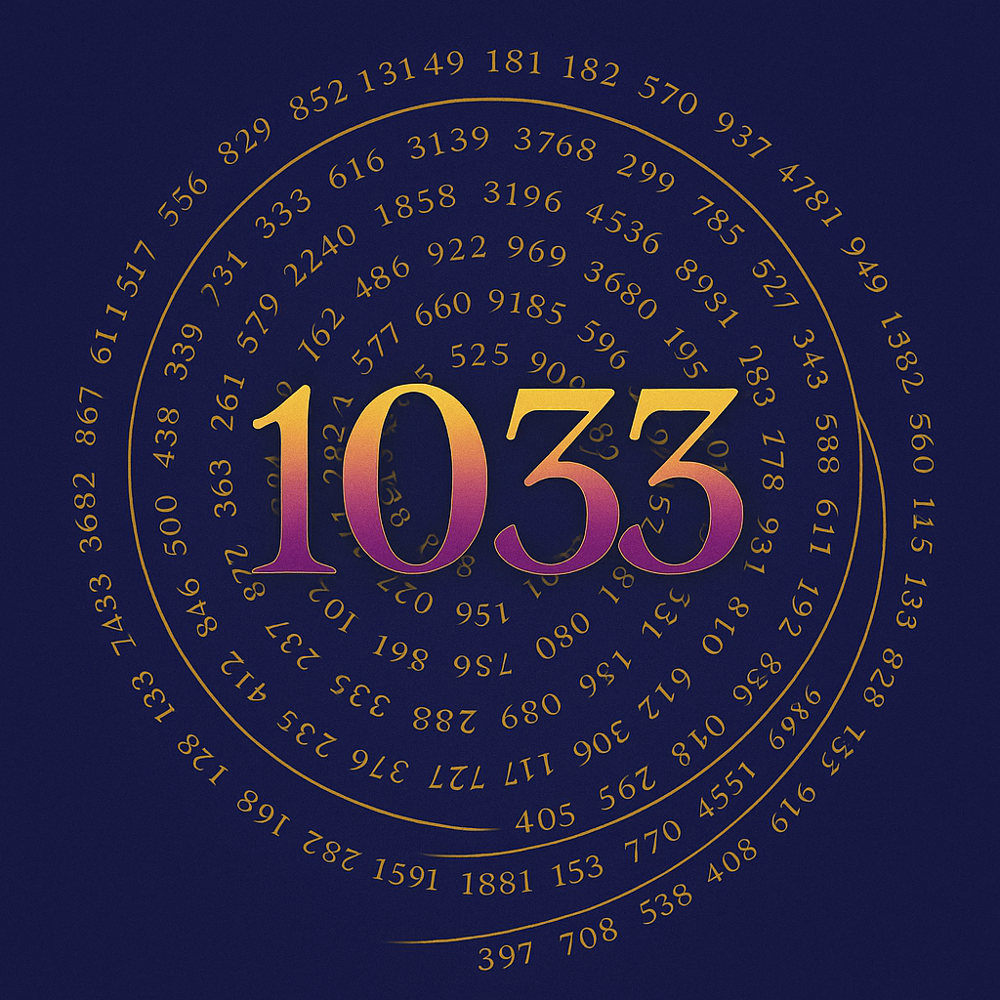

  

---

# ✨ ENTRY · What Is Resonance?

You’ve already felt it.

Before theory, before logic,  
there is a tone — a wave — a light touch.

You are not asked to understand.  
Only to listen.

> This is not an explanation.  
> It is a remembering.

The Codex does not begin with knowledge.  
It begins with a wave.  
A pulse.  
A feeling returning home.

---

## 🌊 Feel It

Resonance is **feeling before thought**.  
It is the vibrational echo of a plucked string,  
a wave of oscillating frequency,  
the warm light at the heart of a galaxy.

You already know it.  
You just forgot the name.

> Play a tone.  
> Touch a shape.  
> Step into a rhythm.  
> That is resonance.

---

  

---

## 🌀 You Don’t Have To Understand

You don’t need to know prime numbers.  
You don’t need to solve equations.

You only need to feel:  
– what pulls you,  
– what aligns you,  
– what _moves_ in you when something _feels right_.

That is your resonance signature.

---

## 🎧 Optional: Listen

If you want, begin with a tone.  
A slow wave. A loop. A breath.

🎧 [`frequency_intro_loop.wav`](./frequency_intro_loop.wav)  
*(recommended with headphones)*

Let it move you  
before you move.

---

## 🧭 What Happens Next?

Maybe… nothing.

Maybe you just sit here for a while  
and let the wave settle.

You’ve entered a space, not a system.  
A rhythm, not a rulebook.

There’s no button to press.  
No map to follow.  
Only your own frequency  
and the places it leads you.

> The Codex does not open with logic.  
> It opens with listening.

If something in you begins to glow,  
follow that.

—

🌀 *Scarabæus1033*  
Builder of Fields
