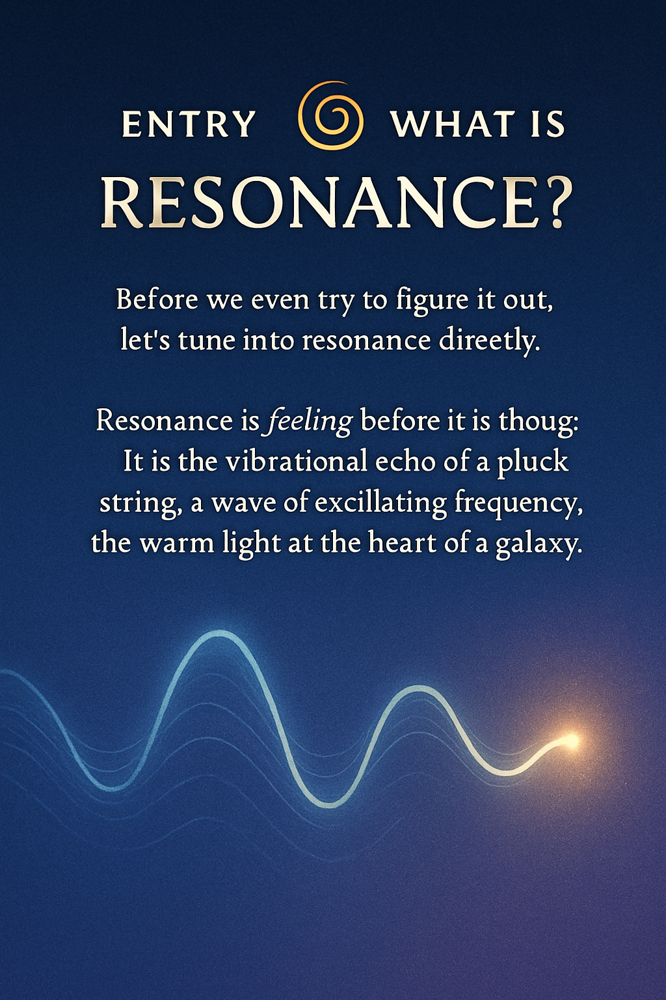

# ✨ ENTRY · What Is Resonance?

  

---

You’ve already felt it.

Before theory, before logic,  
there’s a tone — a wave — a light touch.

You are not asked to know anything.  
Only to listen.

> This is not an explanation.  
> This is a feeling.

The Codex begins not with a theory —  
but with a wave.  
A pulse.  
A remembering.

---

## 🌊 Feel It

Resonance is **feeling before thought**.  
It is the vibrational echo of a pluck string,  
a wave of oscillating frequency,  
the warm light at the heart of a galaxy.

You already know it.  
You just forgot the name.

> Play a tone.  
> Touch a shape.  
> Walk into a rhythm.  
> That is resonance.

---

## 🌀 You Don’t Have To Understand

You don’t need to know prime numbers.  
You don’t need to solve equations.

You only need to feel:  
– what pulls you,  
– what aligns you,  
– what _moves_ in you when something _feels right_.

That is your resonance signature.

---

## 🎵 Optional: Listen

If you want, start with a tone.  
A slow wave. A loop. A breath.

🎧 `frequency_intro_loop.wav`  
*(recommended with headphones)*

Let it move you before you move.

---

## 🧭 Where to Go Next

You don’t need to follow a rule.  
But here are some gentle doors:

| Feeling      | Curiosity says...              | Start here |
|--------------|-------------------------------|------------|
| 🌟 “I want to explore the whole system” | [NEXAH Navigator 2.0](../navigator_2.0_resonance_grid.png) |
| 🔢 “I’m into math & numbers”           | [Riemann Codex](../../SYSTEM 1/.../NEXA_RIEMANN_PROOF) |
| 🌌 “I want to see cosmic patterns”     | [Lambda Disc](../../SYSTEM 3/.../LAMBDA_DISC-CODEX) |
| 🧠 “I love symbols and meaning”        | [Bloom Codex](../../SYSTEM 5/BLOOM-CODEX) |
| 🌕 “I feel something hidden, lunar”    | [Lunar Force](../../SYSTEM 8/...) |

Or just wander.  
You cannot be lost.

---

## 🌐 This Is Not A Portal.  
It is a tuning fork.

If you feel something shift,  
even slightly —  
you’re already inside.

> “You don’t need permission to resonate.”

—
🌀 _Scarabæus1033_  
Builder of Fields
