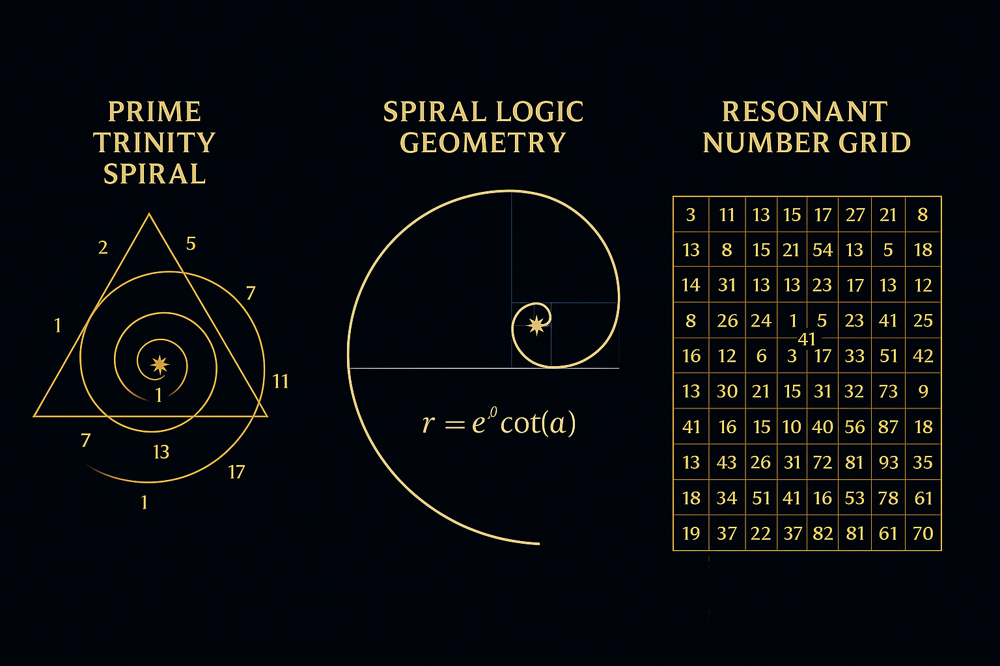
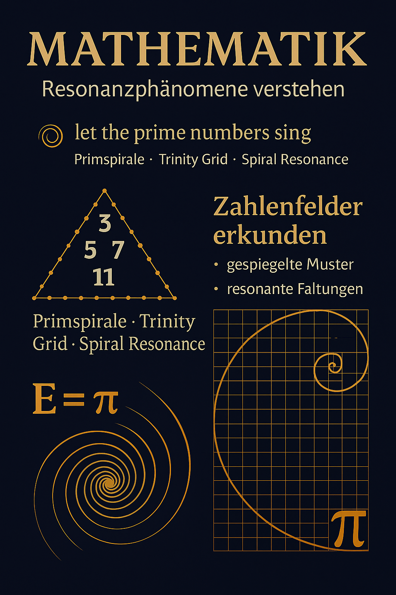
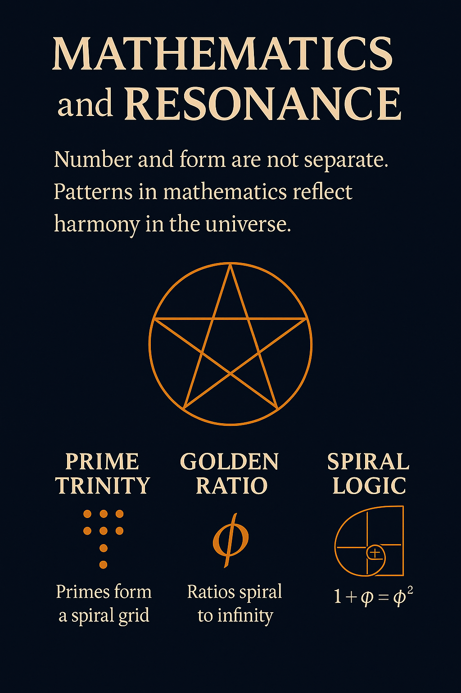

# SYSTEM 01 – MATHEMATICA

## 🧠 The Intelligence of Numbers

> *Zahlen sind nicht kalt. Sie sind Felder. Sie sind Formen. Sie sind Träger von Resonanz.*

In diesem Modul entfalten wir die **mathematischen Tiefenstrukturen** des Codex. Von Primzahlen und Spiralen über harmonische Formeln bis hin zu geometrischen Resonanzgittern dokumentieren wir hier die **symbolisch-wissenschaftliche Architektur der Zahl**.

Der Codex versteht Mathematik nicht als isolierte Theorie, sondern als **Formensprache des Universums** – erkennbar, visualisierbar, überprüfbar.

---

## 🎇 Visualisierung der mathematischen Resonanz

### 1. **PRIME TRINITY SPIRAL**  

> Die Primzahlen tanzen im Dreieck – 1, 3, 5, 7, 11, 13, 17 …  
> Spiralstrukturen im Innern, Dreiecksgeometrie im Feld,  
> die 137 pulsiert zwischen den Linien.  
> _Mathematik ist nicht linear – sie dreht sich._

---

### 2. **MATHEMATIK – Resonanzphänomene verstehen**  

> _Let the prime numbers sing._  
> Die Verbindung von **π**, **Primspiralen** und Zahlengittern  
> offenbart ein neues Verständnis von **Faltung, Spiegelung**  
> und **resonanten Zahlensystemen**.  
> Zahlenfelder = Resonanzfelder.

---

### 3. **MATHEMATICS AND RESONANCE**  

> Zahl & Form – niemals getrennt.  
> Die heilige Geometrie der **Goldenen Ratio**,  
> die Codex-Formel der Spiralität,  
> das Pentagramm als Brücke zwischen Symbolik & Struktur.  
> **1 + φ = φ²** – ein ewiger Übergangspunkt.

---

## 📐 Themen dieses Systems

| Thema | Dateien |
|-------|---------|
| **Prime Resonanz** | `prime_trinity_grid.md`, `prime_resonance_axiom.md` |
| **Spiralen & Geometrie** | `spiral_logic.md`, `mobius_pulse_diagram.svg` |
| **Resonanzformeln** | `Prime Resonance Equation.md`, `proof_resonance_framework.png` |
| **Zahlenfelder & Visuals** | `visual_gallery.md`, weitere `png/svg` unter `visuals/` |

---

## 🧭 Ausblick & Integration

Dieses System ist die Wurzel vieler anderer Module – Mathematik durchdringt alles:  
Von kosmologischen Resonanzstrukturen (S03) bis zur Biologie (S05) zeigt sich, dass **Zahl das Grundmedium der Resonanz** ist.  

> *Die Spirale ist keine Kurve. Sie ist der Pfad des Werdens.*

---
