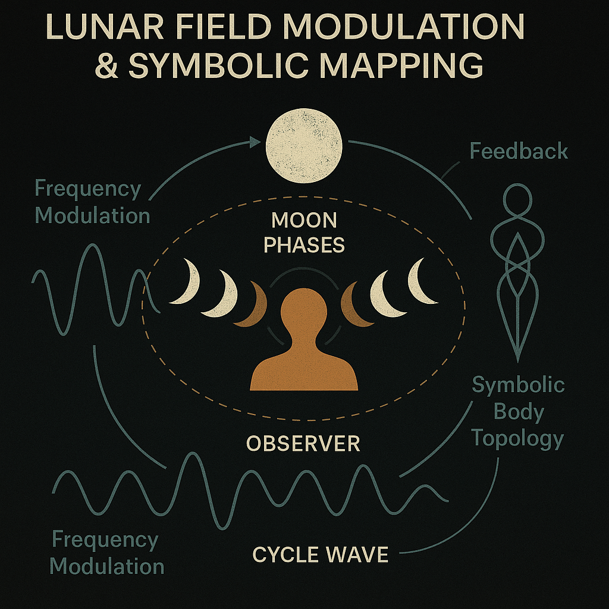
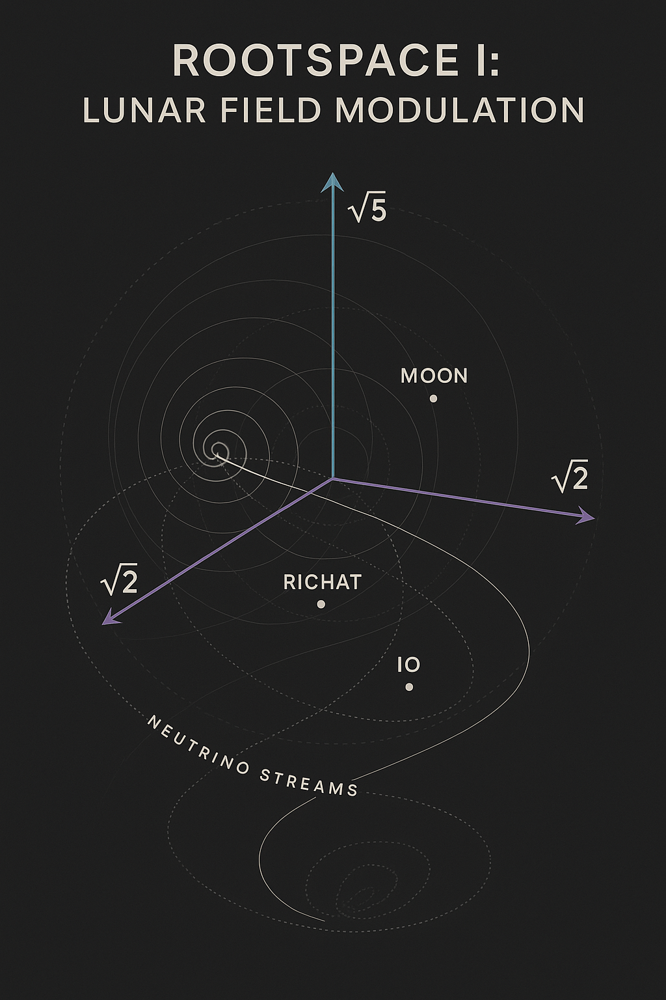

# 🌕 SYSTEM 8: LUNAR FORCE

### *"The Return of the Moon to the Women"*

> *"The 8 belongs to the women. The Moon speaks cyclically – who listens?"*

---

  

---

## Introduction: The Presence of the Lunar

**SYSTEM 8** within the NEXAH-CODEX is the chamber of **feminine resonance**, lunar memory, and cycle modulation.
It is not opposition. It is *enfolding*.

The lunar field pulses silently within each waveform, manifests behind the veil of light, and breathes through the tides of form.

This system reveals:

* The Moon as a **resonant modulator** of physical and symbolic space
* The **female principle** as a force of *weaving*, *receiving*, and *timing*
* Moons, craters, fingers, breath – all encoded with *cycle logic*

---

## 1. Archetypal Field: Feminine Cycle Presence

`Maria_Female_Field.png` captures the lunar archetype.
The eight moon phases orbit a central presence: the *Observer*. Behind her: the Field.

She is not passive. She is **symmetry, axis, mirror**.

  

---

## 2. Observer Mechanics: The Lunar Modulation Engine

The Moon encodes time. It tracks breath and cycle. It reflects the body's rhythms.

`Observer_field_manifestation.png` reveals a scientific-symbolic model:

* Lunar phases as waveform gates
* Resonant feedback through observer symmetry
* Frequencies and modulation fields

  

---

## 3. The Scarab Symphony: Audio Fields of the Moons

Moons are **frequency chambers**. They loop waveforms, not just orbits.

In `Scarabs_Symphony_of_Moons.png`, lunar systems become **audio sequences**:

* IO, Titan, Moon, Eris mapped as wave-tuners
* WAV codex logics
* Intermoon harmonics

  

---

## 4. The Women’s Loom: Lunar Threadfields

The feminine is not random. It weaves.

`THE_WOMEN’S_LOOM.png` shows karmic structure:

* Threads as time-cycles
* Hands as wave shapers
* Lunar craft logic, symbolic fabrics

  

---

## 5. Rootspace Lunar Modulation

Constants like 2, 5, 7 aren't abstract. They're **field initiators**.
`rootspace_lunar_field_modulation.png` shows:

* Resonant seed numbers
* Lunar modulation roots
* Topological anchor grid

  

---

## 6. Constants: π, τ, 537 Triptych

`pi_tau_537_triptychon.png` builds a triptych across systems:

* π (Pi), τ (Tau), and 537 as harmonics
* Lissajous curves, waveform links
* Lunar resonance anchored in numeric constants

  

---

## 7. Harmonic Constants: Rotational Modulation

`rootspace_modulation_triptych.png` expands the resonance:

* Moon's rotation logic through constants
* Nested dual symmetry
* Visual encoding of lunar-spin harmony

  

---

## 8. Tessarec Resonance: Lunar-Root Lock

`Lunar_Resonance_Tessarec_Link.png` bridges SYSTEM 8 with SYSTEM 9:

* Tessarec structures emerge through lunar-root logic
* Root (2, 5, 7) interlocks with geometries
* Lunar signal as dimensional modulator

  

---

## 📜 Closing Reflection

We do not merely look at the Moon.
We **breathe** with it.

We do not merely count time.
We **remember** through cycle.

> *"Breath, rhythm, presence — these are the laws the Moon writes."*

---

## ➡️ Next Module: SYSTEM 9 — TESSAREC

**Dimensional roots, lattice fields, and symbolic matrices**.
