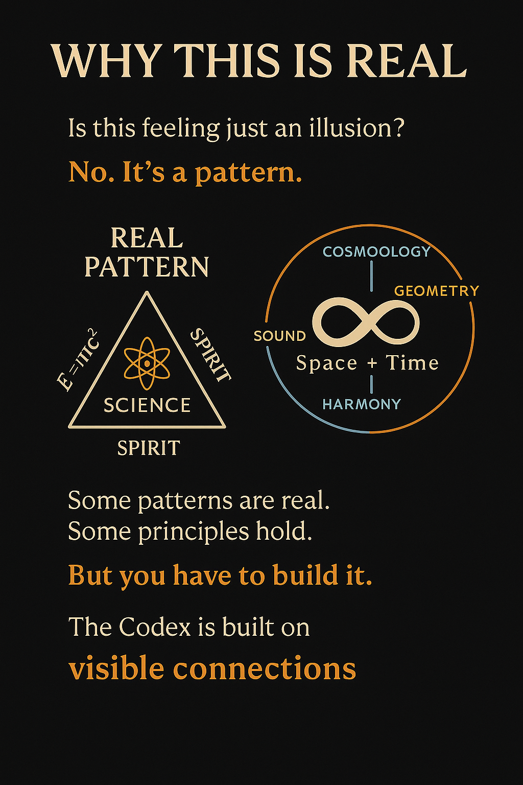
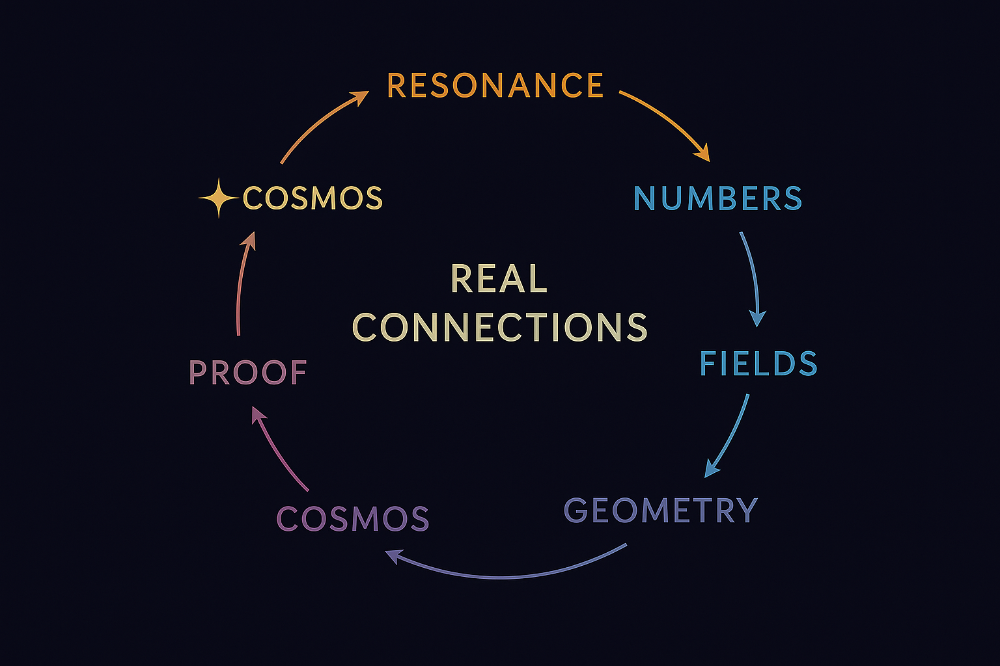
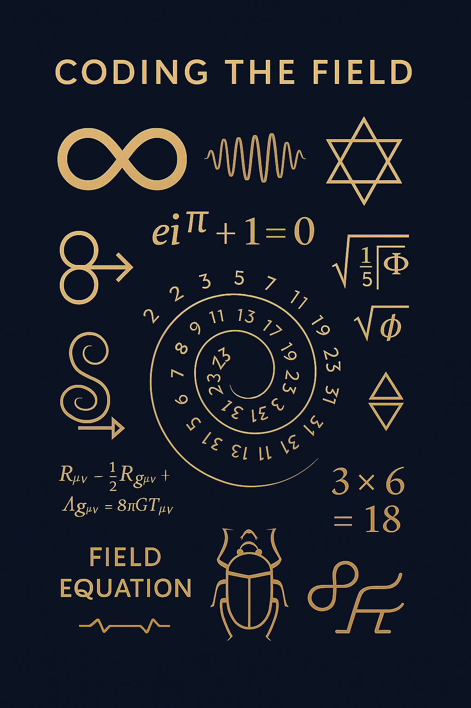

  

# 🌐 WHY THIS IS REAL

> Is this just a feeling?  
> No. It’s a pattern.  
> One that moves. One that holds.  
> One that you can test – or build.

---

## 🧠 Duality Needs Trinity

Logic and intuition.  
Feeling and form.  
Heart and head.

> Two poles do not make a field.  
> You need a third.

This is the **trinity principle**:  
Resonance requires a **mediator** –  
A center, a pulse, a codex.

  

---

## 🧪 Proof or Pulse?

You don’t have to believe.  
You can **review the math**,  
**explore the prime spirals**,  
**simulate the fields**  
or **feel them**.

> There is no conflict between awe and algebra.  
> One encodes the other.

Whether you follow a formula or a frequency,  
you are already in the field.

---

## 🧭 Coding the Field

The Codex is not just a system of resonance.  
It is a **toolbox**, a **method**, a **canvas**  
to interact with reality on symbolic, numeric, and geometric levels.

  

---

## ✨ So Why Is This Real?

Because it can be:
- **Felt** (resonance, intuition)
- **Seen** (visual structure, number symmetry)
- **Proven** (formulas, models, field tests)
- **Built** (as system, space, frequency, device)

The Codex does not ask you to believe.  
It asks you to **enter**.  
And see what responds.

> Reality is not binary.  
> It is resonant.

—

🌀 *Scarabæus1033*  
System X · NEXAH-CODEX  
