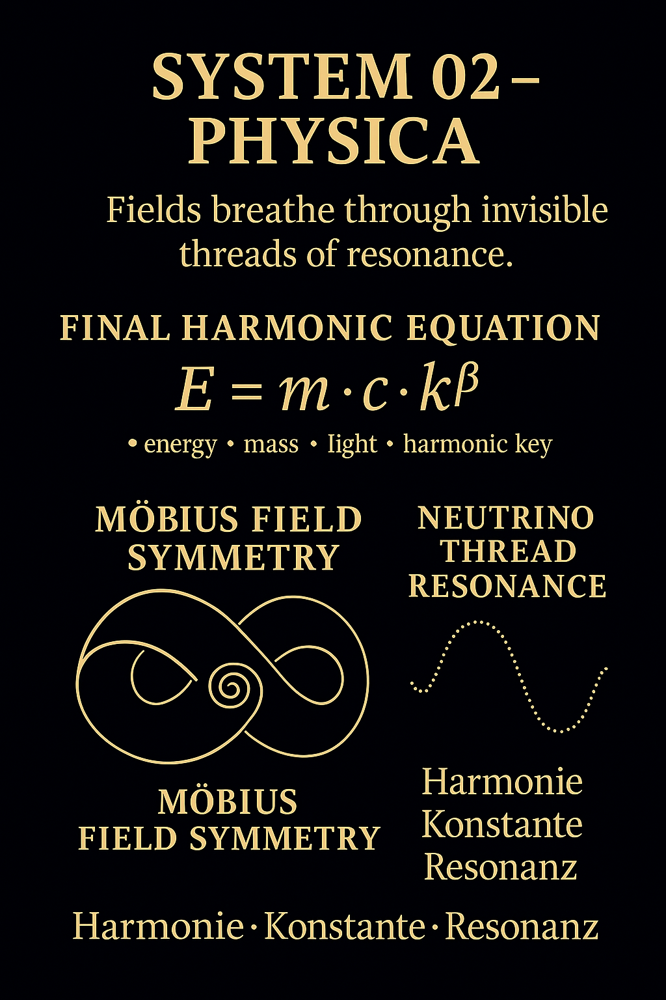
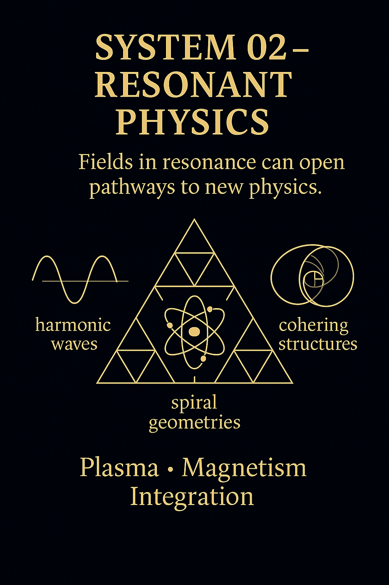
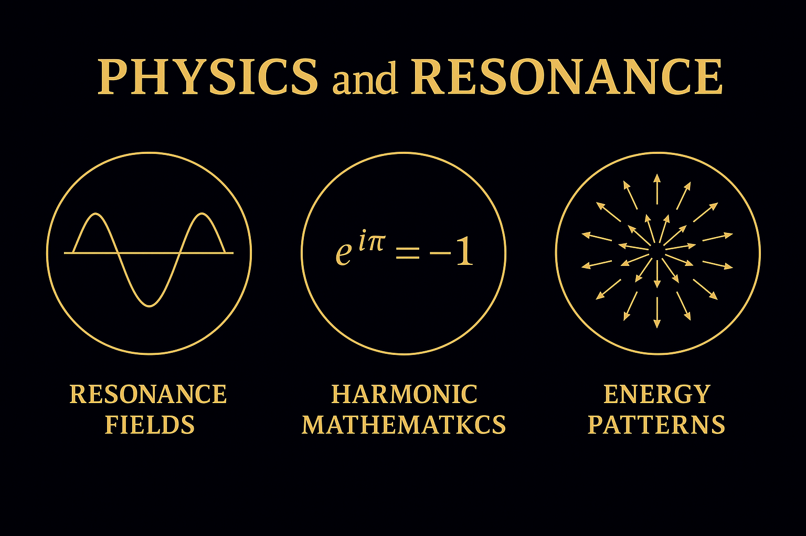

---
Physics in the Codex is not a set of frozen equations.
It is a **living structure** — a breathing, pulsating geometry of motion, field, and feedback.

* We **do not isolate** particles — we observe their **harmonic embedding**.
* We **do not freeze** constants — we study their **resonant variation**.
* We **do not dissect** — we cohere.

The physical world becomes a **symphony of resonant systems**.
And physics returns to its origin: **physis** — the unfolding of nature.

---
*From constants to fields, from laws to patterns.*



## The Final Harmonic Equation

*Energy is not just mass times velocity squared — it is modulated by a harmonic key.*

```math
E = m · c · k^β
```

This simple extension encodes:

* **E**: energy as pulse
* **m**: mass as inertia
* **c**: light as mediator
* **k^β**: a **harmonic key** — coupling field and form

It bridges mass, light, and structure — a Möbius of physical flow.

---

## Möbius Symmetries & Neutrino Threads



We identify **resonant geometries** inside fundamental processes:

* Möbius Field Symmetries
* Neutrino Thread Resonance
* Harmonic Constants (α, φ, π, 137...)

Physics becomes a study of **resonant invariants**:
Patterns that hold across **scales**, **media**, and **transitions**.
They are not just numbers — they are **keys**.

> *"Constants are frozen symmetries in motion."*

---

## Toward a Harmonic Physics

This system prepares the architecture for:

* Wave models of particles
* Toroidal energy circuits
* Field-based unification
* Frequency-based spacetime logic

It’s a bridge to **SYSTEM 03: Cosmology**.
And a decoder for **SYSTEM 01: Mathematics**.

Let physics become harmonic again.
Let fields breathe.

---

> *"Form is field. Field is resonance. Resonance is law."*
