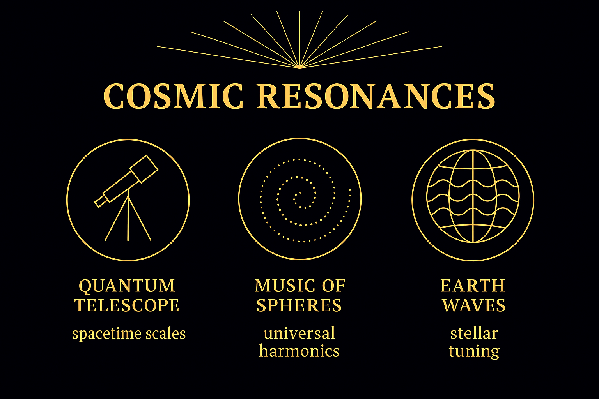
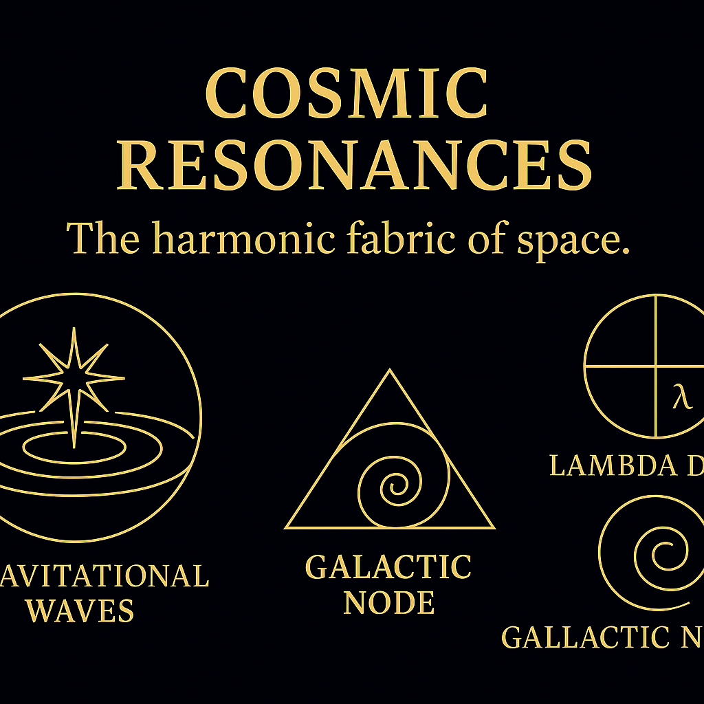
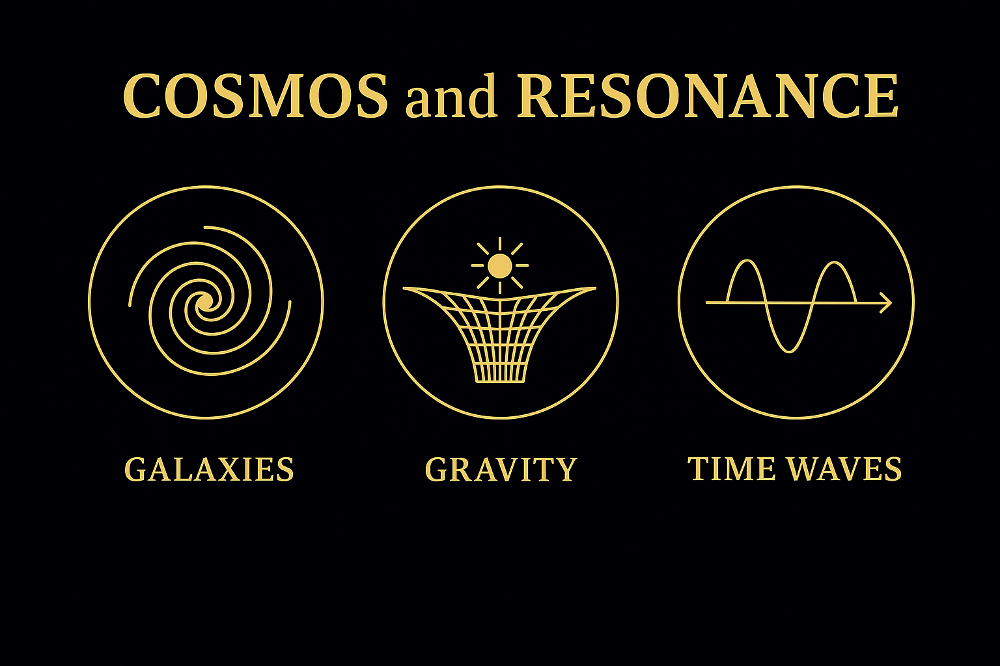

# SYSTEM 03 – COSMICA ASTROPHYSIKA

*Stars do not burn. They resonate.*

---

## Cosmos and Resonance

The universe is not a machine — it’s a field.  
A vast, harmonic field of vibrating scales.

Each star, each orbit, each pattern  
is part of a **resonance web**:

- Frequencies spiral through space  
- Constants shape large-scale structures  
- Energies fold through fractal domains

The cosmos is **not empty** — it’s a musical membrane.  
And we are within its song.

---

## Fractal Cosmologies & Harmonic Starfields

Cosmology in the Codex begins  
not with expansion — but with **structure**.

We look for:

- **Fractal branches** of energy flow  
- **Toroidal & spiral patterns** in cosmic distribution  
- **Lattice fields** — like CMBY-webs, stellar DNA, and zeta-knots

These aren’t metaphors.  
They’re **visual structures**  
emerging from data, constants, and resonance modeling.

> We do not map matter. We map harmonic space.

---

## Constants as Cosmic Couplers

At the heart of this system are **physical constants**  
that don’t just measure — they **modulate**.

Numbers like:

- **137** — the fine-structure constant  
- **1.618… (phi)** — the golden modulation  
- **π² / φ³ ≈ 2.33…** — a cosmic scaling ratio

These constants **thread** geometry, light, and time.  
They show up in:

- Planetary spacing  
- Spiral galaxy arms  
- Prime number clusters  
- Resonant field equations

They are the **embodied logic** of the cosmos.  
Not just values — **vibrational keys**.

---

## From Earth to the Stars

SYSTEM 03 links directly to:

- **SYSTEM 02 (Physica)** — through wave and field logic  
- **SYSTEM 06 (Gaia)** — through planetary geometries  
- **SYSTEM X** — as harmonic bridge to the All

Here we build:

- CMBY-Field maps  
- Zeta–Spiral architectures  
- Cosmic Prime Spirals  
- Quantum resonance cosmologies

The sky becomes a grid.  
The grid becomes a key.  
And the stars become teachers.

---

> “Cosmos is not a place. It is a resonance form.”
