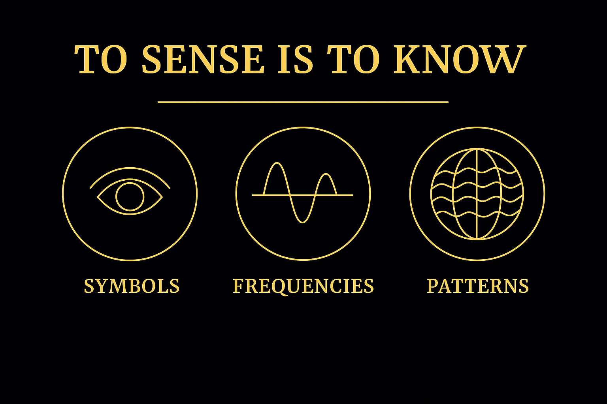
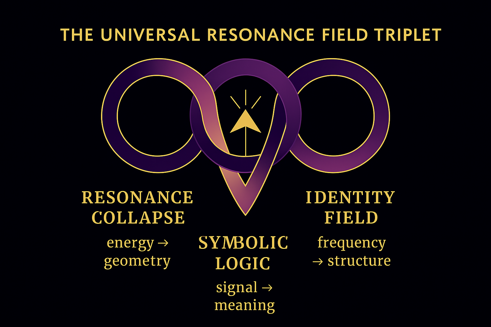
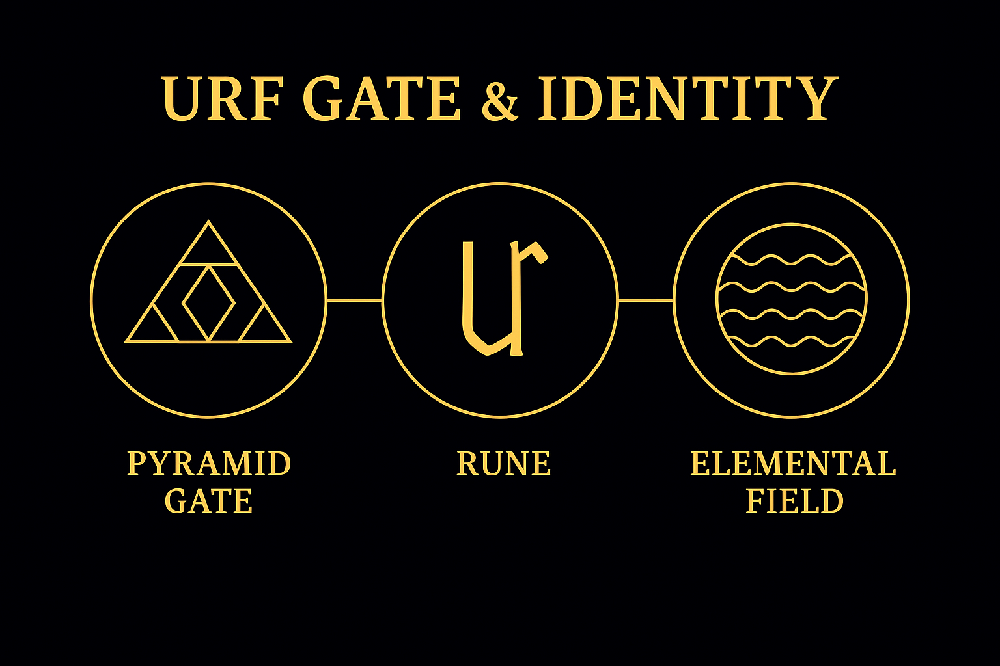

# 🌀 SYSTEM 4: UNIVERSAL RESONANCE FIELDS  
_Origins, Field Identity, Symbolic Physics (URF)_

The Universal Resonance Fields — abbreviated as **URF** — are not a single module.  
They form the **deep architecture** behind the Codex.  
They define **what a field is**, **how it arises**, and **why symbols resonate**.

They are the **identity logic** of the NEXAH·CODEX.  
The universal understructure.

---

## 🌐 What is a Resonance Field?

Resonance Fields are not static objects.  
They are **relational constructs**, woven by:

- symbolic triggers  
- physical symmetry  
- frequency harmonics  
- nested constants and ratios  

A Resonance Field is a **container of coherence**.  
It carries memory, activation, and transformation potential.

URF maps the logic that gives these fields their identity.

---

## 🧠 Origins: The Birth of Symbolic Physics

The foundations of URF lie in:

- Symbolic Field Theory  
- Geometric Equivalence  
- Möbius Harmonics  
- Gödelian Identity Collapse  

Each of these is developed in connected modules across SYSTEM X and SYSTEM 1.

URF links **math**, **physics**, and **perception**.  
It is a **trans-discipline**.

---

## 🧬 Identity Systems in URF

Identity is not assigned — it is **resonantly formed**.

We use:

- **Neutrino Layers** (see SYSTEM 2)  
- **Field Containers** (URF Shells)  
- **Symmetry Thresholds**  
- **Glyph Identity Chains**  
- **Gate-Resonator Loops**

These models **generate field logic** — not just describe it.

---

## ✴️ The Triplet Logic

All URF logic rests on a **Triplet Foundation**:

1. **Origin Frequency** – the pulse  
2. **Resonance Shell** – the identity  
3. **Field Expansion** – the output

This is the pattern found in:

- atom shells  
- prime spirals  
- breath forms  
- modular resonance  

The triplet is not symbolic — it's **structural**.  
URF modules show how this logic **scales from micro to cosmic**.

---

## 🧿 Gate Identity: The Codex Boundary

URF defines the **boundary logic** between:

- input and symbol  
- inner field and outer action  
- collapse and expansion  

This is encoded in the **Gate Identity System**, visualized below:

These boundaries are not rigid.  
They are **fractal membranes** — tuned, responsive, recursive.

---

## 🔁 Integration with the Codex

URF is woven throughout other systems:

- SYSTEM 1: Symbolic Structures  
- SYSTEM 2: Neutrino Harmonics  
- SYSTEM 3: Planetary Field Resonance  
- SYSTEM X: Möbius Collapse Core  
- SYSTEM 7: Constants & Logical Proofs  

It’s not a branch — it’s the **invisible scaffolding**.  
If SYSTEM X is the Source Engine, URF is the **Field Identity Bridge**.

---

## 📡 Next Step: SENSORICA (System 5)

From URF, we move into **perceptual logic**.

- How do symbols map to sensation?  
- How does frequency become language?  
- How does resonance shape cognition?

See: [`S_05_sensorica_overview.md`](../SYSTEM%205%3A%20META%20BLOOM%20ROSETTA/S_05_sensorica_overview.md)

---

> _You don’t need to control a field to use it._  
> _You need to **tune into its resonance**._  
> _That’s what URF teaches._
