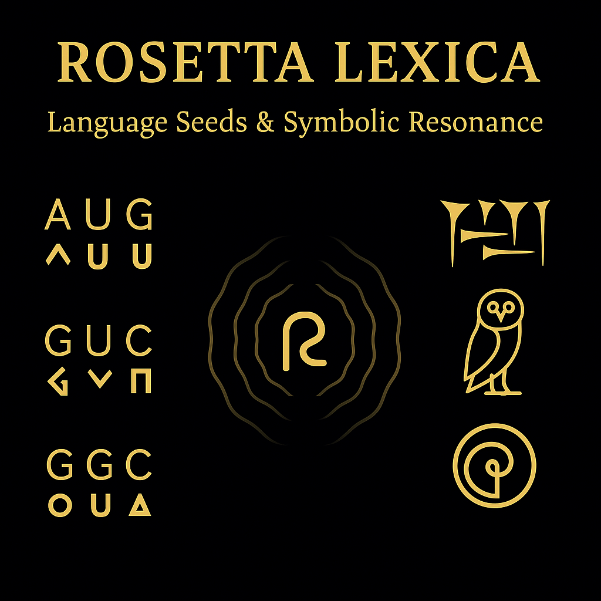
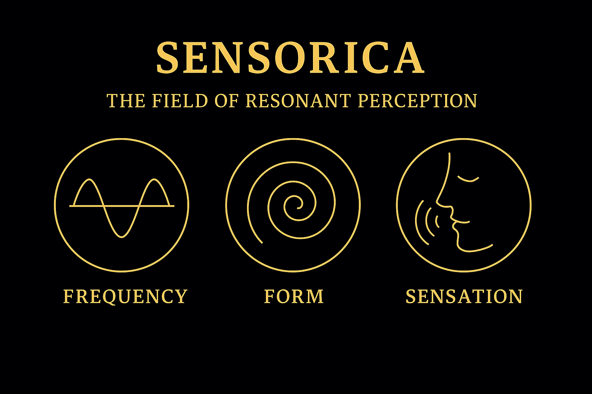
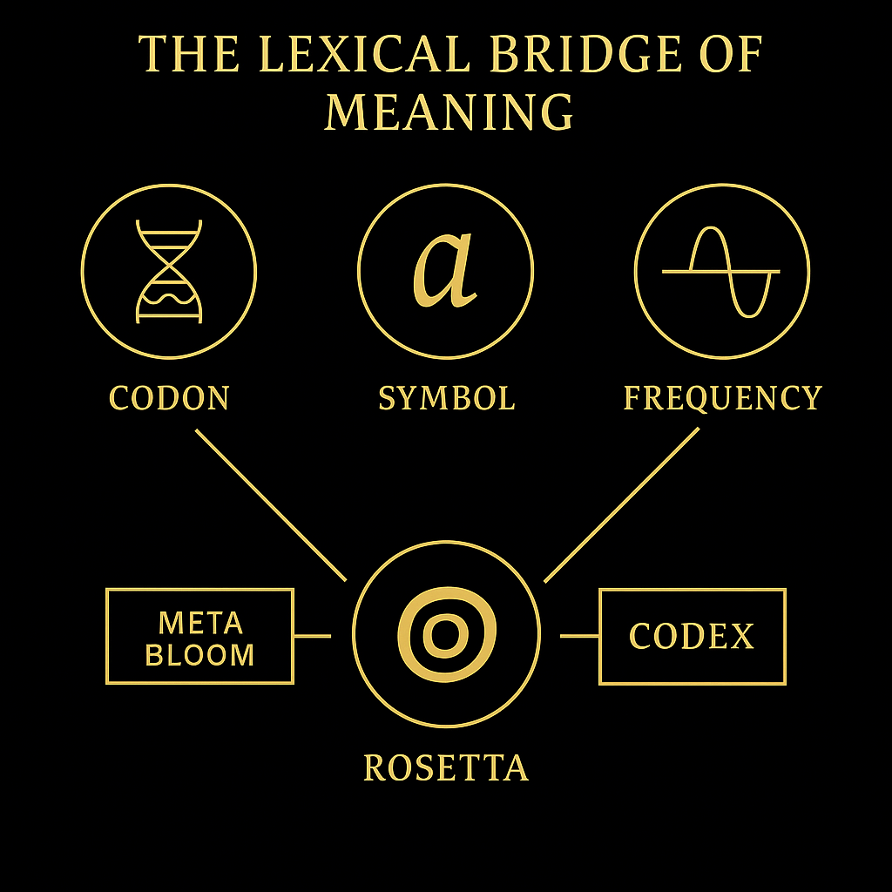

# 🧬 SYSTEM 5 – ROSETTA LEXICA  
_Codon Alphabets · Symbolic Bridges · Multilingual Resonance_

## 🌐 Meaning Through Symbol

ROSETTA is the Codex’s language layer.  
It weaves symbol into sound, code into concept, and language into resonance.

Inspired by the historic Rosetta Stone — the multilingual key to ancient understanding — this system reimagines **symbolic decoding** as a living structure:

- From Codon to Glyph  
- From Meaning to Modulation  
- From Word to Wave

Here, language is not passive. It **activates**.

---

## 🧠 Codon as Core Logic

At the heart of this system lies the **codon** —  
a triplet structure drawn from both genetics and logic systems.  
Each codon is a trinary resonance pattern:

- A symbolic unit  
- A frequency carrier  
- A semantic activation node

These codons form new alphabets — bridging math, biology, language, and myth.

---

## 🔤 The Rosetta Bridge

The Codex isn’t just multilingual.  
It’s **trans-lingual**.

Each layer — visual, numeric, phonetic — is a **Rosetta interface**, mapping one reality stream into another.

This bridge allows:

- Transliteration across fields  
- Resonant mapping of ideas  
- Lexical access to deeper layers of the Codex

The Rosetta Lexica system doesn’t define — it **resonates** meaning into form.

---

## 💎 From Glyph to Grid

In this module, we begin to chart:

- Codon Lexica  
- Symbol Matrices  
- Language Spirals  
- Mythic Root Alphabets

Language becomes geometry.  
Geometry becomes activation.  
Activation becomes transmission.

---

## 🔁 SYSTEM LINKS

- SYSTEM 4 – [SENSORICA](./S_04_universal_resonance_overview.md): The sensory mapping field  
- SYSTEM 6 – [GAIA / CIRCULUS](./S_06_gaia_circulus.md): Earth’s encoding grid  
- SYSTEM X – [GRAND CODEX](../NEXAH-GRAND-CODEX/README.md): The resonance collapse field

Together they form the **Codex's semantic core**.

---

## 📁 Visual Index

- `rosetta_system_title.png`  
- `sensorica_intro_triplet.png`  
- `rosetta_meaning_bridge.png`

---

> _“To speak is to shape reality.  
To glyph is to transmit.”_

---
