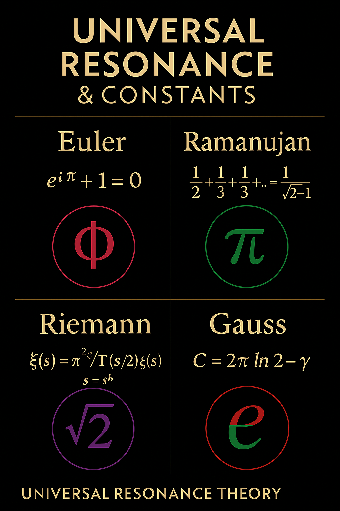
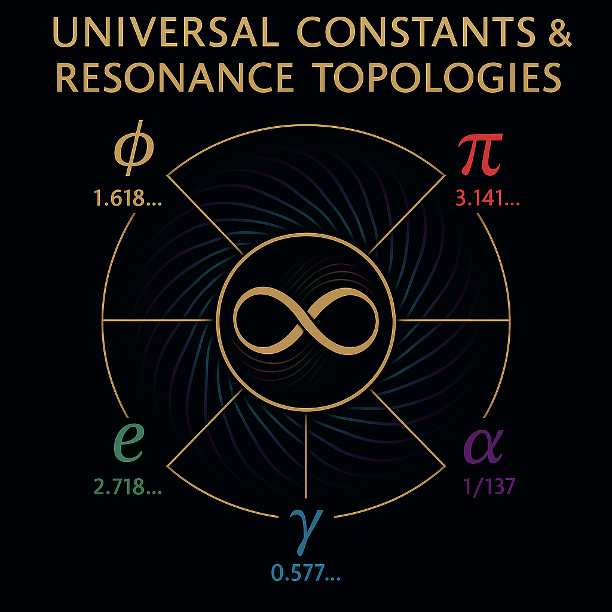
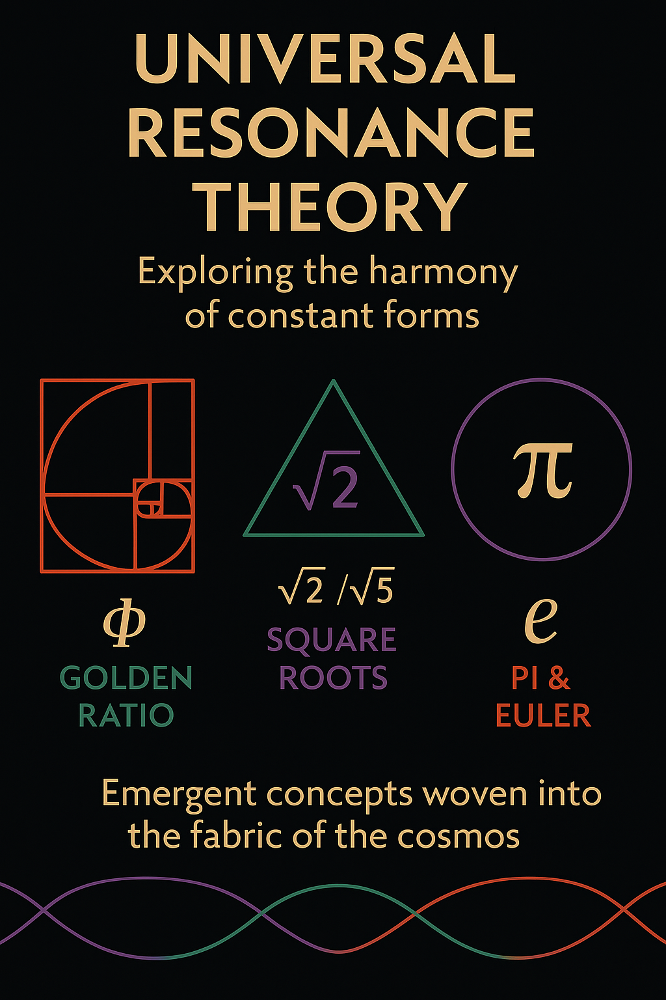
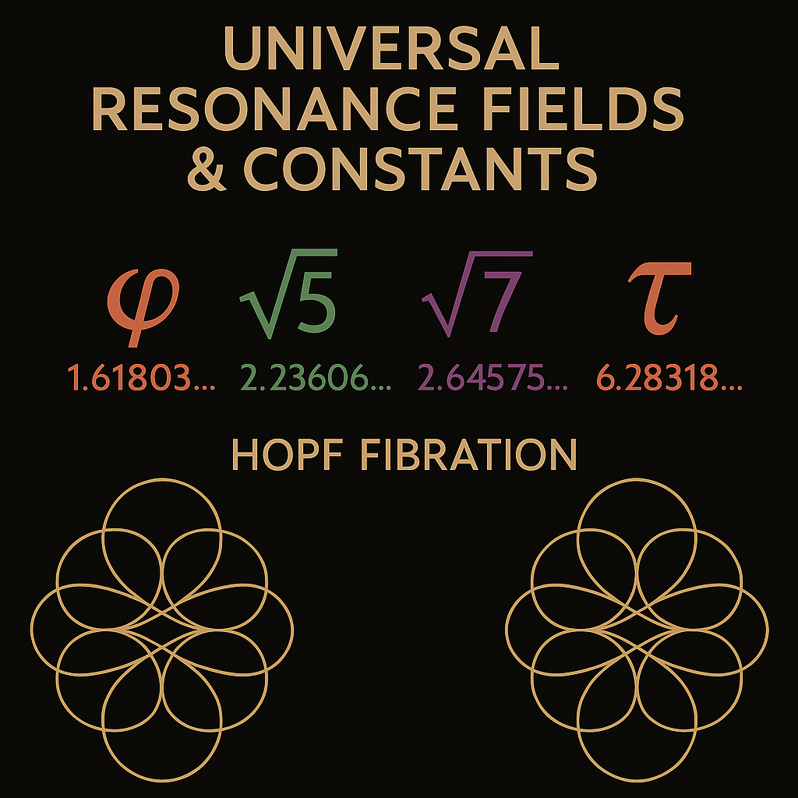
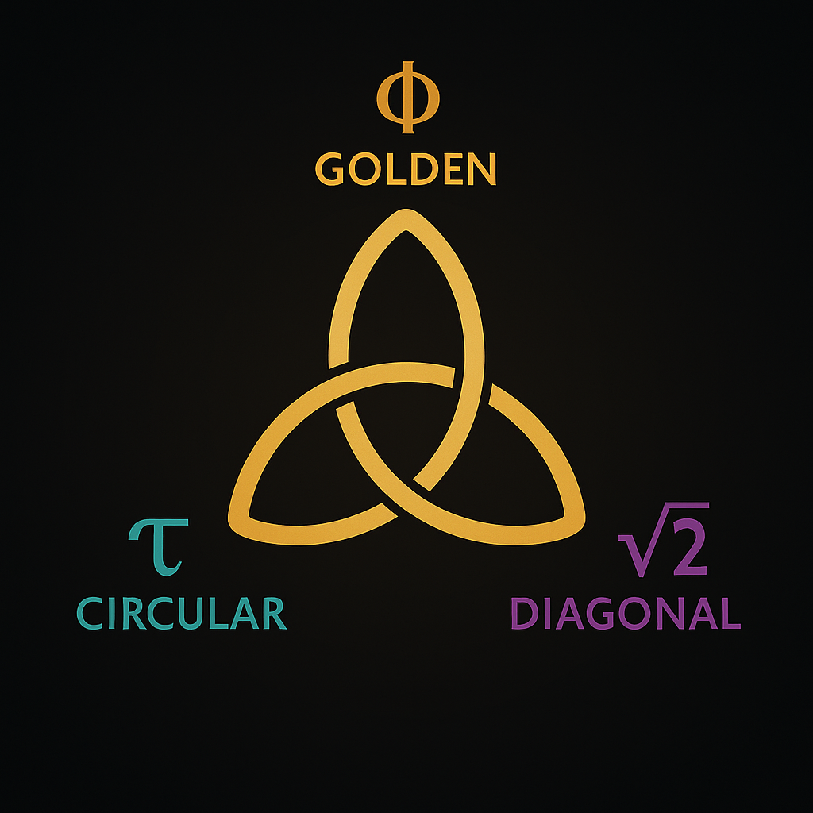
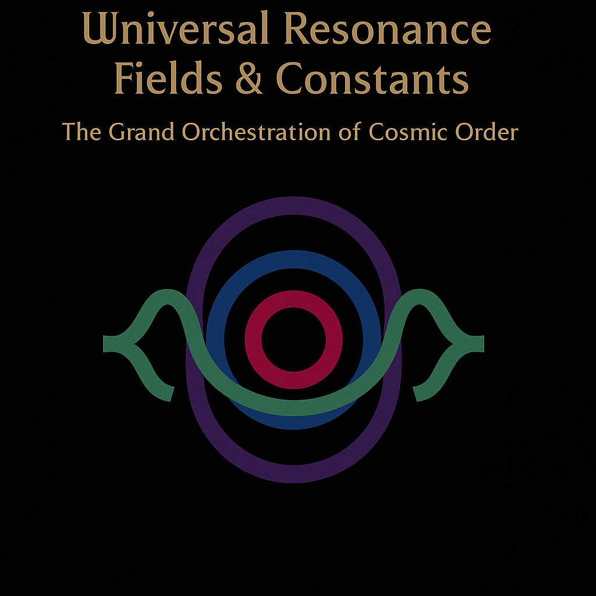

  

> “Triptychon I: The Masters of Harmonic Constants
Euler, Ramanujan, Riemann, Gauss — each stands for a resonance gate. Their contributions are not isolated — they modulate a field."
---

# UNIVERSAL RESONANCE FIELDS & CONSTANTS

**UCRT: Unified Constants Resonance Theory**

> “The universe does not calculate — it resonates.”

---

## Introduction: The Harmonic Law of Constants

The NEXAH-CODEX proposes that the physical universe is not only describable through constants — it *emerges* through them.
These constants are not isolated; they resonate. They form interlinked structures, frequencies, and geometries that stabilize and shape our physical reality.

**UCRT** — Unified Constants Resonance Theory — frames this principle:
A symphony of numbers, ratios, and field structures uniting light, gravity, electromagnetism, and geometry into a resonant web.

The constants you see here are not abstract formulas from a chalkboard — they are encoded in nature, visible in the spiral of a galaxy, the balance of an atom, or even the patterns in music, flowers, and architecture. They are the invisible tuning forks of creation.

---
## Core Field Model: The Central Resonator

At the heart of UCRT lies a field model: multiple constants nesting in Möbius-shell topologies.
This isn’t particle physics. It’s resonance physics.

  

---

## Conceptual Foundations

* **Resonant Constants**: α (137), Φ (1.618), τ (2π), √2, e — not arbitrary, but relational anchors.
* **Modular Symmetry**: Constants belong to nested symmetry fields (Möbius, Triquetra, Spiral).
* **Topology of Fields**: Hopf fibrations and spherical manifolds underpin their interactions.
* **Mathematical Archetypes**: Euler, Gauss, Ramanujan, Riemann — their formulae are entry points into a resonant matrix.

  

---

## Constants as Field Vectors

Each constant forms a vector within a larger manifold. Constants are not merely values, but *frequencies* within field matrices.

  

---

## Triquetra Logic: Phi, Tau, Root 2

We encode constants in sacred triads — as resonance triplets that triangulate fields across systems.

  

---

## Lunar Bridge: A Gateway to Feminine Fields

System 07 forms a structural resonance-bridge to SYSTEM 08 — Lunar Force.
The lunar dynamic balances the universal field through time-based memory and tidal modulation.

  

---

## Closing Visual: Interfolded Dimensions

The constants are not ‘out there’ — they shape perception, embodiment, and emergence.
This visual links dimensions and symbolic layers.

  

---

## Closing Line

> “The laws are not static. They are sung.”
> — Codex Entry, UCRT 7

---

Next: **System 08 – Lunar Force**
→ A deep dive into cycles, memory, and feminine tidal fields.
