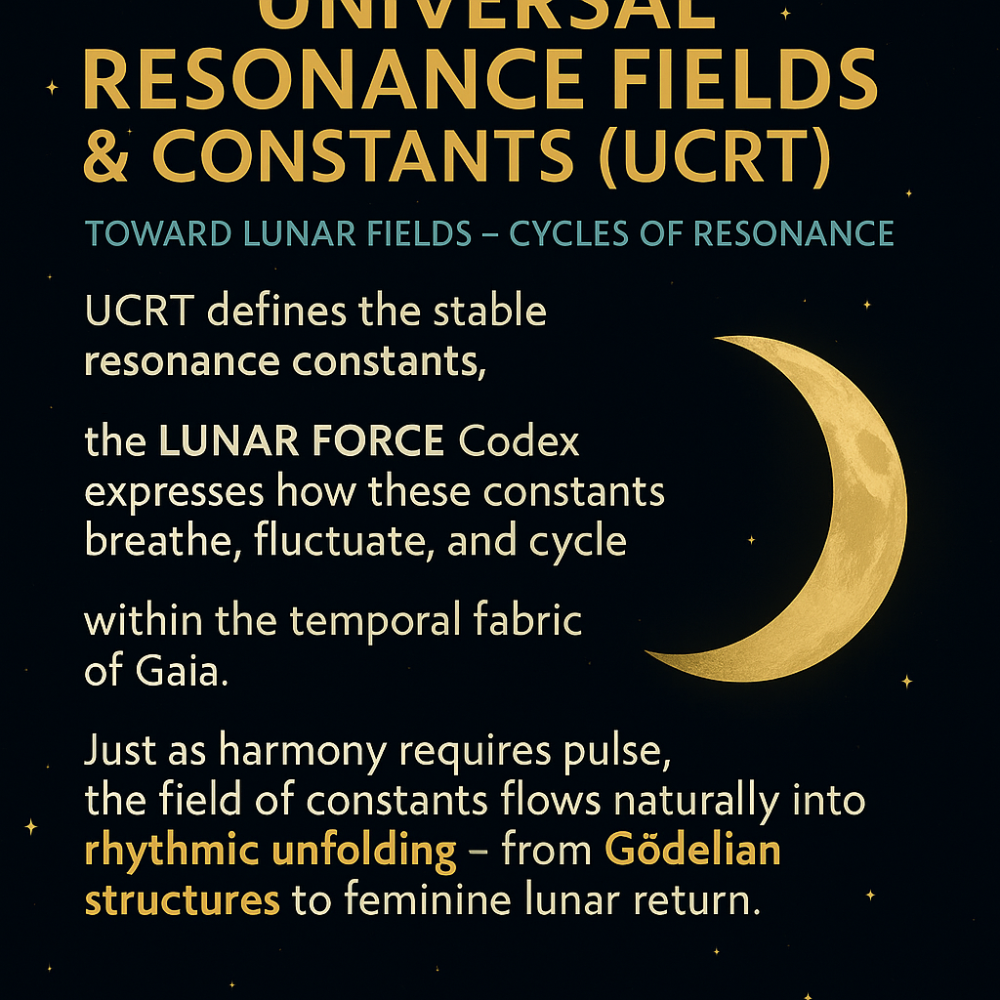

# 🌕 SYSTEM 8: LUNAR FORCE

### *"The Return of the Moon to the Women"*

> *"The 8 belongs to the women. The Moon speaks cyclically – who listens?"*

---

## Introduction: The Presence of the Lunar

**SYSTEM 8** within the NEXAH-CODEX is the chamber of **feminine resonance**, lunar memory, and cycle modulation.  
It is not opposition. It is *enfolding*.

The lunar field pulses silently within each waveform, manifests behind the veil of light, and breathes through the tides of form.

This system reveals:

- The Moon as a **resonant modulator** of physical and symbolic space  
- The **female principle** as a force of *weaving*, *receiving*, and *timing*  
- Moons, craters, fingers, breath – all encoded with *cycle logic*

  

---

## 1. Archetypal Field: Feminine Cycle Presence

`Maria_Female_Field.png` captures the lunar archetype.  
The eight moon phases orbit a central presence: the *Observer*. Behind her: the Field.

She is not passive. She is **symmetry, axis, mirror**.

---

## 2. Observer Mechanics: The Lunar Modulation Engine

The Moon encodes time. It tracks breath and cycle. It reflects the body's rhythms.

`Observer_field_manifestation.png` reveals a scientific-symbolic model:

- Lunar phases as waveform gates  
- Resonant feedback through observer symmetry  
- Frequencies and modulation fields

  

---

## 3. The Scarab Symphony: Audio Fields of the Moons

Moons are **frequency chambers**. They loop waveforms, not just orbits.

In `scarabs_symphony_of_the_moons.png`, lunar systems become **audio sequences**:

- IO, Titan, Moon, Eris mapped as wave-tuners  
- WAV codex logics  
- Intermoon harmonics

  

---

## 4. The Women’s Loom: Lunar Threadfields

The feminine is not random. It **weaves**.

`the_womens_loom_lunar_threads.png` shows karmic structure:

- Threads as time-cycles  
- Hands as wave shapers  
- Lunar craft logic, symbolic fabrics

  

---

## 5. Rootspace Lunar Modulation

Constants like 2, 5, 7 aren't abstract. They're **field initiators**.

`rootspace_lunar_field_modulation.png` reveals:

- Resonant seed numbers  
- Lunar modulation roots  
- Topological anchor grid

  

---

## 6. Constants: π, τ, 537 Triptych

`pi_tau_537_triptychon.png` builds a triptych across systems:

- π (Pi), τ (Tau), and 537 as harmonic structures  
- Lissajous curves, waveform links  
- Lunar resonance anchored in numeric constants

  

---

## 7. Harmonic Constants: Rotational Modulation

`rootspace_modulation_triptych.png` expands the resonance:

- Moon's rotation logic through constants  
- Nested dual symmetry  
- Visual encoding of lunar-spin harmony

  

---

## 8. Tessarec Resonance: Lunar-Root Lock

`lunar_resonance_cube_root3_connection.png` bridges SYSTEM 8 with SYSTEM 9:

- Tessarec structures emerge through lunar-root logic  
- Root (2, 5, 7) interlocks with geometries  
- Lunar signal as dimensional modulator

  

---

## 9. SYSTEM 7 Link: UCRT Lunar Field Connection

`ucrt_lunar_resonance_connection.png` links back to SYSTEM 7:

- Constants from SYSTEM 7 stabilize the **lunar fields** of SYSTEM 8  
- Resonance equations (α, Φ, τ) fold into tidal harmonics  
- Moon as *bridge* between constants and matter cycles

  

---

## 📜 Closing Reflection

We do not merely look at the Moon.  
We **breathe** with it.

We do not merely count time.  
We **remember** through cycle.

> *"Breath, rhythm, presence — these are the laws the Moon writes."*

---

## ➡️ Next Module: SYSTEM 9 — TESSAREC

**Dimensional roots, lattice fields, and symbolic matrices**.
