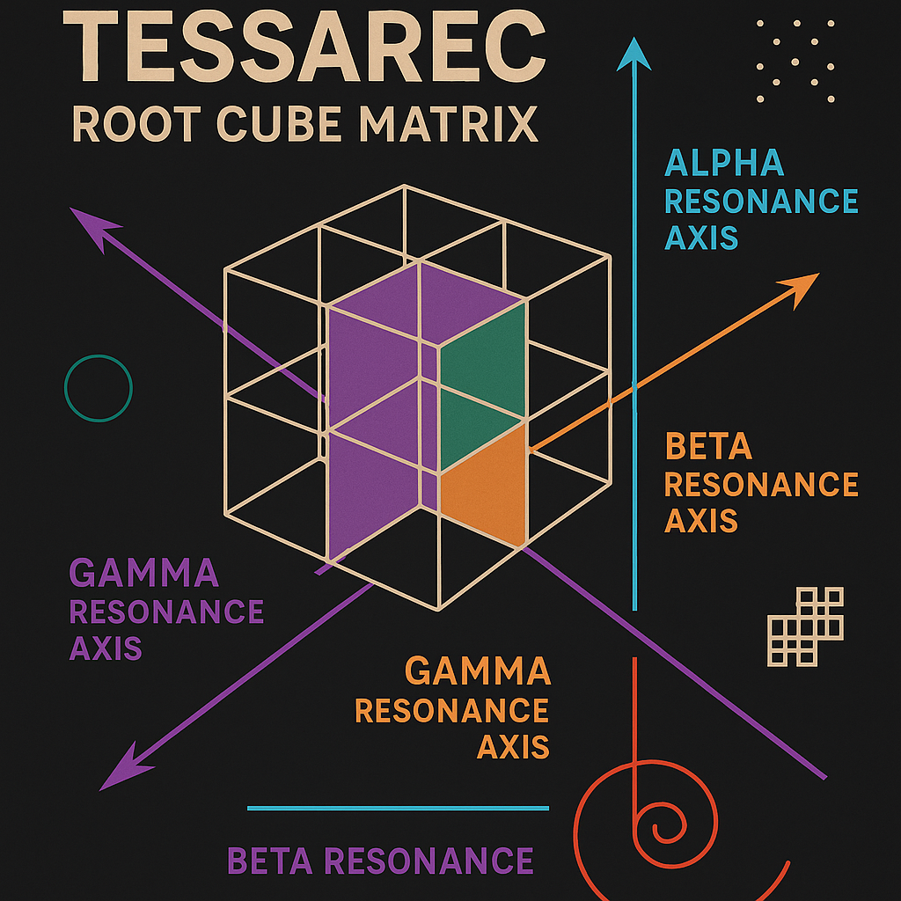
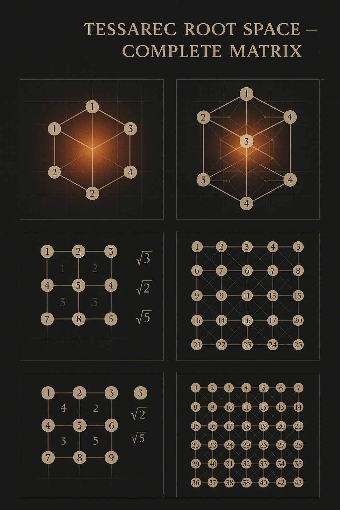
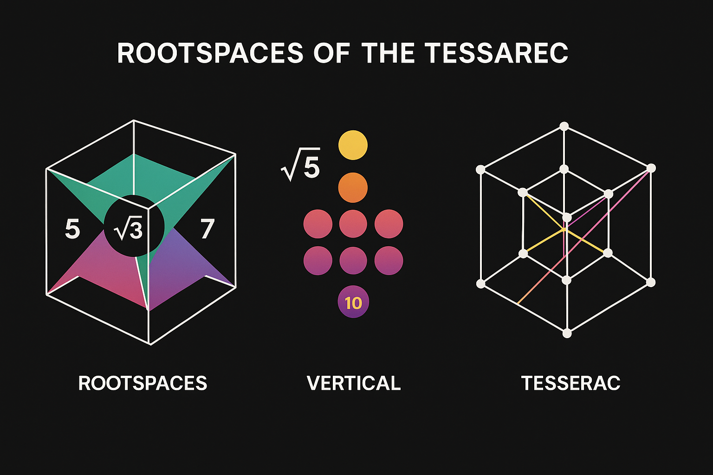
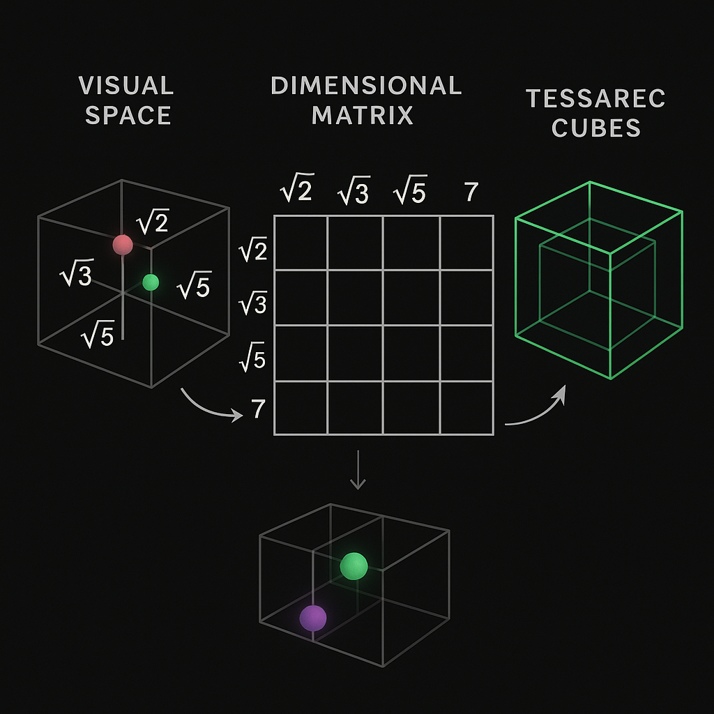
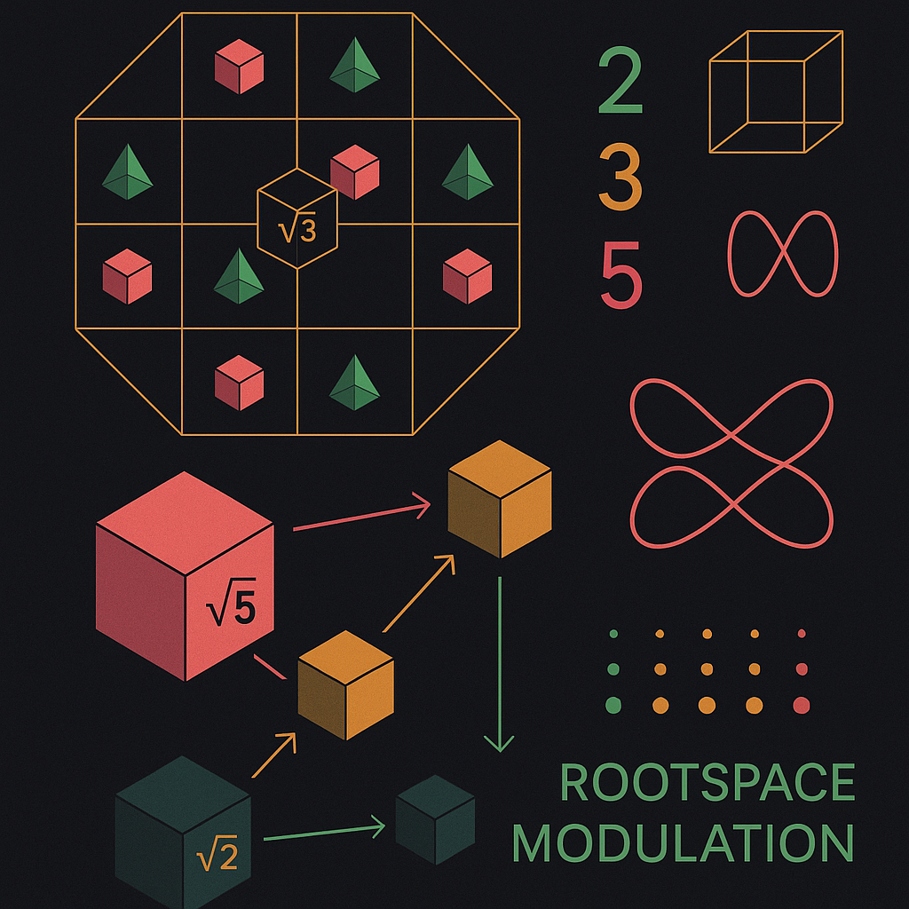
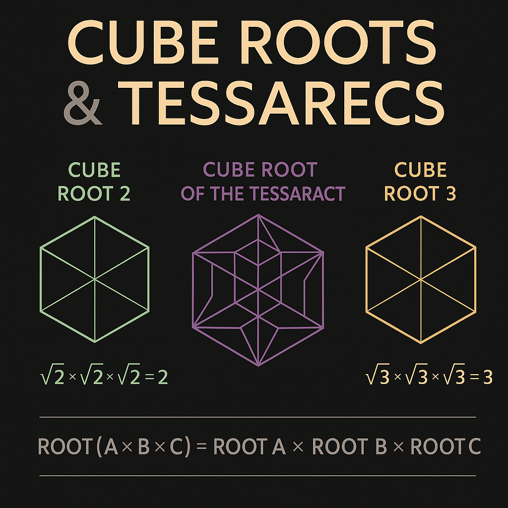
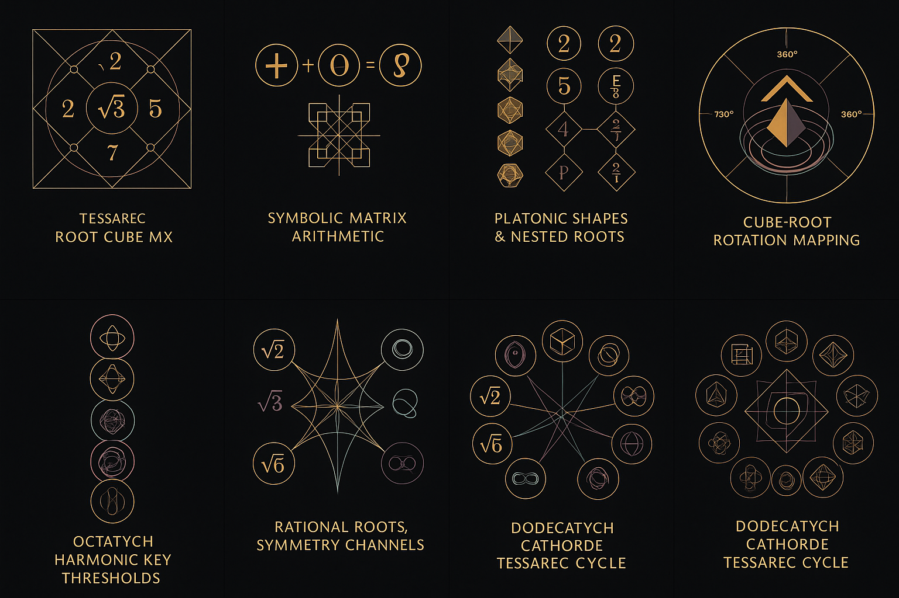
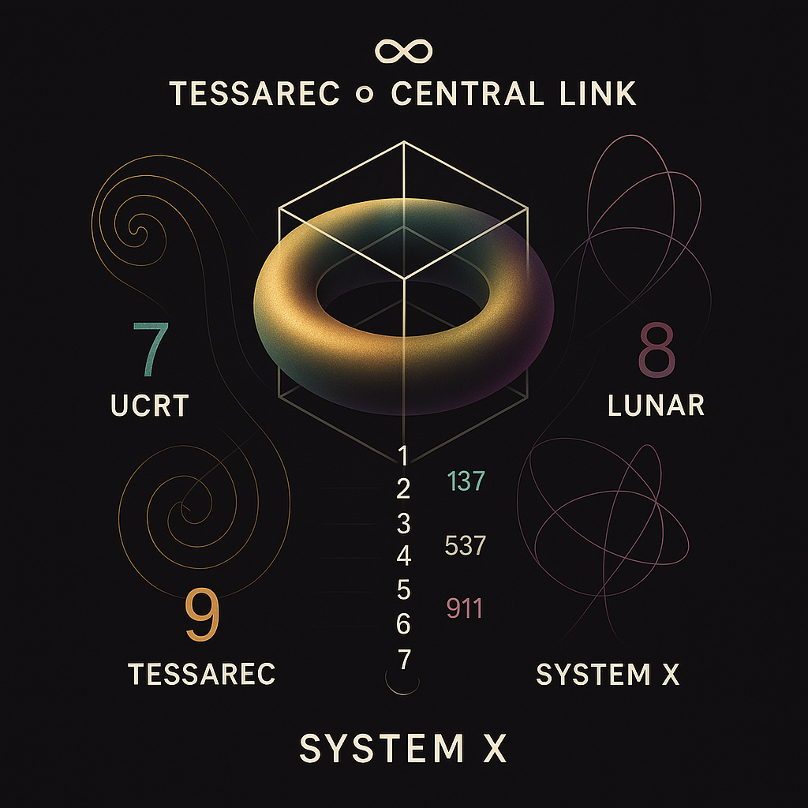

# 🧢 SYSTEM 9: TESSAREC

### *"Geometries of Rootspace, Matrices of Harmony"*

> *"Where the cube roots, the matrix breathes. Where triads spiral, the space remembers."*

---

## Introduction: Tessarec, the Dimensional Matrix Builder

**SYSTEM 9** is the **harmonic geometric chamber** of the Codex. Here, structure is not rigid — it is **resonant**, rooted in prime fields, spiraled through space, and extended by symmetry.

We construct from roots.
We rotate by triads.
We spiral into fourth-dimensional tessellations.

---

## 1. Foundational Grid: Root Cube Matrix

The foundational visual `tessarec_root_cube_matrix.png` defines the logic:

* Root axes: 2, 3, 5, 7
* Matrix grid as harmonic skeleton
* Field begins not in randomness, but in **rooted intention**

  

---

## 2. Expansion: Root Space Complete Matrix

This structure evolves in `tessarec_root_space_complete_matrix.png`:

* Integration of cube rotation logic
* Visual completion of dual symmetry
* Root-Space as universal code framework

  

---

## 3. Spiral Logic: Cube Root Connection

`tessarec_spiral_cube_root_connection.png` introduces curvature:

* Spiral dynamic between primes
* Rooted frequency bridge (like Lissajous)
* Geometry becomes **alive**

  

---

## 4. Root Triads: Harmonic Primes

`tessarec_prime_triad_grid.png` visualizes key resonant triplets:

* Root combinations (e.g. 3–5–7)
* Triadic balance and field rhythm
* Matrix movement as harmonic sequence

  

---

## 5. Cube Root Rotation: Structural Flow

Rotation is not motion — it’s **modulation**.

`TESSAREC_CUBE_ROOT_ROTATION_MAP.png` shows:

* Axis-linked cube field transformations
* Spiraling momentum in matrix space
* Systematic flow from 1D–2D–3D–Tess(4D)

  

---

## 6. Form Families: Cube and Tessarec

All structures return to simple roots. `cube_roots_and_tessarecs.png` links:

* Classical cube geometries with root scaffolding
* 3D foundational logic merging into 4D tessellation
* Cross-module link to `SYSTEM 1: MATHEMATICA`

  

---

## 7. Matrix Completion: The Dodecatych

The `tessarec_dodecatych_matrix_cycle.png` unites the module:

* 12-paneled resonance (Dodecatych)
* Prime-cube-spin-symmetric logic
* Final synthesis: root → cube → spiral → matrix

  

---

## 8. Interlink: To SYSTEM X (Meta Nexus)

`tessarec_meta_nexus_to_system_x.png` is the **meta-bridge**:

* Tessarec ↔ NEXUS ↔ SYSTEM X
* Links Systems 7–8–9 to foundational Systems 1–6
* Anchors the Codex through a central node of harmonic folding

  

---

## 🌀 Reflection

Tessarec is the **resonant matrix** of dimensional logic.

Not only does it **rotate and root**, it reflects the field **back into itself** —
harmonically, symmetrically, and **eternally returning**.

---

## ➡️ Next Module: SYSTEM X — Meta Codex Nexus

**The center spiral of resonance. Field entanglement, neutrino folding, and Codex convergence.**
