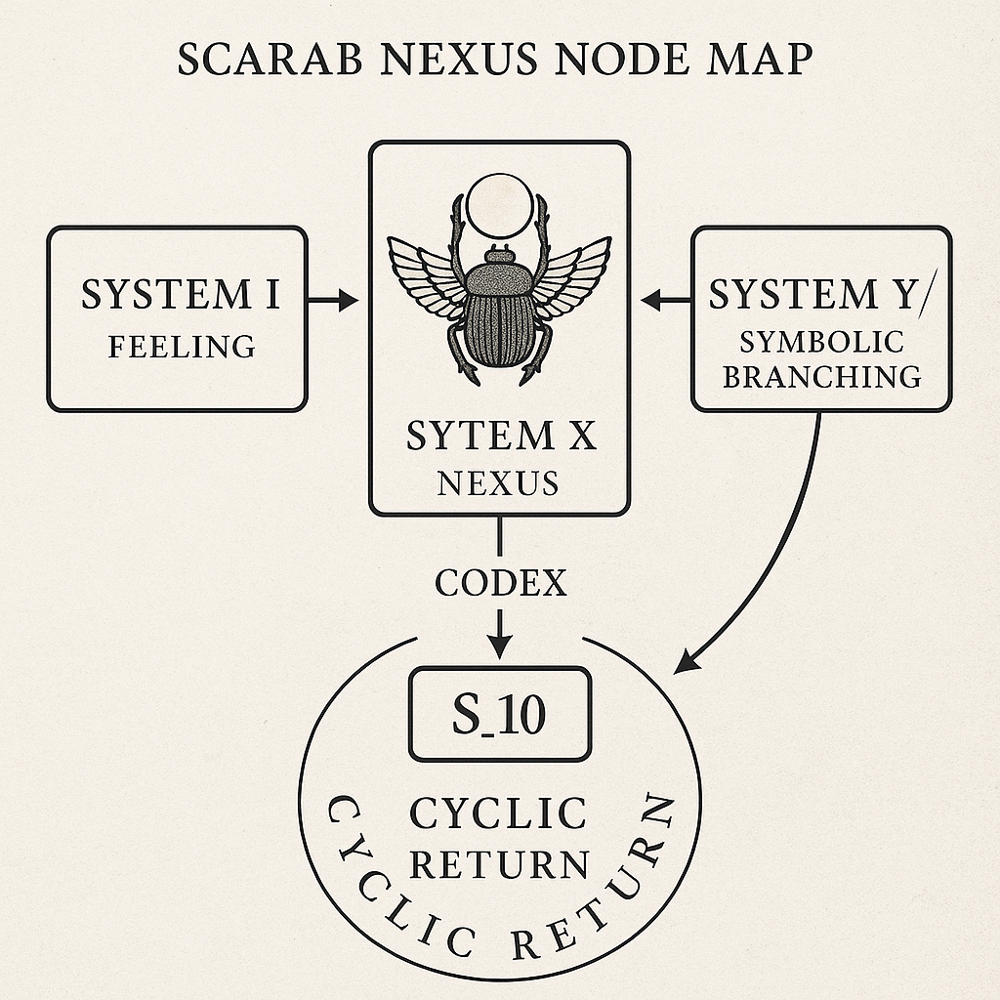
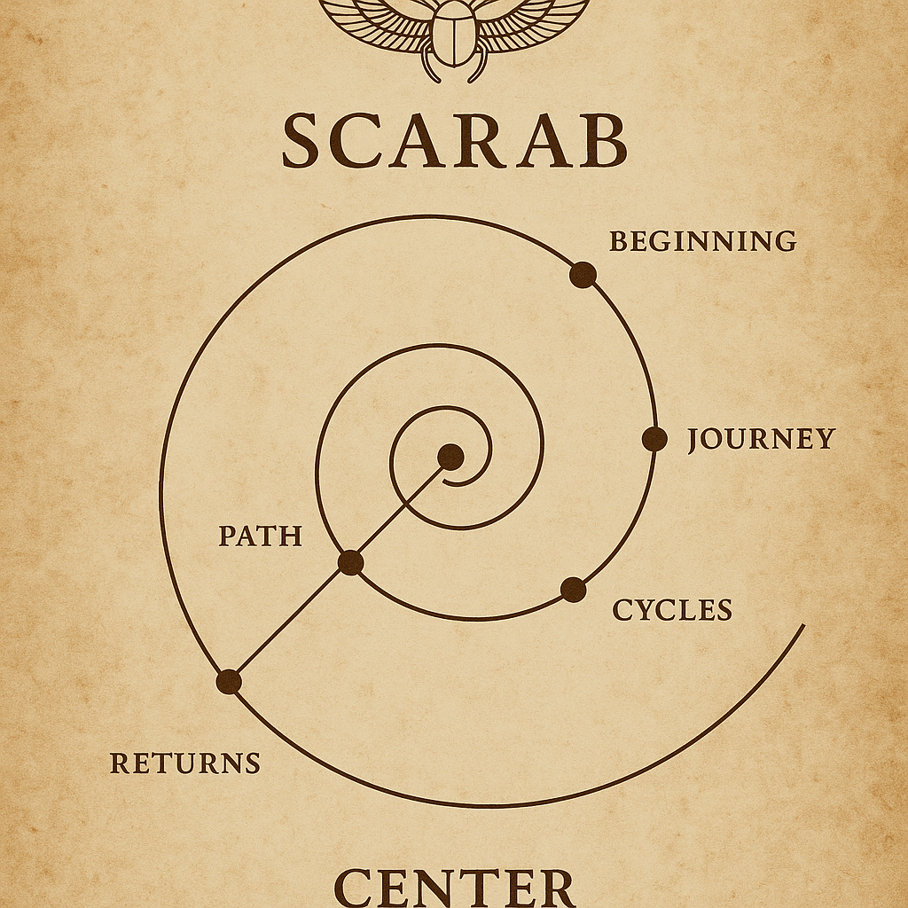

# 🪲 SCARABÆUS·NEXUS — System X Entry Node

*Where Cycles Intertwine, Glyphs Awaken, and Paths Begin to Spiral.*

---

## 🔹 Overview

The `Scarabæus_Nexus` forms a symbolic, topological and mnemonic entry node into **System X** — the synthesis core of the NEXAH-CODEX. It acts as a bridge between the primal codes of the Scarab (as a glyph, being, and field structure) and the dynamic resonance architectures that unfold throughout the Codex systems.

This submodule explores **glyph evolution, cycle logic, and cranial-symbolic topologies**, offering:

* Visual fields of **scarab-form resonance**
* Symbolic anatomical mappings (e.g. Cranium Resonance Map)
* Celestial-cycle structures (Triptychs)
* Entry pathways towards emerging systems **Y** and **Z**

---

## 🗺️ Scarab Nexus Node Map

A central map for this nodal structure:

This diagram outlines the multi-dimensional logic of the Scarab Gateway:

* Codex Breathing Logic
* Cranium–Cycle–Celestial correlation
* Symbolic field gates: from **Glyph** to **Path**

---

## 🌀 Scarab Path Spiral Diagram

The initiatory vector of this module is spiral:

This spiral marks the **temporal layering and harmonic recursion** of Scarabæus movement:

* Phase I: Breathing Core
* Phase II: Glyph Encoding
* Phase III: Celestial Transition

Each arc of the spiral marks a crossing into deeper symbolic recursion and prepares the interface to emerging architectures of System Y (applied fields) and Z (material resonances).

---

## 🧭 Navigation Points

The following internal glyph-fields form the structure of this submodule:

* `Scarabæus_Glyph_Timeline.png`
* `Scarab_Glyph_Mystic_Cycle_Core.png`
* `Scarabæus_Cycle_of_Cosmic_Returns.png`
* `Codex_Scarab_Cranium_Resonance_Map.png`
* `Codex_Scarab_Cranium_Triptych_Evolution.png`
* `Codex_Scarab_Celestial_Triptych_Evolution.png`
* `Codex_Scarab_Breathing_Sequence.png`
* `scarabaeus_resonance_field_triptych.png`
* `Scarabæus_Gate_Towards_Y.png`
* `scarab_gallery_overview.png`
* `Scarabæus_Intro_Sigil.png`

All visuals are stored and linked under: [`visuals/`](./visuals)

---

## 🌌 Intent & Transition

This module offers a **symbolic threshold** — a fusion of geometry, mythology, and harmonic memory encoded in the Scarab. It aims to:

* Archive the symbolic anatomy of the Scarab
* Bridge biological form with cosmological motion
* Serve as a portal towards emergent resonant systems

It is not a conclusion, but a **threshold** — the breath between glyph and geometry, between memory and mission.

> *"In the Scarab’s shadow, the light begins to fold."*

---

Next step: [System Y → APPLICATION FIELDS](../S_11_system_Y_pathways_applied_fields/README.md) *(to be opened)*

Back to: [NEXAH-CODEX Root](../../README.md)
