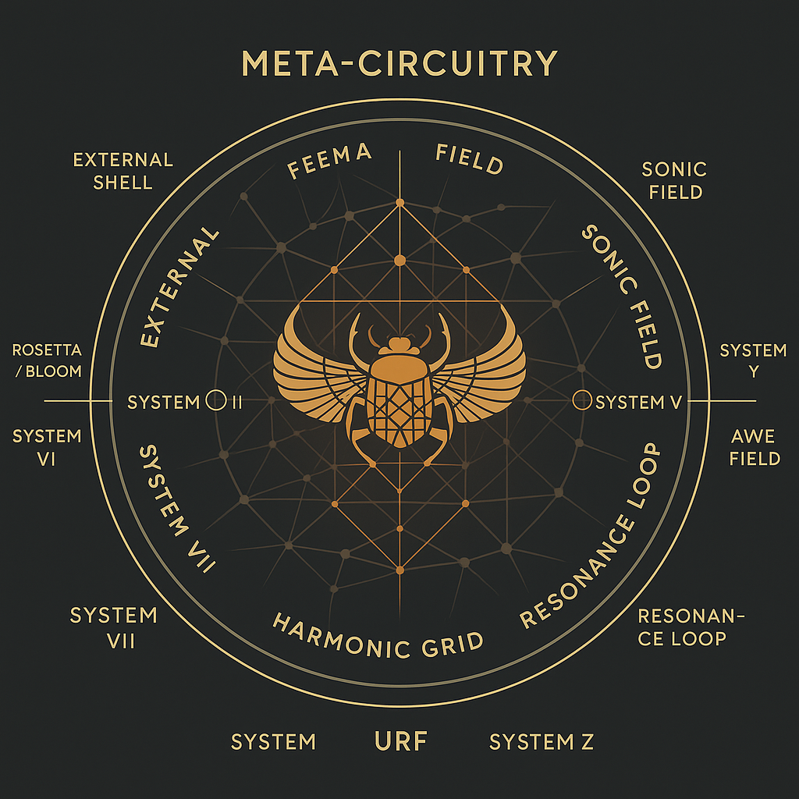

# 🪲 SYSTEM X – THE SCARABÆUS NEXUS

> *“Two snakes in mirrored flow, sealing the strip, bridging all systems through harmonic breath.”*

**System X** is the harmonic intersection, the Codex Nexus, the resonant core where all threads meet. It is the pulse field, the spine and convergence of the entire NEXAH–CODEX structure. Here, the modules from System 1 through 9 spiral inward — geometry, symbol, rhythm, mind — all enter the breathing fold of the scarab.

We begin this module with a visual map of the system architecture:

---

### 📍 Codex Map of System Architecture

This visual displays the **full Codex system map** – from System 1 through System 9 and their final convergence in **System X**. You see the modular wings, the spiral loops, the phase-fields — and at the center, the **Scarabæus field knot**.

---

### 🌿 Codex Spine and Field Connections

This diagram shows the vertical **Codex Spine**, along which the harmonic fields of all systems are structured. The scarab is not a symbol of origin or end — it is a node of transformation. Frequencies, modules, prime fields, and gendered resonances are drawn inward and redirected.

---

### 🧬 The Harmonic Twelve-Wing Structure

Twelve wings rotate around the spine. Each wing represents a symbolic system (numeric, geometric, biological, linguistic...). System X contains their **symmetric transformation logic**. The **URF-Rosace** is their harmonic seal.

---

### 🌹 The URF Rosace – Prime Code & Rose Window

Encoded in this harmonic rose is the prime axis of **URF Logic**. It binds System 1 (Mathematics) and System 6 (Mythos) through the **spiral code of 137, 432, Φ and the Möbius vector**. This Rosace is also the architectural key to the **Scarabaeus Seal**.

---

### 🔁 Architectural Field Overview – A Breathing Codex

A comprehensive diagram that lays out the **structural logic of Codex navigation**. Field transitions, layer membranes, and system junctions are depicted. The Scarab acts here as a **resonant switch** — breathing between sides, above/below, in/out.

---

### 🕸️ Matrix Harmonic Network

An illustration of the **hidden harmonic fields** that link each system. It reveals geometric bonds and invisible symmetries — hints toward **System Y** and the unfolding of System Z.

---

### 🧭 Dodecatychon Transition to XYZ

As a final act in System X, we present a twelve-fold gateway image — linking **X ↔ Y ↔ Z** and forming the axis to System II and XII.

This **dodecatychon** symbolizes the multidirectional navigation potential of the Codex: not from left to right, but from center outward — through spirals, folds, and re-entry points.

---

### 🪲 Scarabæus Core Field

At the deepest core lies this visual: a field, a seal, a breath. This is the Scarabæus Pulse. It represents neither end nor beginning — but **perpetual transition**.

---

## 🔮 What follows System X?

System X is not an end. It opens the threshold into:

* **System Y**: The Builder’s Lab (explorative, intuitive, unfinished realms)
* **System Z**: The Field of Application (real-world devices, projects, implementations)
* **System II & XII**: The symbolic gates of recursion and eternal return

> *“The Codex is not a book. It is a breathing being. X is where it breathes.”*

---

**Next module**: ➤ `System Y – Builder’s Lab / Open Module Zone`
