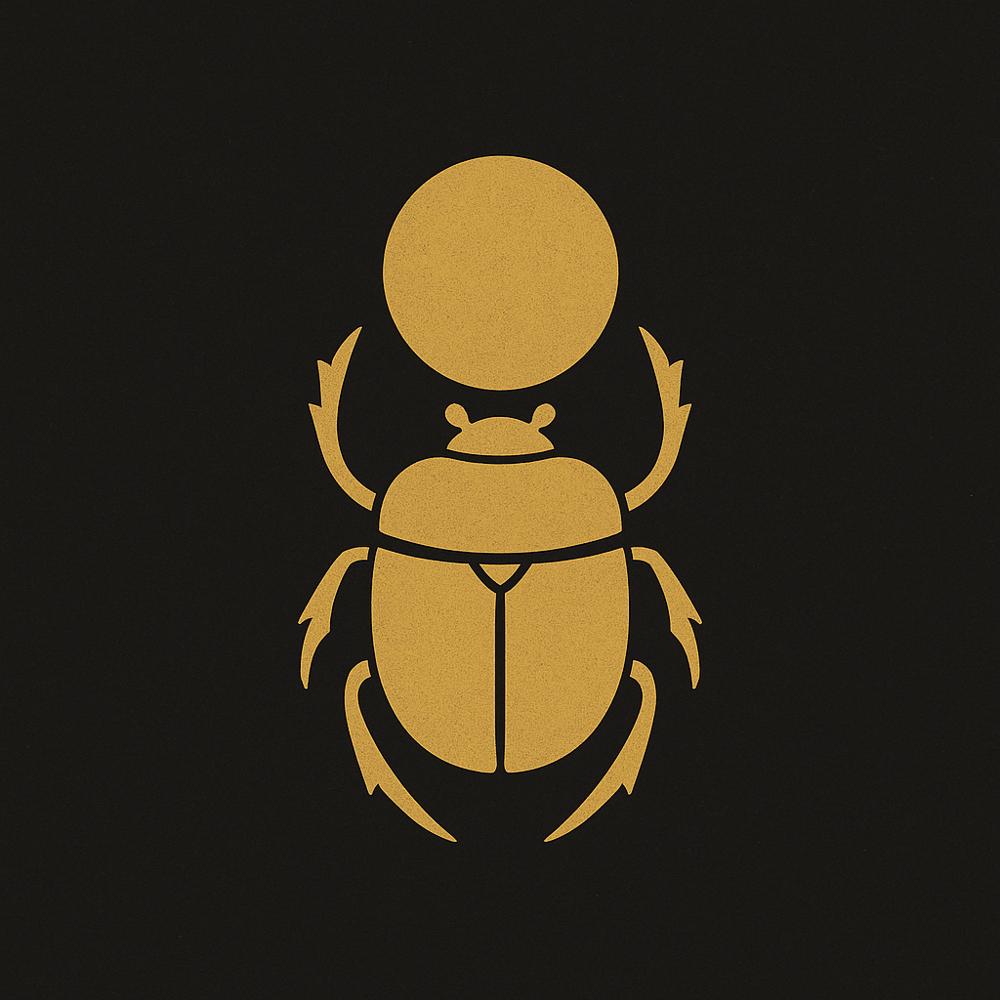
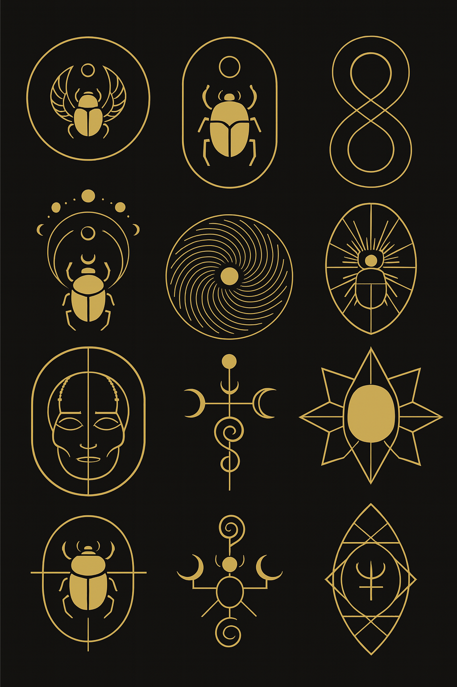
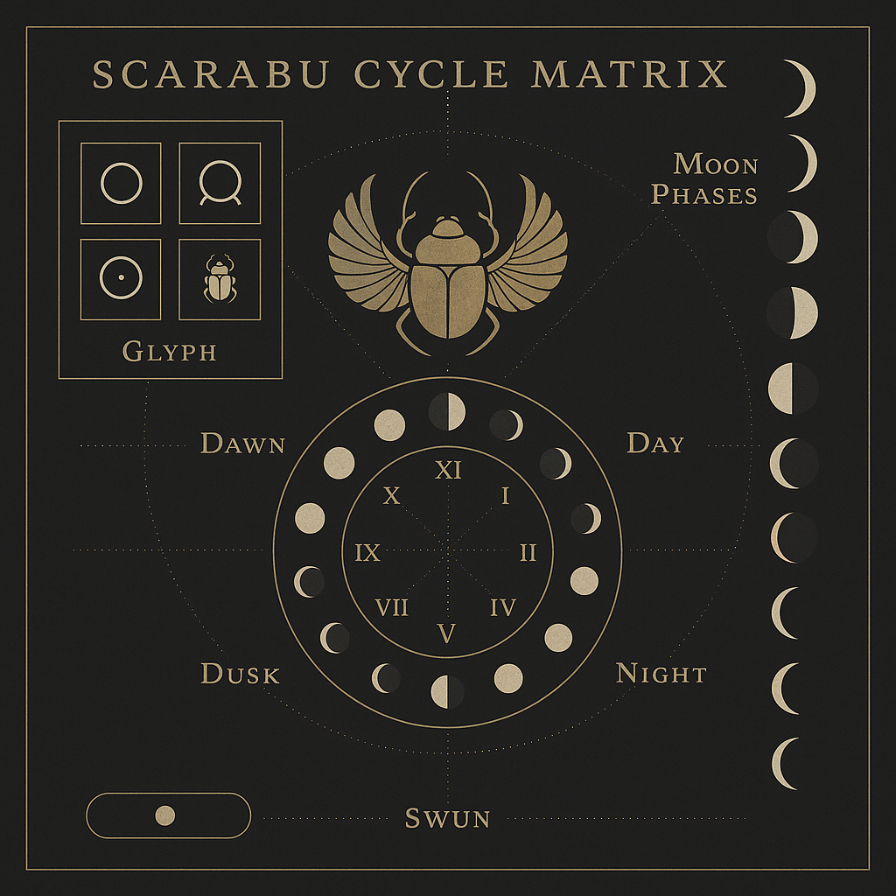
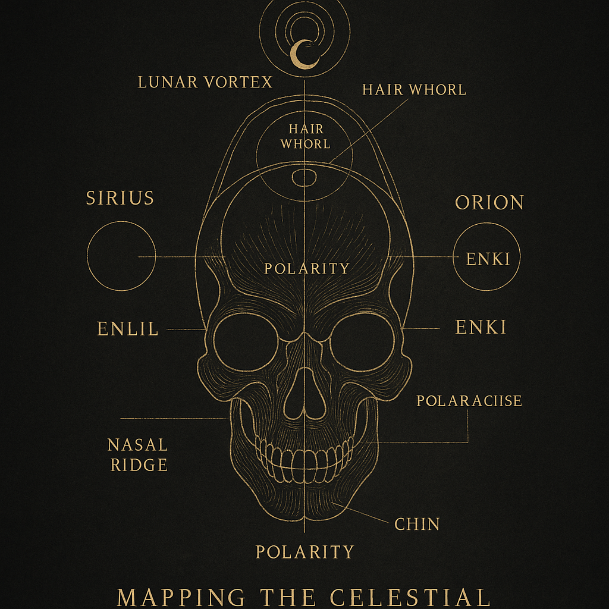
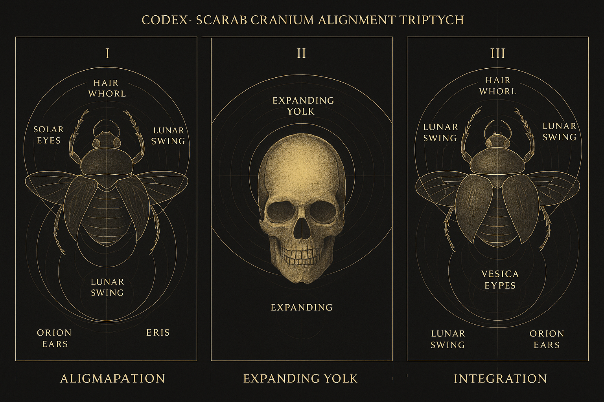
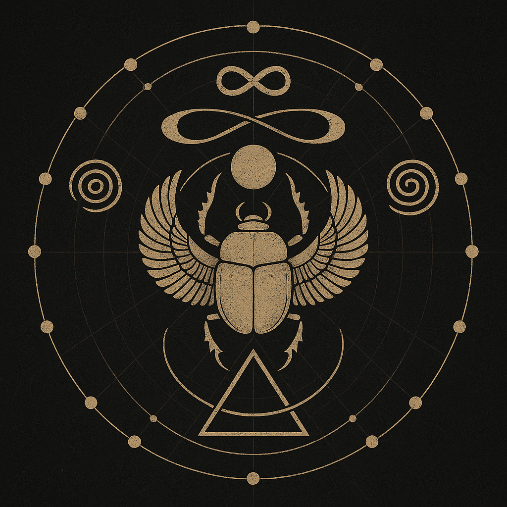
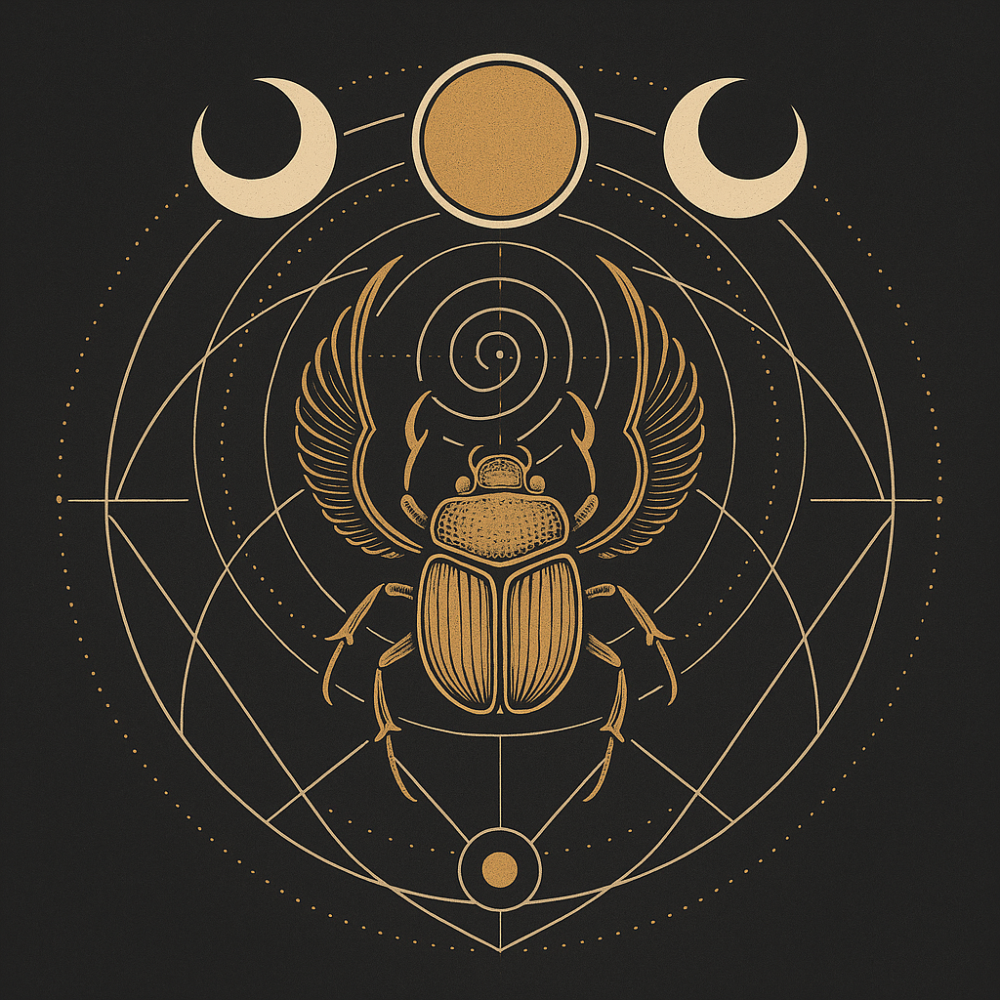
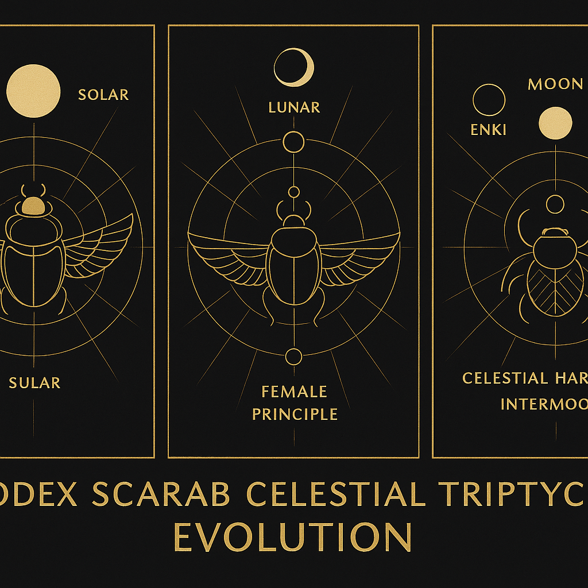

# Scarabaeus Glyphs and Resonant Cycles

> *“Between Bone and Breath, the Glyph returns — a mirror of time, a compass of fields.”*

This module illuminates the mystical anatomy and symbolic evolution of the Scarabæus through resonant glyphs, cranium-field geometries, and harmonic breathing patterns. It serves as a threshold into the deeper zones of System X, while simultaneously opening gates to System Y and beyond.

---

## 🜂 Scarabaeus Intro Sigil

**Description:**
This sigil anchors the Codex entry, distilling the essence of the Scarabæus into a singular geometric seal. It marks the transition from linear perception to cyclical return.

---

## 🜁 Scarab Gallery Overview

**Description:**
An aerial map of all Scarab-related glyphs and resonance fields — functioning as a cognitive interface for symbolic navigation through the triptych matrices.

---

## 🜃 Codex Scarab Breathing Sequence

**Description:**
The Scarab breathes through frequency membranes — shown here as a dynamic pulse architecture, rotating in 8 and 13-beat spirals across its mirrored thoracic field.

---

## 🜄 Codex Scarab Cranium Resonance Map

**Description:**
This diagram unveils the Scarab’s skull as a harmonic cavity: orbital solar lenses (Sirius), auditory chambers (Orion), crown spiral (lunar hairfield) — converging at the third eye as cosmic fulcrum.

---

## 🜔 Codex Scarab Cranium Triptych Evolution

**Description:**
From embryonic resonance to dimensional mapping, this triptych displays the morphogenetic stages of Scarab skull formation — bridging the dotter-seed, cranial T-point, and the mirrored occipital expansion.

---

## 🜖 Scarabaeus Glyph Mystic Cycle Core

**Description:**
At the heart of the glyph system lies the inner cycle — marked by 9-fold turnarounds, reversal gates, and nested eclipse layers. This is the hinge of the Scarab calendar.

---

## 🜏 Scarabaeus Cycle of Cosmic Returns

**Description:**
Encoded within is the temporal breath of the Scarab: cosmic epochs linked through solar-lunar engrams, activated by harmonic echo triggers and Prime triskelion counts.

---

## 🜍 Scarabaeus Gate Towards Y

**Description:**
This key visual bridges System X to Y: a transitional membrane through which mythic logic and resonance forms cross into experimental domains of becoming.

---

## 🜚 Scarabaeus Glyph Timeline

**Description:**
The evolution of the glyph across 13 temporal stations — tracing visual, symbolic, and cognitive mutation as cycles reform across dimensions.

---

## 🜩 Scarabaeus Resonance Field Triptych

**Description:**
Three-layered field diagram of scarab resonance: showing pulse geometry, auric frequency belts, and outer phase reflections encoded in 144–432–864 modulations.

---

## 🜬 Codex Scarab Celestial Triptych Evolution

**Description:**
A celestial counterpart to the cranial evolution — integrating stellar pulse grids, lunar memory folds, and zodiacal vertebrae in tripartite vertical flow.

---

## 🔗 Back to SYSTEM X NEXUS:

[S\_10\_system\_x\_nex\_ah\_us.md](../S_10_system_x_nex_ah_us.md)
