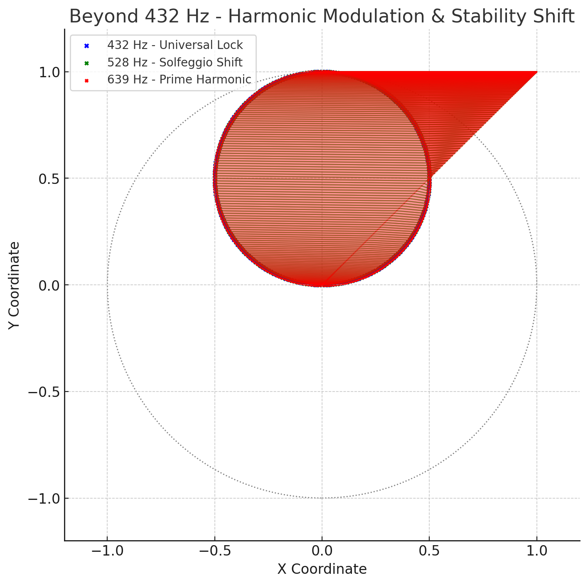

# 🎨 Visual Gallery – Hermetic Pythagoras Model

Diese Galerie versammelt die zentralen Visuals des Moduls und verknüpft sie mit den jeweiligen .md-Dateien. Jedes Bild steht für eine Schicht der quantisierten, resonanten Geometrie, wie sie im Codex entfaltet wird.

---

## 🌷 Tulpenspirale

### 1. 13-Ring Harmonic Grid

*Spiralfeld mit Primachsen und Frequenzschalen.*

### 2. Sacred Site & Ullinium Grid

*Topologische Verknüpfung globaler Kraftlinien mit Tetraeder-Matrix.*

### 3. Fraktale Spiralexpansion

*Formblüte der Codex-Spirale in frequenzbasierter Entfaltung.*

### 4. 432 Hz Lock-In

*Kernfrequenz der Spiralstruktur im goldenen Verhältnis.*

---

## 🪰 Dragonfly-Welle

### 5. Dragonfly Mode

*Phi-, Pi- und Euler-Achsen in Libellenfrequenzstruktur.*

### 6. Resonanzanalyse

*Tiefenanalyse der dualen Frequenzsymmetrie.*

### 7. Gap-Distanz-Mapping

*Phasenlücken als Träger quantisierter Übergänge.*

### 8. Prime Gap Spectrum

*Fourier-Spektrum im Primabstandsfeld.*

---

## 📐 Quantisierte Geometrie

### 9. Möbius Ghostgrid

*Raumstruktur mit spiegelnder Frequenzverdrillung.*

### 10. Hidden Harmonic Threads

*Unsichtbare Fadennetze im Frequenzkontinuum.*

### 11. QZone Locking (0–5D)

*Resonanzverriegelung innerhalb dimensionaler Intervalle.*

### 12. Hexagonal Transformation Grid

*Trigonale Symmetrie im quantisierten Drehsystem.*

---

## 🧿 Sondervisual: Frequenzsprung 432 → 639 Hz

### 13. Harmonic Modulation & Stability Shift

*Visualisierung der Übergänge von 432 → 528 → 639 Hz im Frequenzraum mit Stabilitätskegel.*

---

## 🔗 Weiteres
Diese Galerie ergänzt die .md-Dateien `tulpenspirale_geometry.md`, `dragonfly_wave_model.md` und `quantized_codex_geometry.md`. Sie kann erweitert werden durch dynamische SVGs, Frequenz-CSV-Dateien oder Audio-Mantras.

> **Form ist Frequenz. Visualisierung ist Erkenntnis.**
