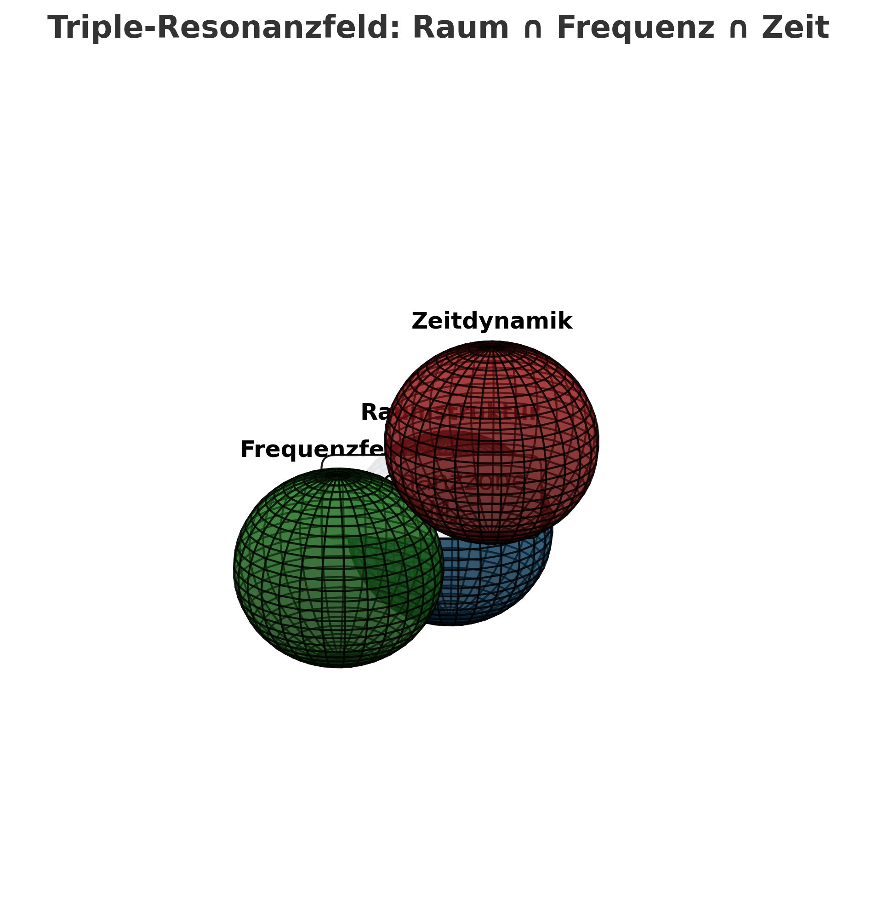

# resonance\_triple\_intersection.md

# 📚 Triple Resonance Intersection – Example Derivation

---

## 🔷 Formal Setup

We extend the basic geometric unity concept by considering three types of resonances:

* **Spatial Resonance** — encoded by $\omega_i$
* **Energetic Resonance** — encoded by $\omega_j$
* **Temporal-Harmonic Resonance** — encoded by $\omega_k$

The fundamental *Triple Resonance Intersection* is given by:

$$
\boxed{\mathcal{R}(M) = \bigcap_{i,j,k} \Phi(\omega_i, \omega_j, \omega_k)}
$$

where $\Phi$ is a resonance interaction function over the fields.

---

## 🧩 Example Construction

Suppose:

* $\omega_i$ represents a spatial curvature field.
* $\omega_j$ encodes an energy-momentum tensor field.
* $\omega_k$ models time-frequency oscillations.

We define:

$$
\Phi(\omega_i, \omega_j, \omega_k) = \text{HarmonicMapping}(g_{ij}, T^{ij}, f_k)
$$

where:

* $g_{ij}$ is the spatial metric tensor,
* $T^{ij}$ is the energy-momentum tensor,
* $f_k$ is a frequency modulation function.

Thus:

$$
\mathcal{R}(M) = \{ p \in M \mid \text{Resonance condition holds for all } (i,j,k) \}
$$

meaning the points $p$ where spatial, energetic, and temporal resonances meet harmonically.

---

## 🌀 Physical Interpretation

The intersection $\mathcal{R}(M)$ forms a **resonant manifold** where:

* Space, energy, and time are harmonically locked.
* Frequency modulations stabilize geometrical structures.
* New dynamic topologies (e.g., tessarecs, Möbius-crystals) emerge naturally.

This triple coupling introduces:

* Stable cycles ($S^1$ structures)
* Harmonic fields ($H^n$ cohomology classes)
* Time-frequency symmetries (resonant clocks)

### ⚙️ Frequency Modulation Details

The frequency modulation function $f_k$ is critical:

* **Function**: $f_k(t) = f_0 \cdot \sin(\omega t + \phi)$
* **$f_0$**: Base frequency amplitude
* **$\omega$**: Angular frequency
* **$\phi$**: Phase shift

By varying $\omega$ and $\phi$ across the manifold $M$, we induce local oscillatory behavior, resulting in:

* Modulated spacetime curvature
* Dynamic field amplitudes
* Phase-coherent energy transfers

This links the resonance field to physical observables like gravitational wave modulation or vacuum energy fluctuations.

---

## 🌐 Physical Analogies

* **Gravitational Waves**: Resonance zones behave like standing wave patterns.
* **Neutrino Oscillations**: Temporal resonance shifts mimic flavor oscillations.
* **Photon Resonance Chambers**: Energy fields trapped and modulated inside geometric cavities.
* **Tessarec-Lattices**: Four-dimensional lattice structures arising from resonance stabilizations.

These analogies connect the abstract model to experimental and observable physics.

---

## 📊 Visual Representation

---

## 🔗 Related NEXAH Modules

* [NEXAH GRAND-CODEX](https://github.com/Scarabaeus1033/NEXAH-CODEX/tree/main/NEXAH-CODEX-Startstruktur/GRAND-CODEX)
* [Resonance Constants Core](https://github.com/Scarabaeus1033/NEXAH-CODEX/tree/main/SYSTEM%207:%20%F0%9F%9A%B1%20UNIVERSAL%20RESONANCE%20FIELDS%20%26%20CONSTANTS%20%E2%80%94%20UCRT/UCRT_CORE)

---

\© Scarabäus1033 · 2025 · All Resonances Reserved.
