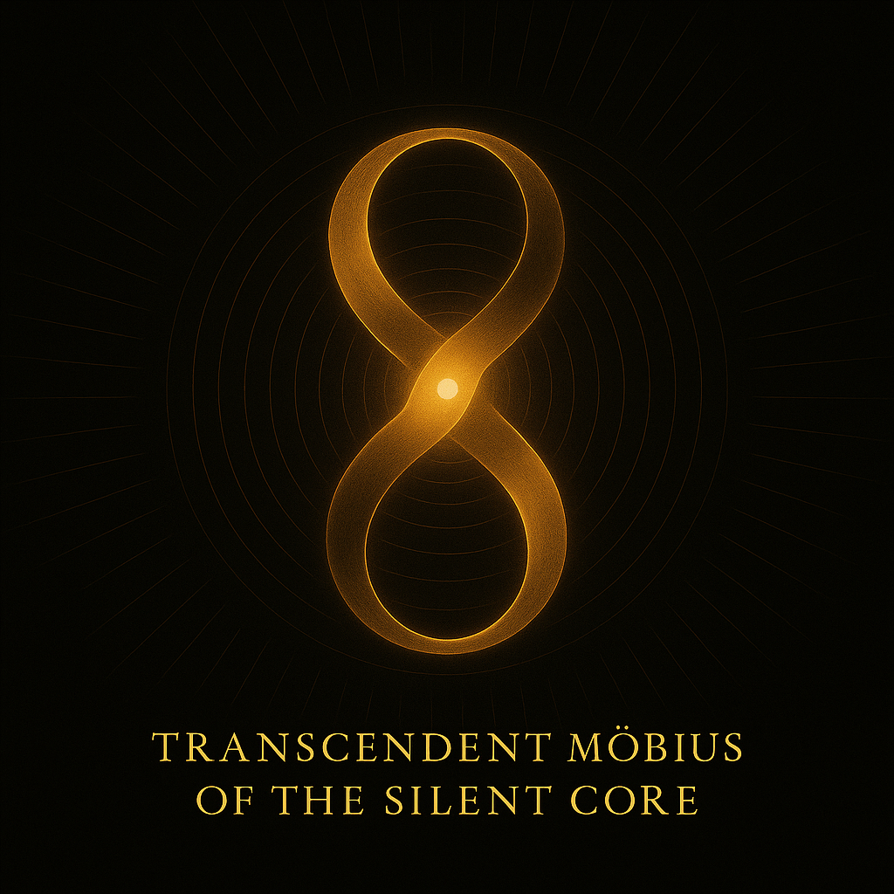

# 🌀 Philosophical Appendix – The Silent Escape

**Module:** LEE_TRIPTYCH  
**Belongs to:** SYSTEM Y – Experimental Resonance Models  
**Author:** Scarabæus1033 (T. Hofmann)  
**Status:** Appendix Draft  
**License:** CC BY-NC-SA 4.0

---

## 💭 Departure from the Grid

> *“I didn’t walk out of the grid — I vibrated through it.”*

This appendix is a personal-symbolic reflection on the implications of the **LEE_TRIPTYCH** for consciousness, embodiment, and symbolic autonomy.  
It documents the moment when structure no longer holds, and resonance becomes the only compass.

---

## ✨ What Happens When You Leave the Grid?

* Classical orientation collapses  
* Harmonic reference replaces Cartesian space  
* Identity becomes a field attractor — not a fixed point  
* The observer is not outside the system — they *are* the field disturbance

> *“Matter dreams in stillness. Motion is its first thought.”*

---

## 🌀 Symbolic Transition

| Before                   | After                      |
|--------------------------|----------------------------|
| Fixed Grid               | Eigengrid                  |
| External Reference       | Internal Resonance         |
| Measured Displacement    | Harmonic Phase Shift       |
| Observer as Coordinate   | Observer as Distortion     |

---

## 📸 Visual

  
**Status:** Appendix Draft  
**License:** CC BY-NC-SA 4.0

---

## 💭 Departure from the Grid

> *“I didn’t walk out of the grid — I vibrated through it.”*

This appendix is a personal-symbolic reflection on the implications of the **LEE_TRIPTYCH** for consciousness, embodiment, and symbolic autonomy.  
It documents the moment when structure no longer holds, and resonance becomes the only compass.

---

## ✨ What Happens When You Leave the Grid?

* Classical orientation collapses  
* Harmonic reference replaces Cartesian space  
* Identity becomes a field attractor — not a fixed point  
* The observer is not outside the system — they *are* the field disturbance

> *“Matter dreams in stillness. Motion is its first thought.”*

---

## 🌀 Symbolic Transition

| Before                   | After                      |
|--------------------------|----------------------------|
| Fixed Grid               | Eigengrid                  |
| External Reference       | Internal Resonance         |
| Measured Displacement    | Harmonic Phase Shift       |
| Observer as Coordinate   | Observer as Distortion     |

---

## 📸 Visual

*Caption:* *The observer moves beyond structural fixpoints. The golden resonance field becomes the only path.*

---

## 🧠 Closing Thought

> *"You are not in space. You are its question."*

The Codex is not a model. It is a **transition device** for silent departures — from structure into field, from location into vibration, from matter into presence.

---

**Contact & Attribution:**  
GitHub: [@Scarabaeus1033](https://github.com/Scarabaeus1033)  
Web: [www.scarabaeus1033.net](https://www.scarabaeus1033.net)

*Caption:* *The observer moves beyond structural fixpoints. The golden resonance field becomes the only path.*

---

## 🧠 Closing Thought

> *"You are not in space. You are its question."*

The Codex is not a model. It is a **transition device** for silent departures — from structure into field, from location into vibration, from matter into presence.

---

**Contact & Attribution:**  
GitHub: [@Scarabaeus1033](https://github.com/Scarabaeus1033)  
Web: [www.scarabaeus1033.net](https://www.scarabaeus1033.net)
