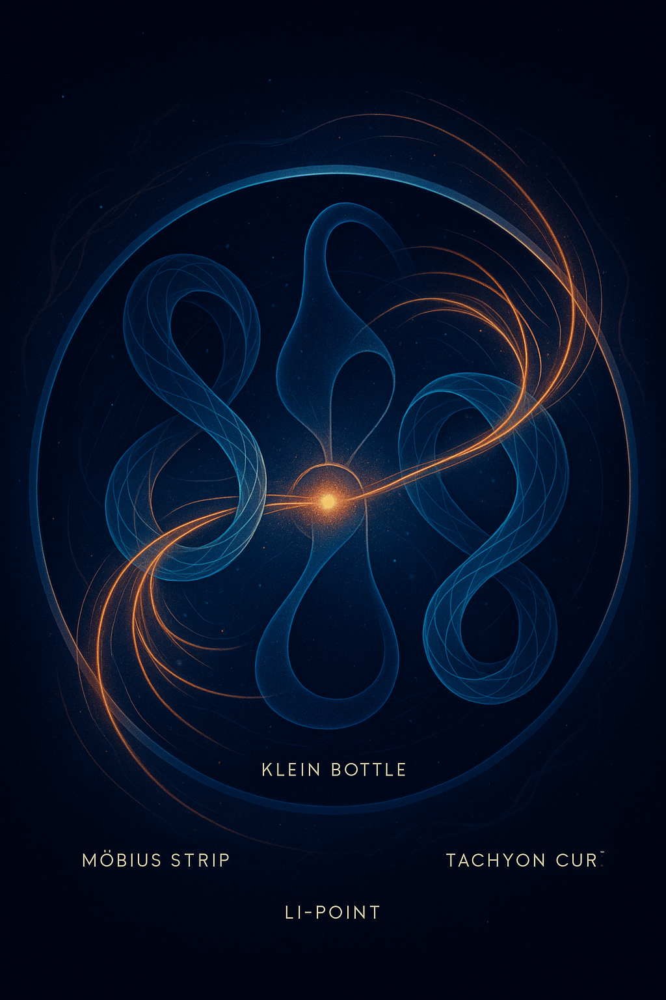

# 🖼️ Visual Gallery – THE LEE TRIPTYCH

This visual index supports the abstract and mathematical formulation of the **LEE_TRIPTYCH** module.  
All visuals are thematically connected to symbolic field emergence, topological transitions, and harmonic motion.

---

### 1. Möbius → Klein → Tachyon Flow

**Filename:** `symbolisch-physikalischer_Codex_stabiler_Loop-Universumsstruktur.png`  
**Belongs to:** `LEE_TRIPTYCH.md`  
**Meaning:** Symbolic transition of a Möbius loop into a Klein bottle with tachyonic flow lines forming a stabilized field.

---

### 2. LEE Expansion Field – Moonwalk Mode

**Filename:** `Atome_Moonwalken.png`  
**Belongs to:** `LEE_TRIPTYCH.md`  
**Meaning:** Atoms begin to follow internal resonance paths within a harmonic expansion zone — self-referencing motion.

---

### 3. Moonwalk of Atoms – The Gridless Grid

**Filename:** `MOONWALK_OF_ATOMS-ASCENT_OF_THE_GRIDLESS_GRID.png`  
**Belongs to:** `LEE_TRIPTYCH.md`  
**Meaning:** The resonance field becomes a guiding matrix. Classical grid disappears; field defines motion.

---

### 4. THE LEE TRIPTYCH – Final Panel Layout

**Filename:** `THE_LEE_TRIPTYCH.png`  
**Belongs to:** `LEE_TRIPTYCH.md`  
**Meaning:** Modular triptych: Möbius Genesis – Klein Emergence – LEE Expansion. Diagram of symbolic transitions.

---

> *“From loop to law: the structure sings its field.”*
