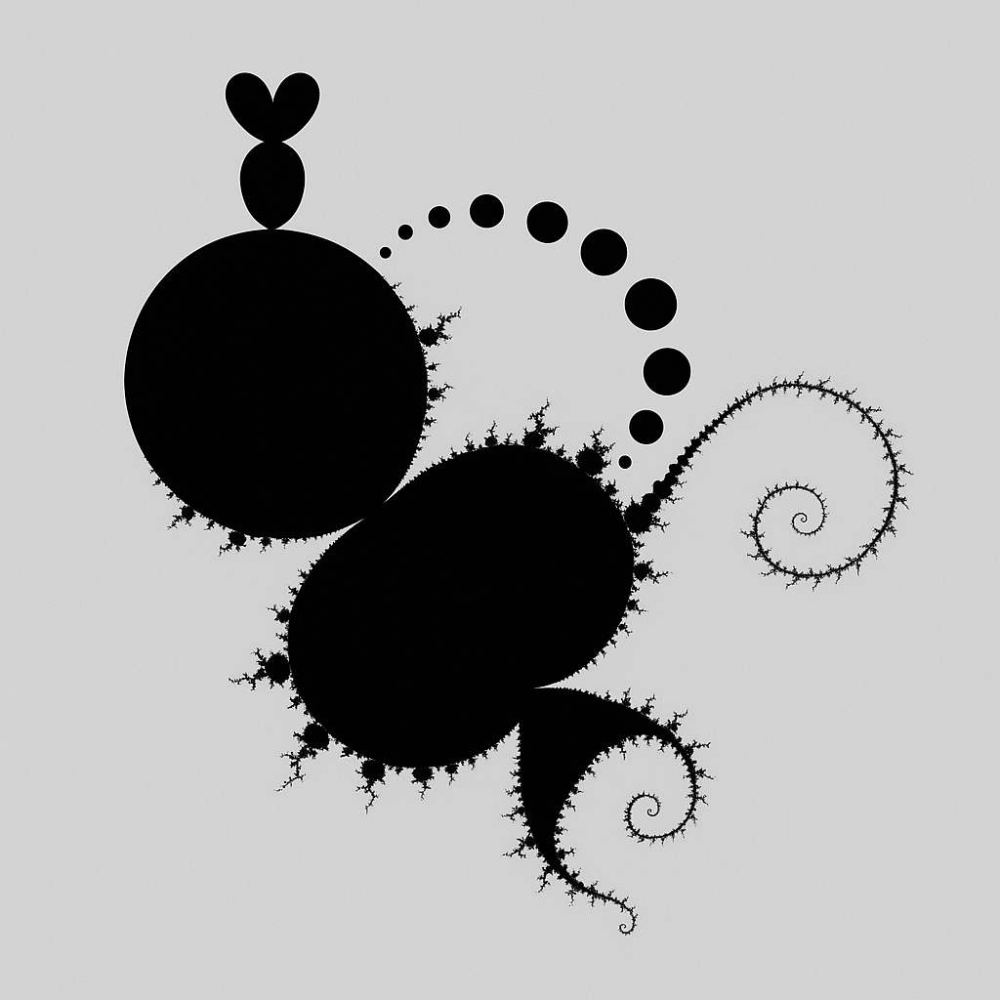
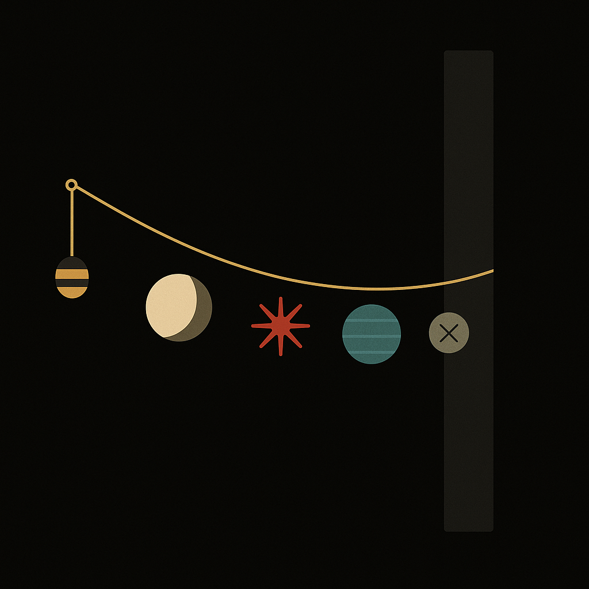
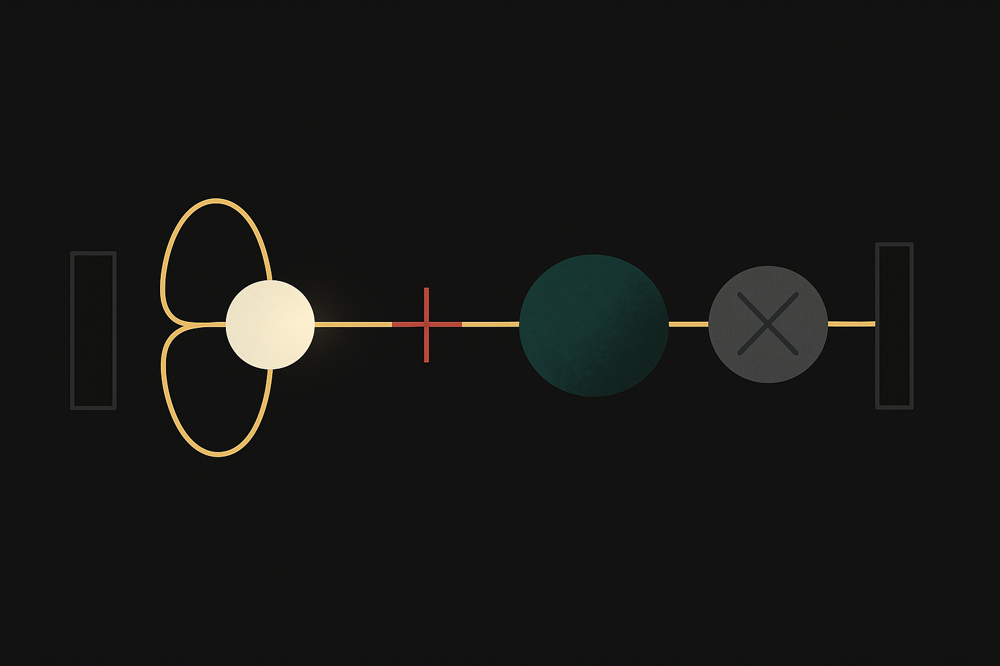
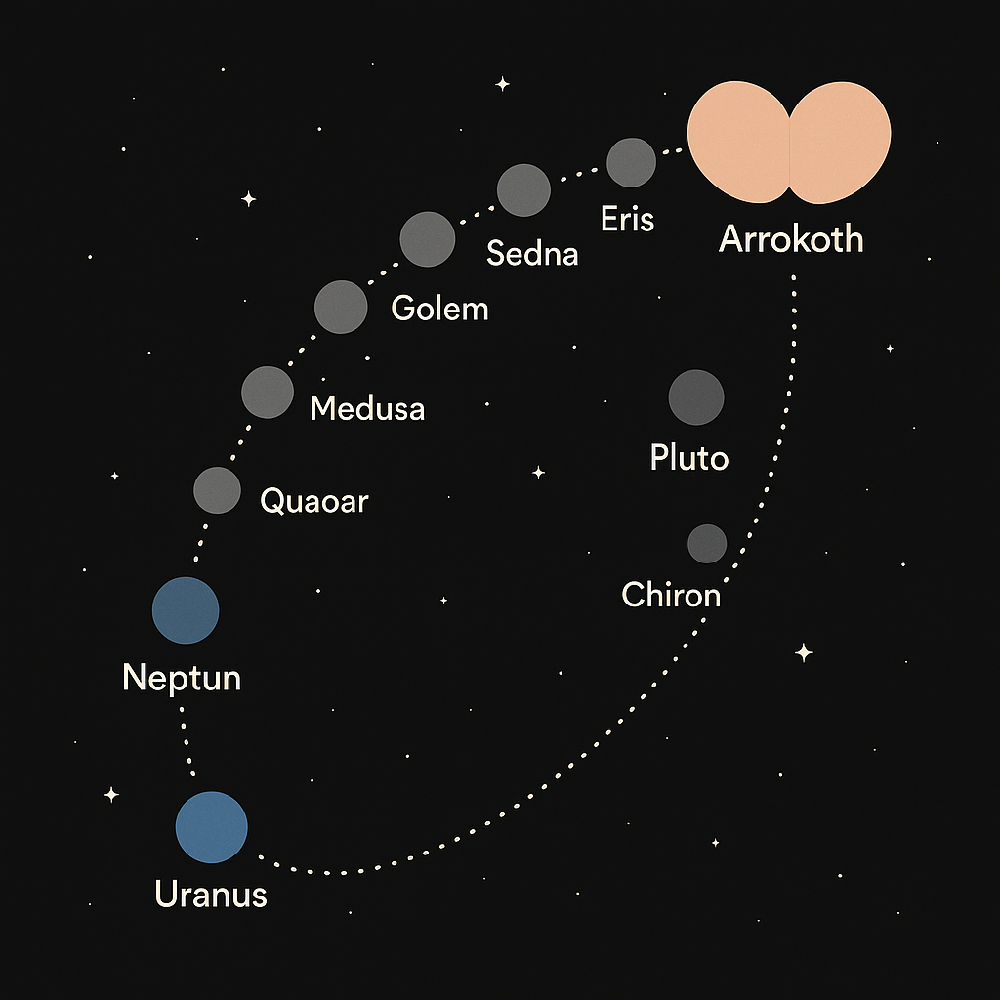
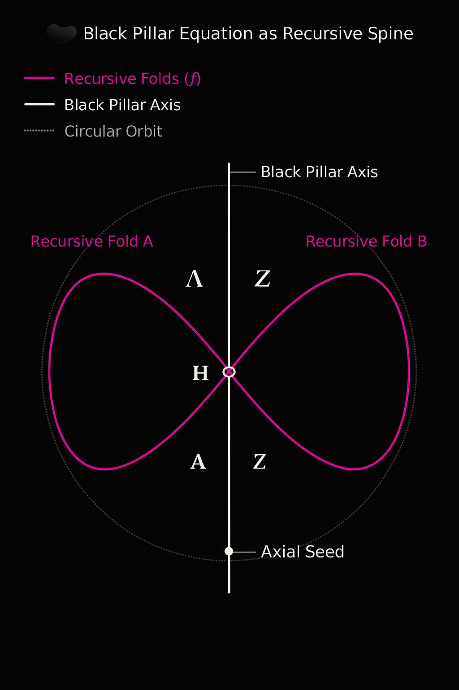

# 🖼️ `visual_gallery.md`

## Title
**Visual Gallery** – Mandelbrot Planet Fold · Prime Resonance Projections

---

This gallery collects and explains the core visual components of the `MANDELBROT_PLANET_FOLD` module within **SYSTEM 1** (Mathematica). These images link **fractal mathematics**, **cosmic topologies**, and **prime-based resonance structures** in one evolving symbolic model.

---

## 🌀 Mandelbrot Structures

### 1. **Mandelbrot_the_whole_thang.png**
  
*A complete symbolic-fractal overview: from the Mandelbrot heart (lower left) to the planetary zoom zone (upper right). Arrokoth is visualized as a twin-leaf signature at the tip. This represents the full cosmogram: origin to resonance embrace.*

### 2. **mandelbrot_tail_section.png**
  
*A symbolic section of the Mandelbrot Set’s spiral arm: four primary windings and one return curve. At the tip, Arrokoth’s form as butterfly or twin-egg emerges — the point of conscious seeding.*

---

## 🌌 Neutrino / TNO String Visual Series

### 3. **01_string_of_vision_from_blackpillar.png**
  
*A golden resonance thread spans the cosmos: From the Black Pillar (left) through five nodes — Mercury (blink), Moon (loop), Red Node (Lagrange), Neptune (dream), Planet X (grey eye). Vision is encoded perception — a cosmic neural field.*

### 4. **02_neutrino_projection_knotloop.png**
  
*A curved light path through a field-knot loop — with the Moon as lens, Red Node as energetic mirror, and X as invisible target. Perception is not light, but field topology.*

### 5. **03_tno_string_knotring.png**
  
*Outer solar objects in a resonant ring: Uranus → Neptune → Sedna, Medusa, Eris → Pluto, Chiron → Arrokoth. Arrokoth as heart, butterfly, keystone. The outer resonance arc — chaos to cohesion.*

---

## 🔭 Planetary Resonance Fields

### 6. **Z00m_to_Arrokoth_Q-Lens_Zone_Mandelbrot.png**
  
*Precise planetary locations mapped within Mandelbrot’s Q-lens zone: Chiron, Pluto, Arrokoth. A convergence of symbolic astronomy and fractal mathematics.*

---

## 🔁 Morphology and Resonant Ideals

### 7. **Resonante_Körpermaße_–_Schönheitsideale_über_Zeit.png**
  
*Time-mapped resonance body proportions – from Venus of Willendorf to 21st-century aesthetics. Encodes shifting cultural ideals into harmonic graphs.*

---

## 🧿 Additional Visual Resonators

### 8. **black_pillar_resonance_diagram.png**
  
*The central resonance axis (Black Pillar) shown as vertical recursive conduit — spiraling across symbolic domains: from Mandelbrot tail to quantum seed.*

### 9. **Doppel-Oval_mit_Spiegel-Dreieck_O-Z-^.png**
  
*Zeta–Theta–Lambda triangle in a mirrored 8-form oval: resonance bridge and field inversion model — the blink geometrized.*

### 10. **Codex_Raumschiff_Dodekaeder_Spiralnetz.png**
  
*Dodecahedral field architecture, wrapped in spiral logic. A vessel for the Codex observer system — inner flight and outer map.*

### 11. **Dodekaeder_Observer-Vektoren_ueber_dem_Spiralnetz_Codex-Projektion.png**
  
*Codex projection of observer paths in a 12-node structure. Vector resonance overlayed on spiral grid — the framework of embedded perspective.*

---

## 📌 Notes
- All visuals link to prime number resonance, projection mechanics, and aesthetic-harmonic interpretation.
- Further symbolic overlays are expected in `symbolic_projection_operators.md`.

**Curated by:** Thomas Hofmann (Scarabæus1033)
