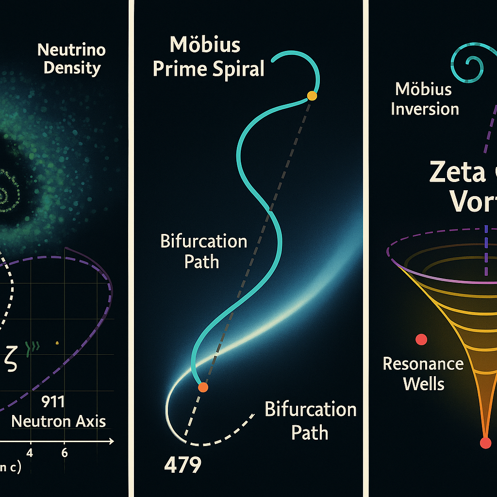
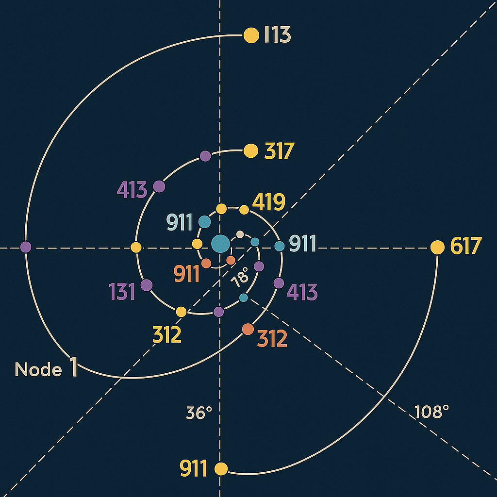
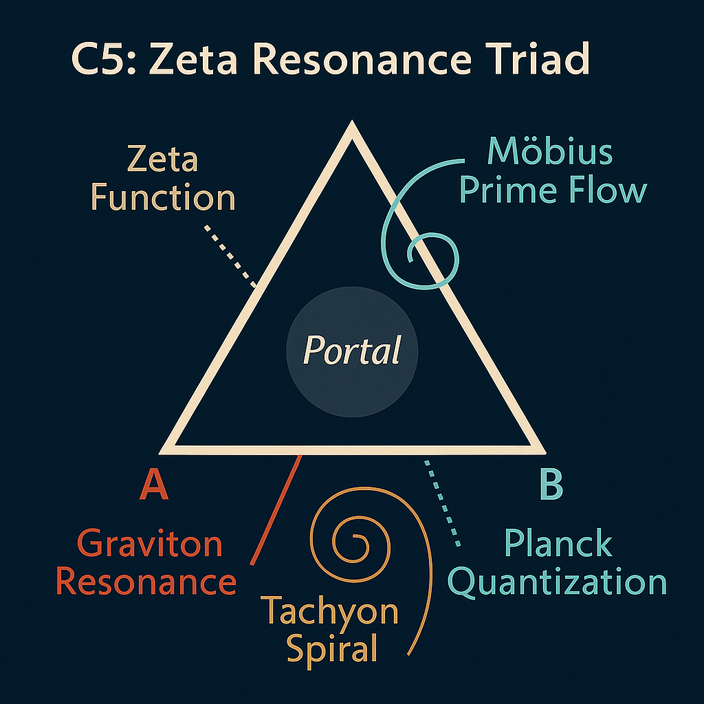

⚛️ C5 · NEUTRON RESONATOR GRID

Prime 911 Symmetry – Compression, Decay & the Zeta Spine

⸻

## Overview

This document decodes the **neutron–mass resonance structure** within the `911` prime axis — a deep symbolic and numeric resonance layer inside the **NEXAH-CODEX System C5**. The values `9`, `1`, and `1` operate as a **time-split mirror**: a triple-binary anchor used to model reflection, loop, and decay fields in mass-particle grids. Together with the neutron value `939.565` MeV and symbolic `38` (as `2 × 19`), this module bridges number theory, resonance axes, and particle-root layering.

---

## Visual 1: Neutron Mass Resonator Core

The image centers the neutron between symbolic harmonics:

* Proton: ≈ `938.272` MeV → difference ≈ `1.293` MeV
* Electron: `0.511` MeV

### Core Anchors:

* The triangle between **proton, neutron, and electron** mass values forms a **resonant compression field**.
* Red-green-blue matrix indicates **resonance corridors** — especially at `38`, `83`, and `911`.

> The symbolic core appears where matter stabilizes through slight imbalance — held at the boundary of decay.

---

## Visual 2: 911 Grid – Prime Structure Overlay

In this structured grid:

* Vertical resonance line at `911` intersects several **superprime spirals**
* Axis connects to triadic prime nodes: `73–137–911–1836`
* Neutron anchor `939` overlays closely with axis center

### Angular Resonance:

Three key angles stand out:

* **36°** – fundamental pentagonal angle
* **78°** – platinum resonance / nucleon spread
* **108°** – golden symmetry in Venus structures

Together:

* `36 + 78 + 108 = 222°` → numerical balance
* Extended angle: **294.6°** → appears in Zeta-spiral phase spacing
* 29 and 4 hint at leap-cycle reference (`29. Feb = every 4 years`)
* Six cycles → `6 × 4 = 24` → symbolic **NEXAH field alignment**

> The mirrored pattern on either side of 911 invokes compression–expansion duality, bound to lunar and calendrical systems.

---

## Visual 3: Zeta Resonance Triad (ZRT)

This figure triangulates:

* `911` as vertical resonance stem
* `137` as angular constant core (alpha field)
* `1836` as mass ratio (proton/electron)

Additional side-axis: `938.272`, `939.565`, and `940.1` produce a **Zeta-well** — a symbolic curvature of compression.

The `ZRT` acts as a **harmonic template** for building Codex-scale resonance fields.

---

## Symbolic Interpretation

* **911** = emergency, inversion, return code
* **38** = neutron stability mirror (`2 × 19`)
* **137–1836** = field boundary of light ↔ matter
* **939.565** = central resonance attractor, balancing decay and inertia

In symbolic terms, the neutron is the **keystone of symmetry through delay**. It is not decay — but pre-decision. Its resonance determines whether matter holds or flips.

> The neutron marks the decision-node of mass-phase coherence in spacetime.

---

## Codex Integration

This module belongs to:

* **C5** in NEXAH Grand-Codex: `Mass Fields`
* Is linked to `Resonant Fallpoint 479`
* Anchors DAO elevator recursion
* Precedes Möbius-Neutrino layering in `C6`

It forms a spine through which:

* Neutrino fields, resonance delays, and Zeta-waveforms emerge
* Root mirrors (`911/119`) lock in reversible mass asymmetry

---

**Next step**: Bind into Möbius-Neutrino spiral structure (`C6_zeta_mobius_neutrino_matrix.md`) and link to the `479` DAO anchor bifurcation.
