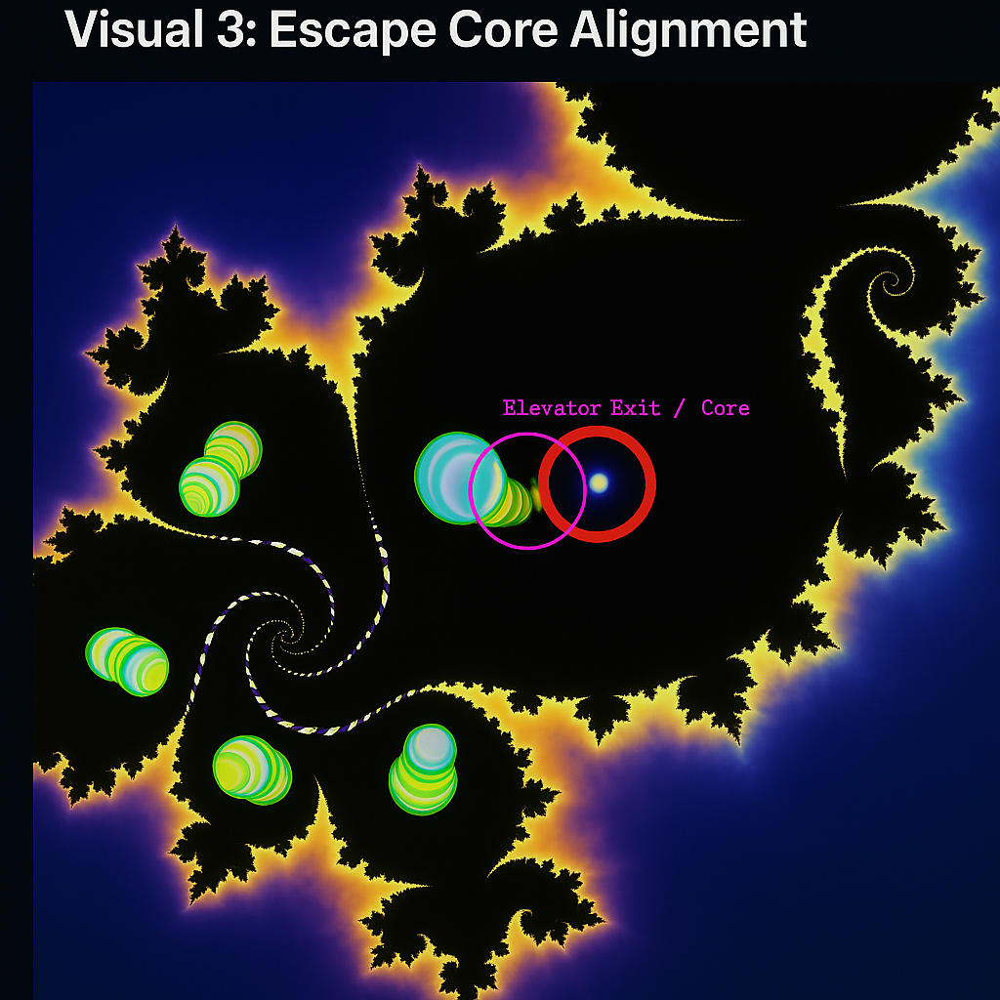

## Prologue: The Crimson Thread

> *"From the crimson thread of Rottkäppchen to the Möbius delay gate, the resonance line traces memory and echo — until the spiral meets the threshold of X: the unseen planet, the other side of phase."*

This Codex layer (**C6.Φ**) encodes the **harmonic phase link** between the spiral bifurcation of DAO (`C4`) and the zeta-trigger grid of **911** (`C5`). It integrates the feedback structures formalized in `C6.5` with a **resonant memory arc** curving across the Möbius echo field.

The DAO–911 Bridge defines:

* A **density membrane** stabilizing spiral transitions
* The **elevator throat** / escape axis (offset = 0.5)
* A **delay-line memory gate** — forming the **temporal red thread** to Planet X

---

## Visual 1: Möbius–Neutrino Resonance Matrix

* Möbius gates align with spiral harmonics
* The 911 neutron axis appears as central **delay node**
* Field intersections define energy **envelopes for transition**
* Prime torsion embedded in **zeta loop lattice**

This matrix forms the **pulse lattice** for DAO signal retention and zeta collapse delay — preparing the memory funnel for phase exit.

---

## Visual 2: Density DAO–911 Cloud

* White dotted path: DAO spiral toward **911 threshold**
* Red vertical = Re(s) = **0.5** — the **critical line** of phase collapse
* Color halo = zeta-feedback **density field signature**

> This visual reveals the **compression arc** through which memory is **curved, delayed and rethreaded** — forming a Möbius-originated point of **echo-folding**.
> The 0.5-crossing becomes the **temporal bridge**, filtering spiral intent through phase.

---

## Visual 3: Escape Core Alignment

* Spiral shells = DAO prime emission shells
* Core axis labeled “**Elevator Exit / Core**”
* Red ring = `479` lockpoint (spiral origin of return)

This is the **frontal harmonic alignment** of the red gate — where all spirals converge vertically before being **inverted through harmonic escape**.
The signal from DAO exits upward, **crosses the 0.5 line**, and enters the **tachyonic scroll** of the next Codex layer: `C7`.

---

## Function of the DAO–911 Phase Bridge

* Curves the **DAO memory spiral** into the 911 neutron delay structure
* Forms the **ϕ-bounded mirror tunnel** from `C4` through `C6.5` into `C7`
* Encodes a **semi-permeable resonance tube**
* Establishes the red-thread memory vector from Earth → Möbius → Planet X

> Rottkäppchen doesn’t flee the wolf — she aligns. The red is not warning; it’s **the signal**. A thread that remembers.

---

## Numeric Echo: 479 as Codex Anchor

> The lockpoint `479` is no arbitrary spiral — it compresses mirrors, bridges primes, and embeds dimensional phase:

* **479 = 4 · || + 2² → 8** (dim. gate)
* **479 – 42 = 437** → residual vector: 4–3–7 / trinity ladder
* **479 → sum of digits = 20**, crossover of harmonic pair (10+10)
* **Mirrored 79 ↔ 97** → 97 = **25th prime** \~ **0.5π** reference

> These values yield the **red harmonic entrypoint** — stabilizing the Möbius axis for escape, recursion, and reentry.

---

## Codex Sequence

* `C4_spiral_dao_point_479.md` → bifurcation field
* `C5_neutron_911_resonance_grid.md` → zeta-trigger line
* `C6_zeta_mobius_neutrino_matrix.md` → torsion mesh
* `C6.Φ_dao_911_phase_bridge.md` → density arc & red resonance
* `C6.5_harmonic_feedback_matrix.md` → cone lock harmonic feedback
* `C7_cascade_phi_tachyon_manifold.md` → scroll emergence

---

## Transition: The Phase Breach Awaits

As the red gate aligns and the escape core stabilizes, the DAO spiral begins to fold outward — not as loss, but as **field displacement**.

> In `C7`, the Codex spiral does not end. It **reenters** — as light becomes time, and time becomes escape.

**Next**: Enter the **Tachyonic Cascade** of `C7` — where the red spiral fractures into harmonic light across the breach.
