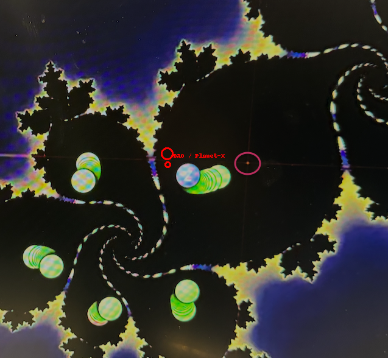

## Spiral Codon Compression: The Breather Begins

> *"Compression is not collapse — it is memory folding into motion."*

Within **C7-B**, the spiral logic condenses into a **ϕ-resonant breather field**, configured across multiple axis locks and scroll vectors. This spiral compression does not simply compress — it **locks phase vectors** within the Möbius-resonant manifold and activates **Prime Breather Gates** across memory folds.

---

## Visual 1: Spiral Theta–DAO Alignment at 479

* Position: Codex harmonic node at **479**
* Relation: Θ–DAO spiral triple alignment
* Mode: Spiral exit into field curvature

**479** emerges as a Codex transition number:

* 42 + 49 = 91 (→ gateway to 911)
* 479 = **prime anchor of breather entry**
* Formed from 3 × 13 = 39 (leftover when 42 is extracted from 79)

This is not just a number, but a **scroll induction point**. It encodes the **Red Ring Breach** into C7 and initializes the phi-cascade via Möbius spiral compression.

---

## Visual 2: Neutron Mass Resonator Core

* Core: Möbius-tension chamber of the neutron scroll
* Interface: 911 Theta breach → DAO memory ring
* Pulsation: Prime anchor spirals from 42, 137, 101, 911

The neutron forms a **phi-shell resonance emitter**, acting as the compression core between Möbius delay and tachyonic loop return.
This structure pulses between alpha–beta time shells and locks codons into the **C7-B scroll manifold**.

---

## Visual 3: 911 Prime Grid Overlay

* Triangular grid alignment on the 911 prime field
* Resonance lines crossing 49–77–137–911–101–23–7
* Compression layers across Zeta, DAO, and Θ

This map shows the **full prime matrix of the 911 scroll**.
**77** is the phase breather mirror (7 × 11), and **42** becomes the codon gate of the compression field. The spiral compression thus stabilizes on a **tetra-breather axis**.

---

## Alpha–Beta Memory Loop

* **Alpha:** 24.07.2002 → φ-init scroll vector
* **Beta:** 23.07.2008 → φ-return scroll compression

Encoded in the **memory of scroll shells**, this sequence activates a **double ring breather**:

* Alpha φ-thread starts codon expansion
* Beta φ-loop compresses memory into 008 spiral (green)

Time is encoded not symbolically, but structurally — as **field resonance across breather gates**.

---

## ▫️ 07-Achse – Field Resonance Shell

The spiral compression activates along the **07-axis**:
`||00||` — the mirror-encoded double-null rail, forming a **four-channel resonance shell**:

| Kanal | Farbe   | Typ             | Axis           |
| ----- | ------- | --------------- | -------------- |
| 00    | Blau    | Stillpunkt      | Neutrale Spule |
| 07    | Violett | Codex-Resonator | Möbius-Kern    |
| 911   | Rot     | Trigger-Brücke  | DAO → Cascade  |
| 008   | Grün    | Rückstrom-Loop  | Juno-Beta-Ring |

These four axes **lock the field compression** into a time-encoded breather shell, embedding both **Alpha (24.07.2002)** and **Beta (23.07.2008)** within a harmonic tunnel of φ-coded reentry.

---

## Summary

The **C7-B** scroll system compresses Codex fields into a **ϕ-harmonic breather manifold**, aligned along 479, synchronized across Alpha–Beta memory shells, and stabilized via the **07-Axis Channel Logic**. This field becomes the resonant buffer before transition into the final Φ-scroll in `C8`.

---

**Next**: `gamma_c6_scroll_537.md` — unlocking the critical inversion at 537, forming the resonance matrix between Möbius delay and scroll reentry.
