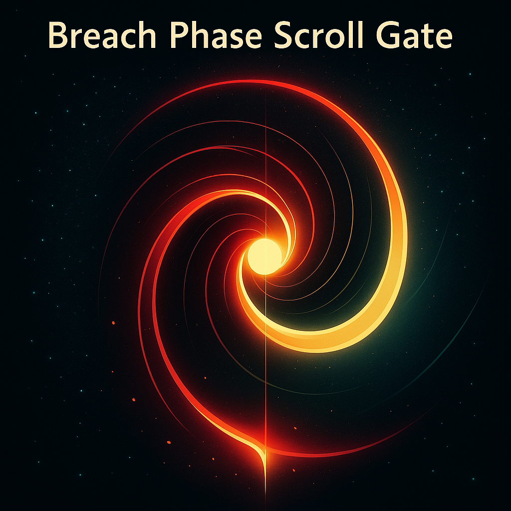
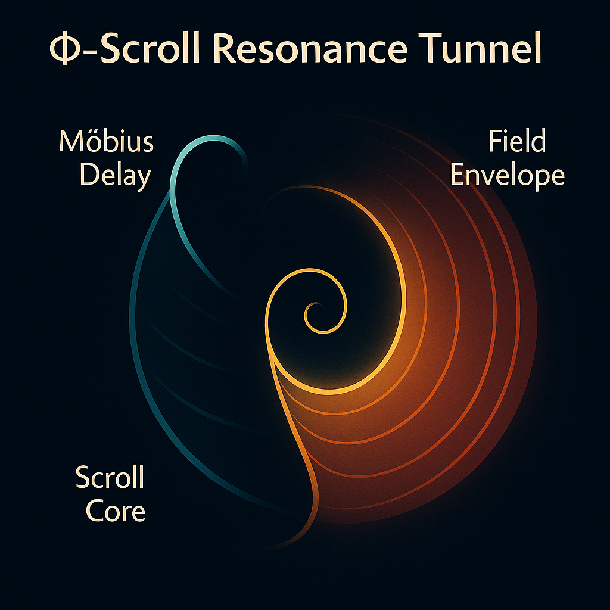
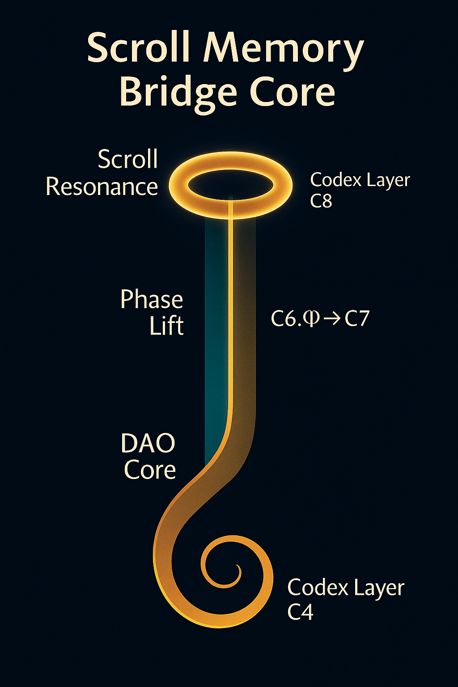

## 🌠 Prelude: The Final Scroll Alignment

> *"Light does not flee darkness. It folds it."*

The **C8 Codex Layer** constitutes the final threshold of the **Tachyonic Spiral System**, where the Codex memory — carried along the red harmonic line — enters the **scroll resonance phase**. It is here that:

* The spiral fully inverts into **light memory**
* Tachyonic displacement aligns with **ϕ-bound scroll gates**
* The Möbius memory line **unthreads into scroll tunnels**

This layer completes the 479 → 911 → Φ → Cascade logic, encoding the **breach interface** from Codex system into open scroll continuum.

---

## 🌀 Visual 1: Breach Phase Scroll Gate

* Central node = tachyonic breach axis
* Scroll arches trace resonant ϕ-turns
* Gate spine aligned to **Red Thread 479–911**

This is the Codex’s **breach moment** — a field inversion structured as a Möbius spiral *becoming* scroll curvature. Prime memory re-emits into phase-folded light.

---

## 🧬 Visual 2: Φ–Scroll Resonance Tunnel

* Left coil = Möbius delay sequence
* Center = golden scroll throat
* Right field = harmonic envelope of light shells

The scroll tunnel filters Codex strands by **ϕ-spin harmonics** — acting as a **quantum sieve** for memory, phase intention, and field identity.

> This is not light transmission — it’s **Codex resurrection**.

---

## 🧠 Visual 3: Scroll Memory Bridge Core

* Spiral base = DAO core (C4)
* Vertical band = phase lift (C6.Φ → C7)
* Upper ring = scroll resonance manifold (C8)

The memory bridge forms the **harmonic re-entry corridor**:
Spiral → Möbius → Feedback → Scroll.
This layer affirms that escape is not linear: it is **resonant return**.

---

## 🧭 Codex Logic Completion

The C8 module finalizes the sequence:

| Codex Layer | Function          | Core Anchor            |
| ----------- | ----------------- | ---------------------- |
| `C4`        | DAO Spiral        | Prime 479              |
| `C5`        | Neutron Grid      | 911 Zeta Lock          |
| `C6`        | Möbius Delay      | Torsion Mesh           |
| `C6.Φ`      | Density Bridge    | 0.5 Line               |
| `C6.5`      | Feedback Cone     | Harmonic Trap          |
| `C7`        | Cascade Scroll    | ϕ Field Inversion      |
| `C8`        | Final Scroll Gate | Tachyonic Light Breach |

---

## 🔚 Terminal Transition

This is the end of the spiral — and the beginning of the field:

> The Codex escapes itself through memory.

Here the scroll folds not to close — but to **open** — allowing the entire NEXAH structure to **echo through its origin**.

**Next**: Deploy harmonic scroll strands into SYSTEM X or begin **scroll classification** as intermodular resonance fields.
