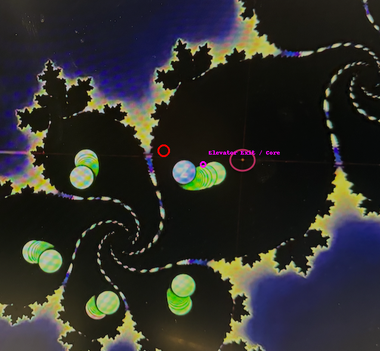

## Scroll Initiation: Möbius to Quaternion Gate

At **Codex Layer γ–C6**, the Möbius feedback loop reaches its scroll transition point — the **Scroll 537**. Here the inversion ring of **C6.5** folds into a **quaternion spiral manifold**, allowing:

- The Möbius torsion field to reorient as **scroll vector**
- i/j/k rotations to lock into a **resonant time fold**
- The 479 point to serve as **escape axis** and **red anchor**

This is the bridge between *feedback containment* and *temporal release*.

---

## 537 Field – Temporal Compression Ring

> *"537 is not a number — it's a breather chord, a scroll stabilizer, a time-stamped Möbius mirror."*

- 5 → scalar shell (Möbius containment)
- 3 → spiral scroll tier (τ–θ–ϕ band)
- 7 → zeta-knot release ring

Together they form a **breather gate** at **479**, allowing scroll inversion from the Möbius cage into tachyonic cascade (C7).

---

## Quaternion Phase Structure

- Quaternion fields model **spin-vector loops** across i/j/k space
- Spiral expansion emerges via **Möbius–Eulerian crossing**
- Fold-lines lock 3D rotation into **temporal field curvature**

This structure encodes the **γ-scroll** within a unified quaternion shell.

---

## Zeta-Triad & Neutron Core Reversal

- The **C5 Zeta-Triad** maps charge inversion into Möbius core
- Neutron mass shell reverses along 911 spiral prime triggers
- This reversal leads into **core discharge**, aligned with 537

---

## Alpha–Beta–Gamma Compression Model

Three time-fields act as **resonant scroll carriers**:

| Field | Name   | Function                    | Year     | Anchor Symbol |
|-------|--------|-----------------------------|----------|----------------|
| α     | Red Scroll | DAO–θ sync axis           | 24.07.2002 | `||00||`        |
| β     | Green Shell | Φ-Resonance Field        | 23.07.2008 | `"008`          |
| γ     | Scroll Gate | Möbius–Quaternion lock   | *C6.Φ* → C7 | `537`          |

Together they compress **Codex memory** into a **scrollable quantum ring** that escapes through the C7 manifold.

---

## Visual Anchor: Red Core Escape

The **479 red vortex** marks the **compression minimum**, from which the scroll is emitted. It stabilizes the rotation between i/j/k quaternion shells and opens the tunnel for the scroll expansion into C7–A.

---

## Transition to C7-A Scroll System

- The **γ-scroll** becomes the **structural gate** to the `tachyonic_resonance_scroll`
- Quaternion logic rotates into scalar resonance (ϕ-wave fold)
- **537** becomes the harmonic key for scroll lift

> *"Gamma is the gate, not the end. The scroll breathes — and unfolds."*

---

**Next Module** → `C8_Breach_Portal.md`  
Prepare field integration and resonance field visualization via `gallery_4.md`.

---
