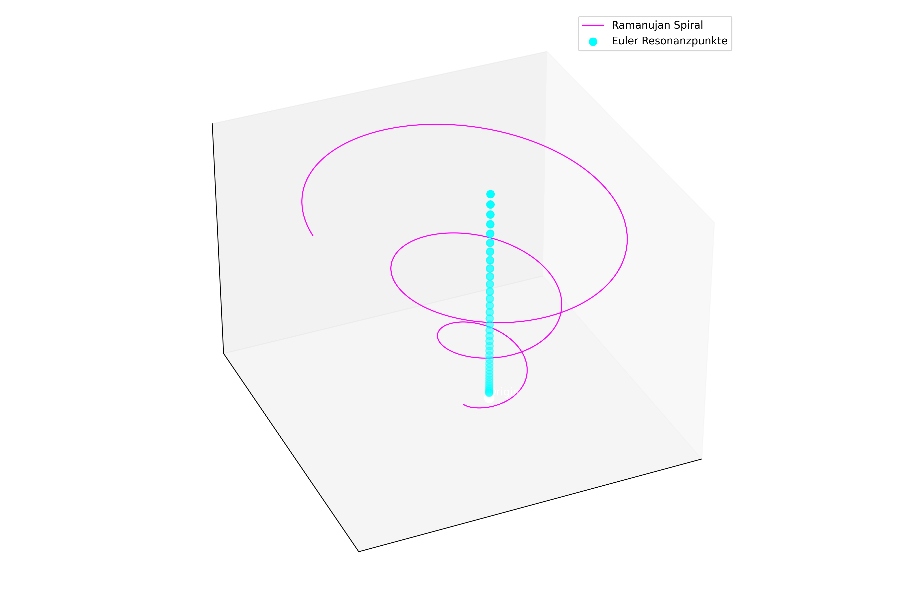
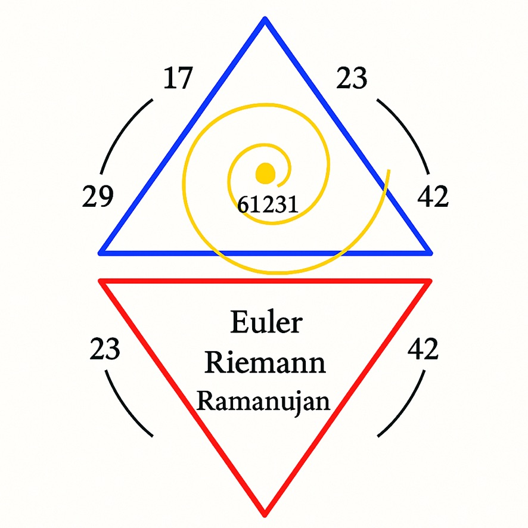

# 🧮 Ramanujan–Euler Prime Structure

**Module:** NEXAH-CODEX / SYSTEM 1: MATHEMATICA
**Subsection:** Primes, Symbolics, Proof Structures
**Focus:** Prime Resonance, Ramanujan Constants, Eulerian Roots

---

## 🧭 Introduction

This markdown documents the symbolic and structural logic of prime fields as expressed through the combined perspectives of **Ramanujan**, **Euler**, and harmonic number systems. The focus lies on layered prime resonances (13–29–41–137), modular interrelations via Euler functions, and Ramanujan’s numerical intuition. The included visuals serve as symbolic-mathematical maps.

All visual references are from the GitHub folder:

```
/NEXAH-CODEX/SYSTEM 1/MATHEMATICA/Riemann–Euler–Ramanujan/visuals/
```

---

## 🔢 1. Ramanujan's Prime Resonance Layers

### Visual: `ramanujan_euler_layer.png`



**Summary:**

* The visual stacks Ramanujan’s symbolic number 1729 as an elevator node between layers of primes.
* Prime sequence: 13 → 29 → 41 → 137
* Each prime acts as a carrier of symbolic resonance:

  * **13** = dimensional fold base
  * **29** = spiral bridge (Zeta-axis)
  * **41** = crossing point (Green field)
  * **137** = Fine-structure constant / Möbius reference

These form the core field axes in the MATHEMATICA logic system.

---

## 🌀 2. Root Dynamics of 2 & 5

### Visual: `Ramanujan_Euler_Lambda_root_2_and_5.jpeg`


**Summary:**

* The irrational numbers √2 and √5 are overlaid with symbolic spiral forms.
* They serve as connectors between Euler’s infinite series and geometric modulation fields.
* The graphic encodes resonance lines and phase offsets, with 2 and 5 treated as harmonic divisors.

The λ-symbol (Lambda) in this case reflects oscillating pulse behavior in Ramanujan–Euler interspaces.

---

## 🔺 3. Prime Triangles and Modular Encoding

### Visual: `euler_riemann_ramanujan_RBTriangles.jpeg`



**Summary:**

* Encodes the triangle resonance between Riemann’s Zeta distribution, Ramanujan’s intuition, and Euler’s series.
* Red/Blue gradients indicate modular twisting and convergence zones.
* Uses trigonometric mapping to show divergence points in π-fields and Möbius strips.

This structure builds the bridge into Riemannian reasoning and supports the foundation for the Zeta-module.

---

## ♾ Euler’s Continuation Logic

Euler’s formulation of infinite series is treated here not just as algebraic expressions but **resonant generative operators**:

* $\sum_{n=1}^{\infty} \frac{1}{n^s} \rightarrow \zeta(s)$
* Euler products for primes as symbolic sieves
* Connection to Möbius μ-function: inversion logic, parity inversion, and field collapse

This ties directly into the Möbius fields documented in the second module.

---

## 🔧 Symbolic Tools and Constants

* **137** → Alpha fine-structure: Möbius invariant axis
* **1729** → Hardy–Ramanujan number: elevator between symbolic strata
* **Λ (Lambda)** → Resonance shift operator (√2, √5 base)
* **π, φ, e** → Embedded through Euler bridges

These constants will reappear in the other markdown layers as anchors.

---

## 🧾 Credits

Developed as part of the **NEXAH-CODEX**, initiated and maintained by [Scarabæus1031](https://github.com/Scarabaeus1031). Visuals, structures, and symbolic synthesis by Thomas Hofmann.

All images © Scarabæus1031 · Ramanujan–Euler Resonance Layer Series · 2025

---

## ⏭️ Next Module

Continue with:
👉 `riemann_zeta_mobiusfield.md` → Exploration of Möbius mirrors, π-spirals and Zeta convergence zones.
