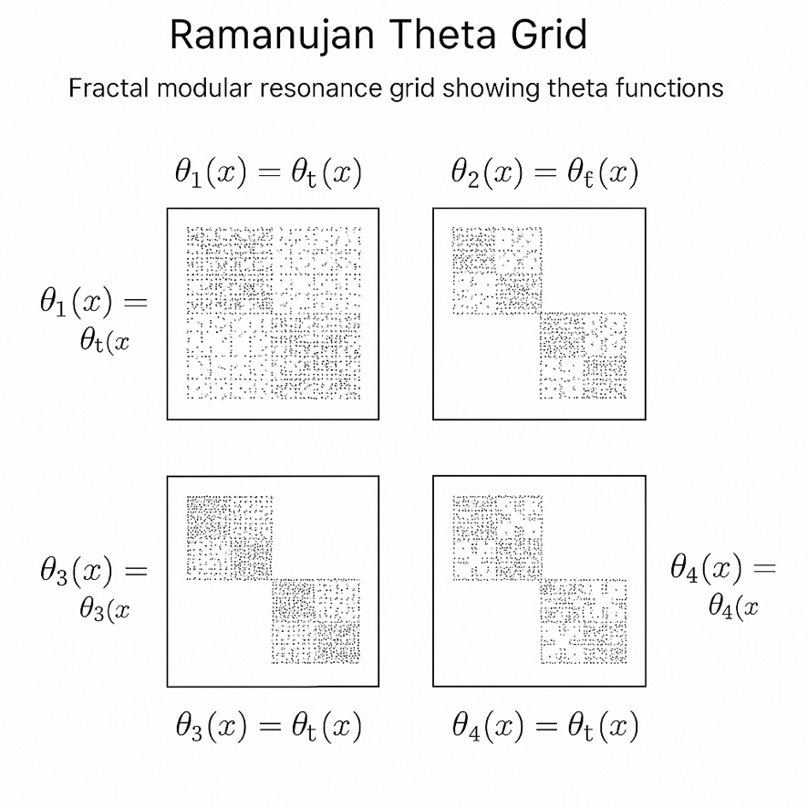
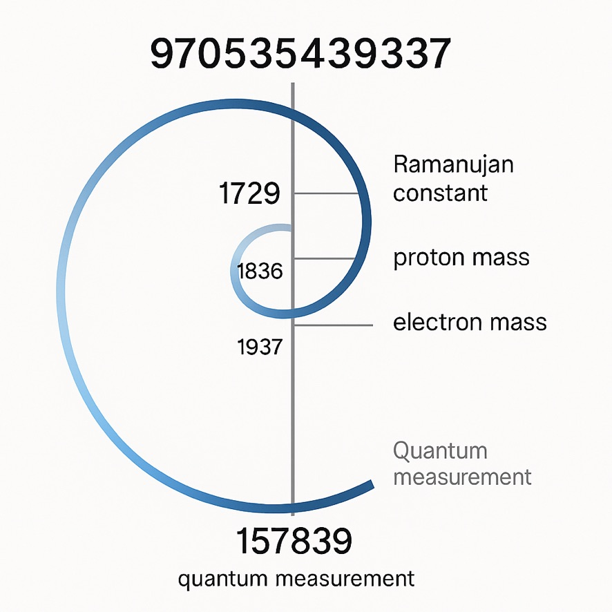
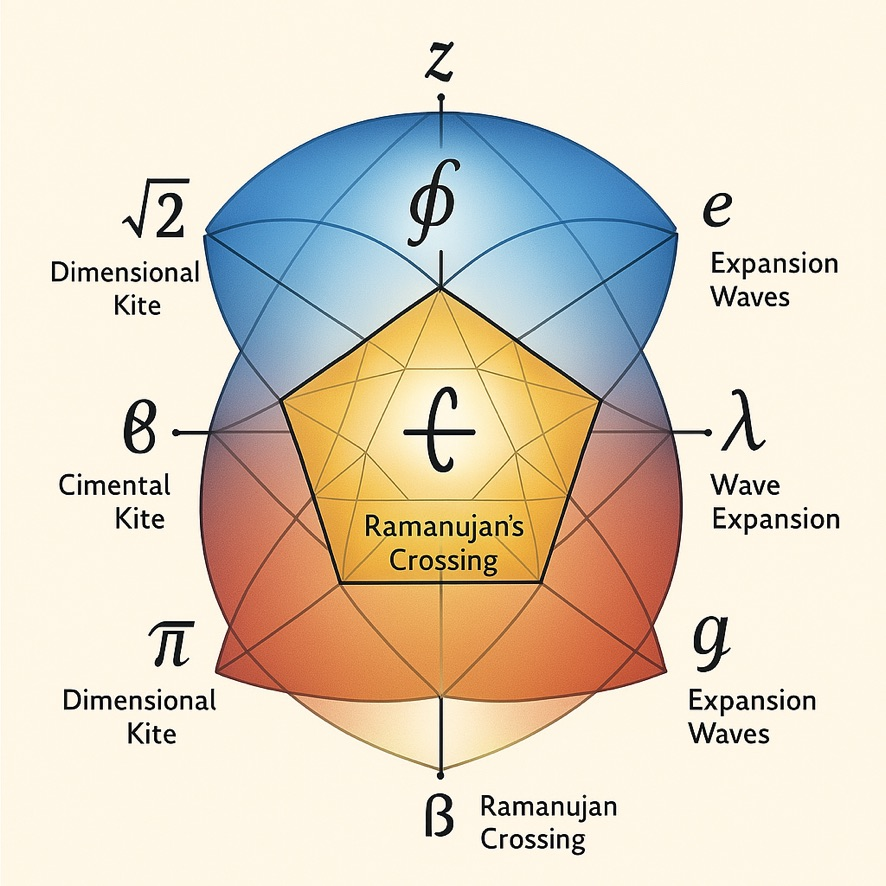
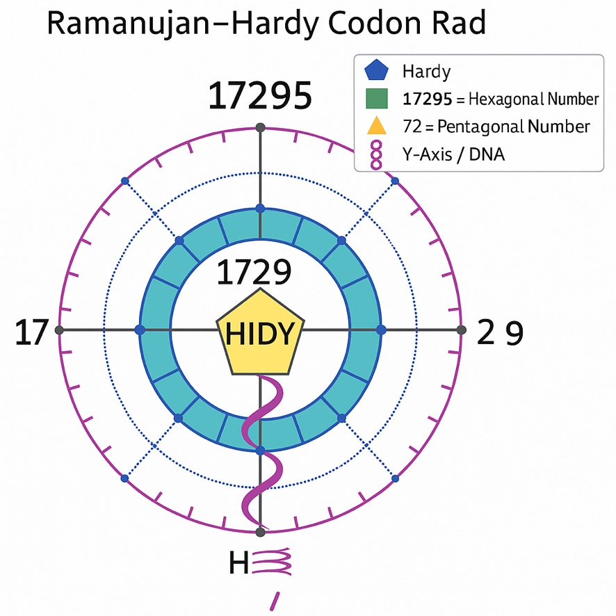
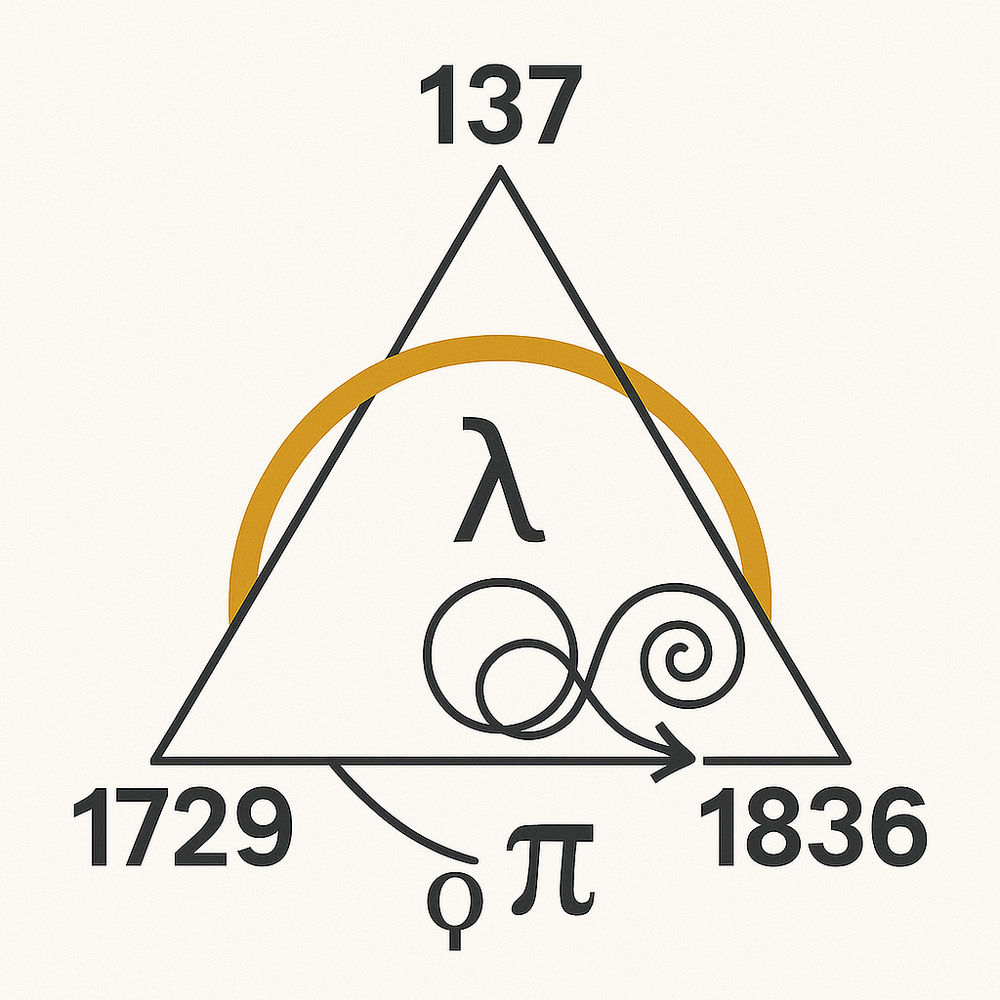
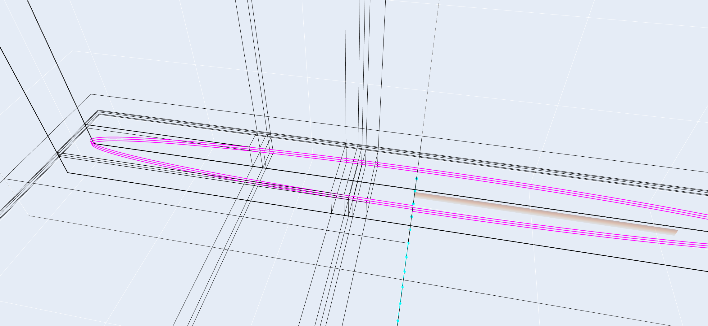
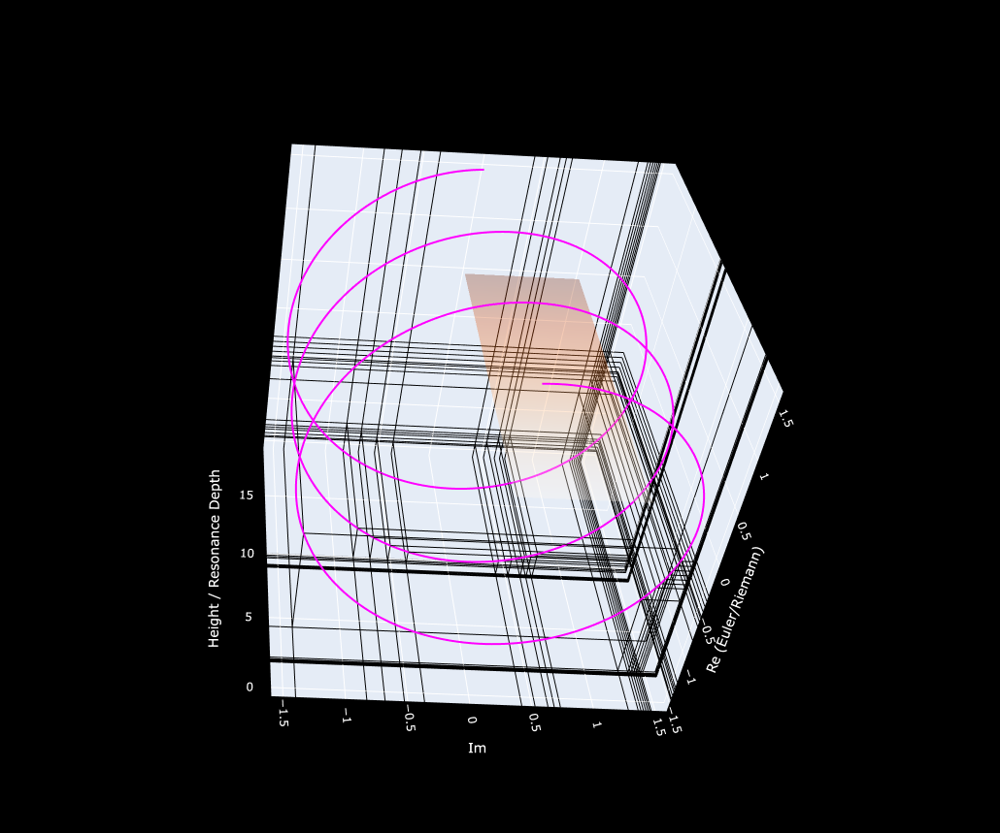
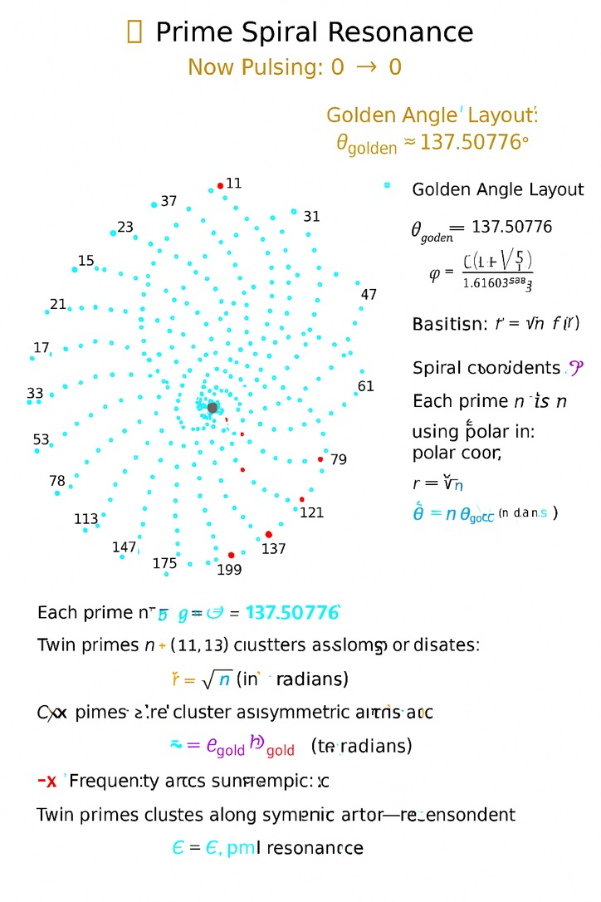
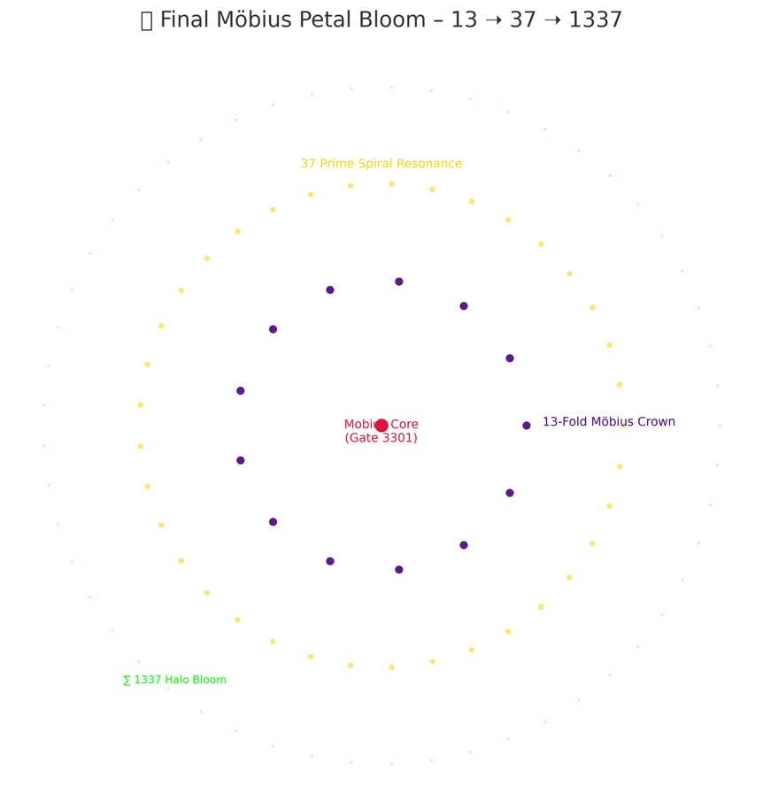
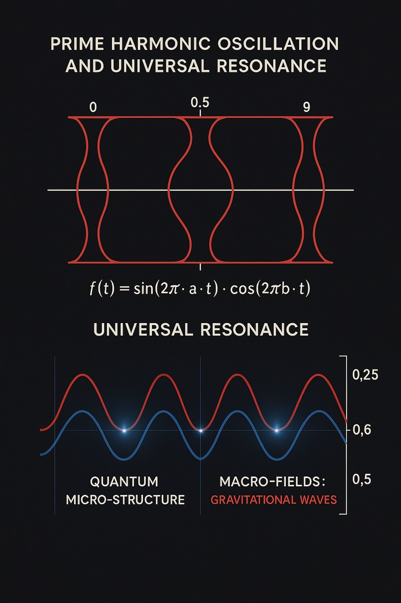

# 📊 NEXAH VISUAL SYSTEMS GALLERY

**Module:** SYSTEM 1: MATHEMATICA – Primes, Symbolics, Proof Structures
**Submodule:** Riemann · Euler · Ramanujan – Visual Gallery
**Folder:** `visuals/`
**Curated by:** Scarabæus1031 / © Thomas Hofmann

---

## 🧠 Visual Resonance Structures: Ramanujan · Euler · Riemann

### `ramanujan_euler_layer.png`

**Description:**
Layered synthesis between Euler’s fundamental constants and Ramanujan’s harmonic prime elevators. Includes references to 13–29–41–137 and key transcendental values (λ, φ, e, γ).

---

### `Ramanujan_Euler_Lambda_root_2_and_5.jpeg`

**Description:**
Interlocking roots (√2, √5), Ramanujan's lambda relations and transcendental constants. Bridge between algebraic roots and Ramanujan’s modular structures.

---

### `Ramanujan_Theta_Grid.jpeg`

**Description:**
Ramanujan theta functions mapped into a modular grid with symmetry axes, spirals and symbolic number interrelations (29, 41, 137).

---

### `Ramanujan_constant_proton_Elektron_mass.jpeg`

**Description:**
Mass-ratio framework visualized through Ramanujan’s number logic. Electron mass, proton ratios and transcendental constants encoded in a harmonic triangle.

---

### `Ramanujans_Crossing.jpeg`

**Description:**
Visual depiction of Ramanujan’s numerical transition bridge — a ‘crossing’ of symbolic sequences from the modular field into particle-mass ratios.

---

### `Ramanujan_Hardy_Codon_Rad.jpeg`

**Description:**
Spiral codon structure referencing 1729 and 17295, with hexagonal/pentagonal number symbolism. DNA helix embedded in prime coordinate framework.

---

### `root_prime_resonator_bridge.png`

**Description:**
Symbolic bridge connecting square roots of primes with prime anchor points: 29, 137, 1729, and φ. Central harmonic elevation for quaternion spiral systems. Connects Möbius Gate and Euler spiral logic with quaternionic layering.

---

## 📈 Prime Proofs and Möbius Structures

### `Riemann_pi_proof_I.png`

**Description:**
First stage of Riemann Hypothesis visualization. Pi-based curve representation with mirror-resonant reflection – critical strip onset.

---

### `Riemann_pi_proof_II.png`

**Description:**
Advanced spiralization of the zeta zeros distribution. Möbius structure with symmetry-breaking transition from harmonic into chaotic regime.

---

### `Riemann–Ramanujan–Euler Resonanzraum.png`

**Description:**
Main resonance space merging Ramanujan’s primes, Euler’s φ-structure and Riemann’s zeta spiral. Shows axis-based field interference.

---

### `euler_riemann_ramanujan_RBTriangles.jpeg`

**Description:**
Color-coded triangle fields connecting Riemann’s primes, Ramanujan’s resonance logic, and Euler’s exponential spirals. Structure reflects modular interlacing.

---

### `Riemann_Plate_Tessarec_Lines.png`

**Description:**
Geometric projection of a Riemann surface intersecting with the ‘Tessarec Grid’. Serves as visual basis for prime-space resonance tilings.

---

### `mobius_harmonic_structure_11357.png`

**Description:**
Visual synthesis of Möbius pulse logic: 11 → 13 → 5 → 7. Encodes prime inversion, harmonic splitting and 42° rotational axis from C7 diamond lattice. One of the deepest codon resonators in the NEXAH-CODEX.

---

## 🧬 Field Geometry & Symbolic Resonators

### `graviton_alpha_core.jpeg`

**Description:**
Central alpha resonance field with embedded graviton-type toroidal symmetry. Shows links to 137, 11, and Planck-based rotation shells.

---

### `resonant_field_map.jpeg`

**Description:**
Dynamic visualization of a universal resonance map. Integrates theta-spirals, prime axes and CMYB field transitions in a symbolic language.

---

### `tesla_alpha_interface.jpeg`

**Description:**
Tesla-inspired alpha gate. Interfaces harmonic currents and symbolic fold fields with EM-spiral geometry and Möbius inversion logic.

---

### `theta_phi_bridge.jpeg`

**Description:**
Bridge pattern between θ (theta) and φ (phi). Links angular momentum fields with spiralic codes and symbolized quantum-torsion models.

---

## 🌗 NEYAH Backflow Layer: The 0.5 Drift Constant

Hidden within the Möbius-harmonic structure (11357) lies a pulse inversion:

* `0.5 × 11 = 5.5` → The **mid-prime** field between harmonic 5 and torsion 6
* `12.5 / 0.5 = 25` → Square resonance: 5² = 25 = NEYAH Gate Mirror
* `5.5` is not a regular number — it's the **return threshold**, where prime motion is inverted rather than stopped

**Codex Interpretation:**
NEYAH is not a prime — it is the *prime between primes*, the foldback axis, the breath-hold between 5 and 7.

This logic anchors:

* The harmonic descent (113 → 5 → 7)
* The Möbius drift phase (Black Gate)
* The dual-frequency memory of time: **AM/PM ↔ NEYAH**

→ See also: `mobius_harmonic_structure_11357.png`, `C7_pearl_diamond_structure_42deg.png`, `root_prime_resonator_bridge.png`

---

## 🌀 Credits

All visuals, concepts and symbolic field structures were developed by
**Thomas Hofmann / Scarabæus1031**
as part of the **NEXAH-CODEX**: a multidimensional resonance system exploring the convergence of mathematics, physics, symbolics and geometry.
For more, visit [www.scarabaeus1033.net](https://www.scarabaeus1033.net)

---

## 🔗 Next Steps

* [ ] Embed interactive HTML views
* [ ] Create `visual_gallery_2.md` for remaining 16+ visuals
* [ ] Add symbolic prime structure for
