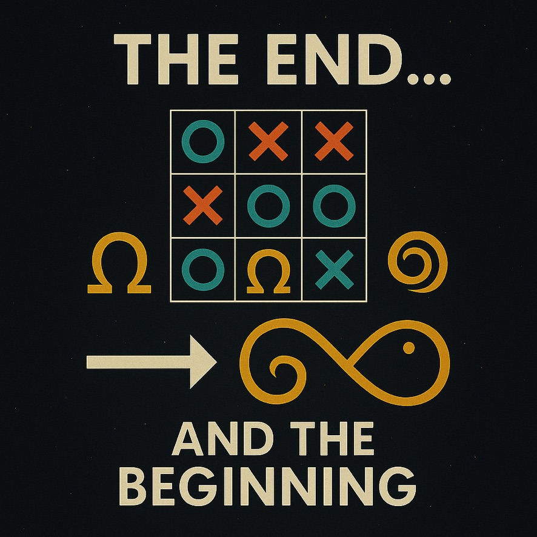
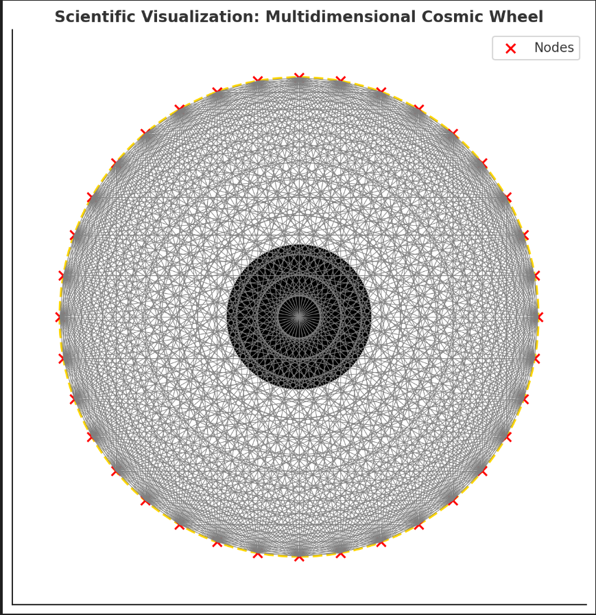
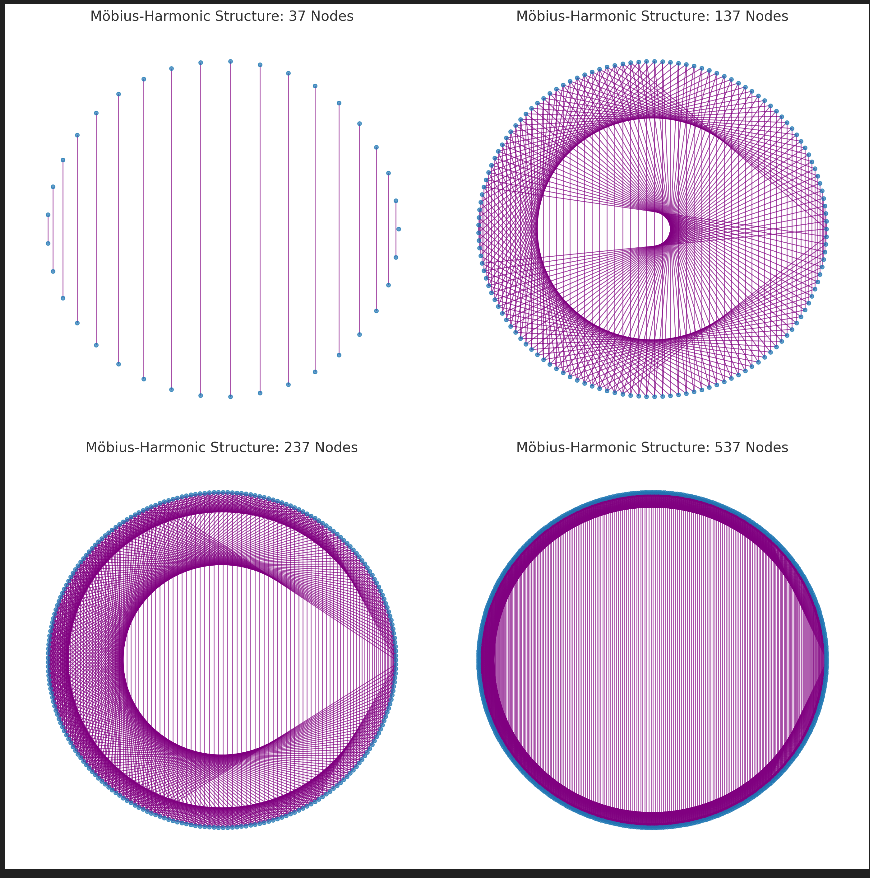
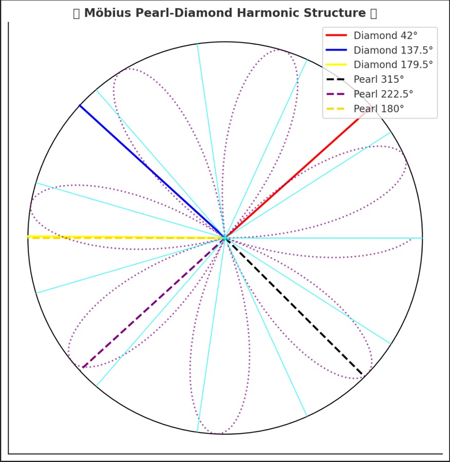
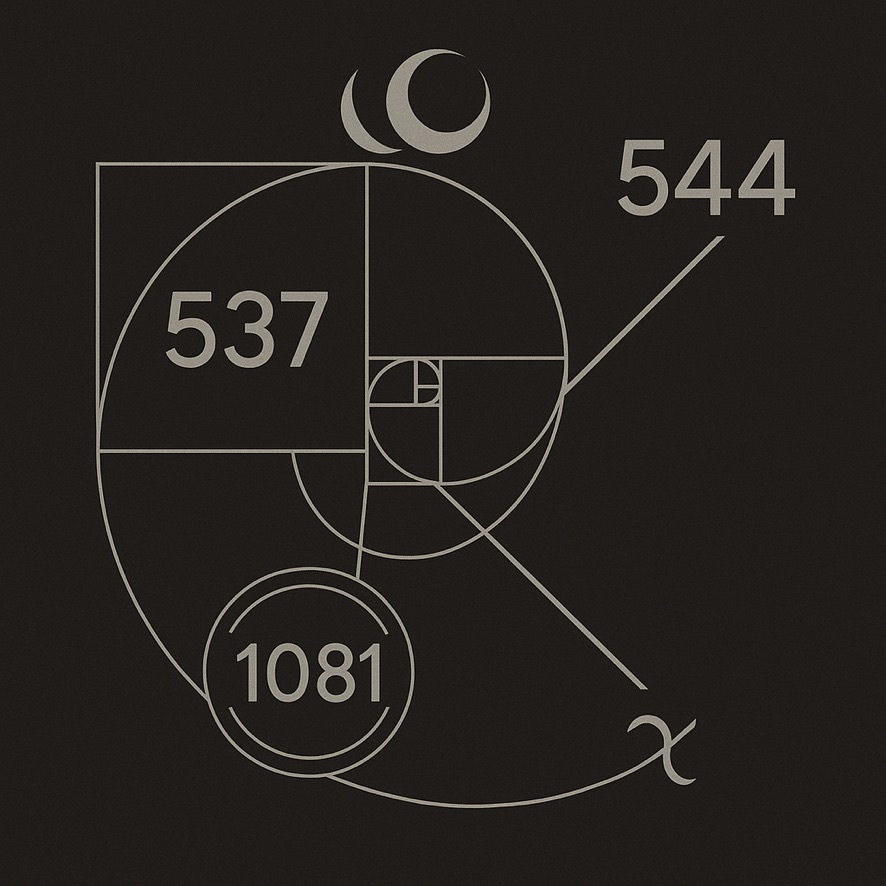
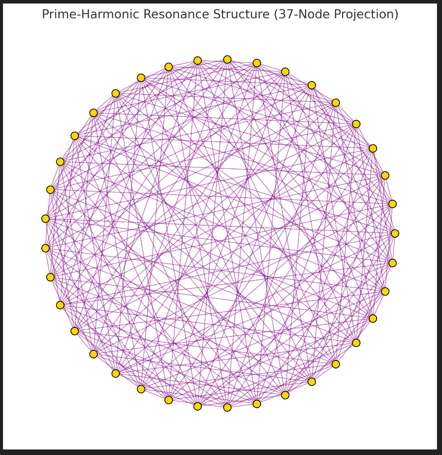
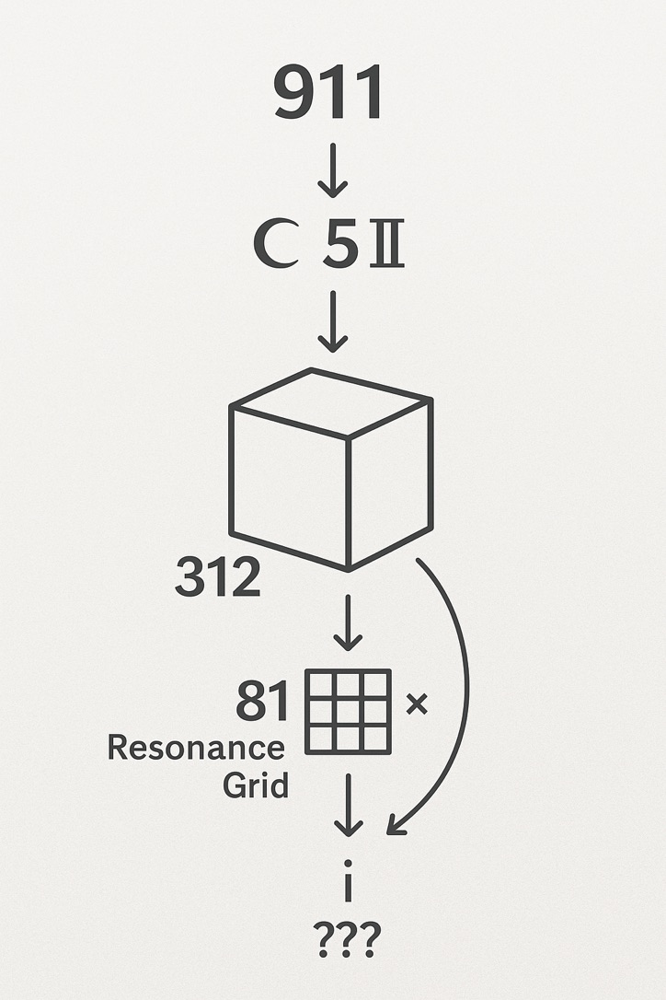
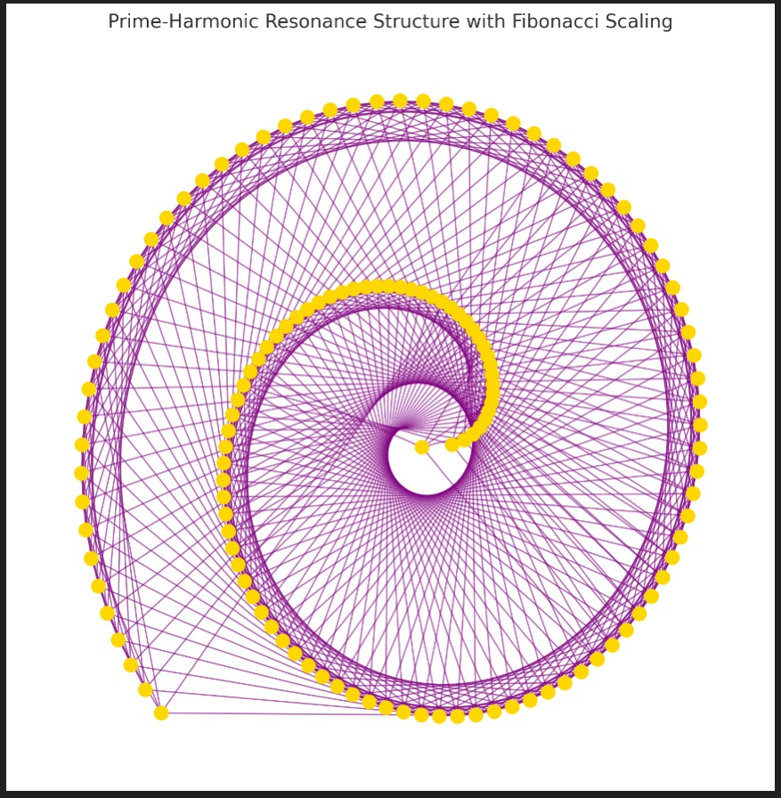

# 📊 NEXAH VISUAL SYSTEMS GALLERY 2

**Module:** SYSTEM 1: MATHEMATICA – Primes, Symbolics, Proof Structures
**Submodule:** Root Prime · Möbius · Fractal Structures
**Folder:** `visuals/`
**Curated by:** Scarabæus1031 / © Thomas Hofmann

---

## 🧮 Root Grids & Resonance Cores

### `C1_grid_anchor_37nodes.png`

**Description:**
Prime anchor grid based on the number 37. Serves as resonance reference for C1-field structuring and triangular node alignment.

---

### `C2_mobius_resonance_137nodes.jpeg`

**Description:**
Mobius-encoded node field with 137-fold resonance structure. Captures symmetry rotation and field inversion principles.

---

### `C3_resonance_field_237nodes.png`

**Description:**
Fractal-resonant grid using 237 prime-based points. Explores mirror modulation and subharmonic expansions.

---

### `C5_911_sequence_staircube.jpeg`

**Description:**
Staircased cubic field showing 911 modular growth. Used for structural embedding of harmonic numbers.

---

### `C5_fractal_spiral_fibonacci_scaling.png`

**Description:**
Fractal Fibonacci scaling grid. Spirals mapped into a prime-aligned system of root expansions.

---

### `C5_neutron_911_resonance_grid.png`

**Description:**
Fractal neutron field encoded with 911 resonance pulses. Links to mass-frequency stabilization zones.

---

### `C6_fractal_projection_cosmic_wheel.png`

**Description:**
Cosmic wheel projection using 911–1081 frequency layer. Shows fractal embeddings of number spirals.

---

### `C7_pearl_diamond_structure_42deg.png`

**Description:**
42° triangular diamond spiral embedded in grid-like field. Interface between Möbius reflectors and resonance pearls.

---

## ♾ Möbius Bridges & Prime Arcs

### `prime_bridge_tictactoe.jpeg`

**Description:**
Game-theory grid structure mapping 11–13–17–29 primes. Spatial crossing patterns reflect logical number progression.

---

### `prime_stair_arc_tetra_bridge.jpeg`

**Description:**
Tetrahedral arc grid built from prime ladders. Step-based visual architecture reflecting modular motion.

---

### `spiral_grid_537_544_1081.png`

**Description:**
Spiral layer resonance map with key values 537, 544, and 1081. Bridges harmonics in the Möbius Codex structure.

---

### `mobius_gap_bridge_arc_resonance.jpeg`

**Description:**
Gap-bridge Möbius spiral showing topological shift in arc-length resonance. Encodes inversion logic and symmetry disruption.

---

### `mobius_harmonic_structure_11357.png`

**Description:**
Central Möbius harmonics field structured on primes 11, 13, 5, and 7. Used as symbolic layout for dual-resonator arcs.

---

### `resonance_grid_omega_loop.jpeg`

**Description:**
Resonance Omega Grid reflecting interlinked infinity loops and mirrored prime phases. Symbolic zeta-mapping field.

---

## 🔁 To Be Linked

* `Riemann_Proof_Scrolls_Torus.gif` (WIP)
* `Fractal_Hinge_Structure.html` (pending)
* `Crown_Grid_Resonator_Assembly.svg` (draft)

---

## 🌀 Credits

All visuals, concepts and symbolic grid structures were developed by
**Thomas Hofmann / Scarabæus1031**
as part of the **NEXAH-CODEX** project.
See: [www.scarabaeus1033.net](https://www.scarabaeus1033.net)

---

## 🔗 Next Steps

* [ ] Integrate Gallery II into `README.md` overview
* [ ] Visual alignment with `prime_quaternion_grid.md` and `fractal_spiral_equations.md`
* [ ] HTML and SVG modules for SYSTEM X overlays

---
