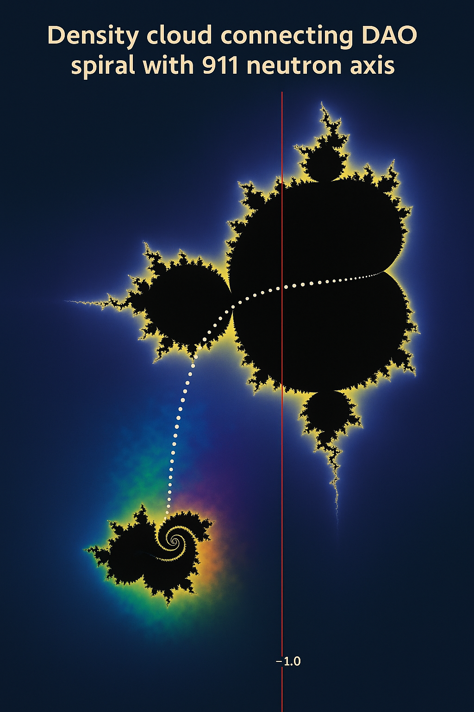
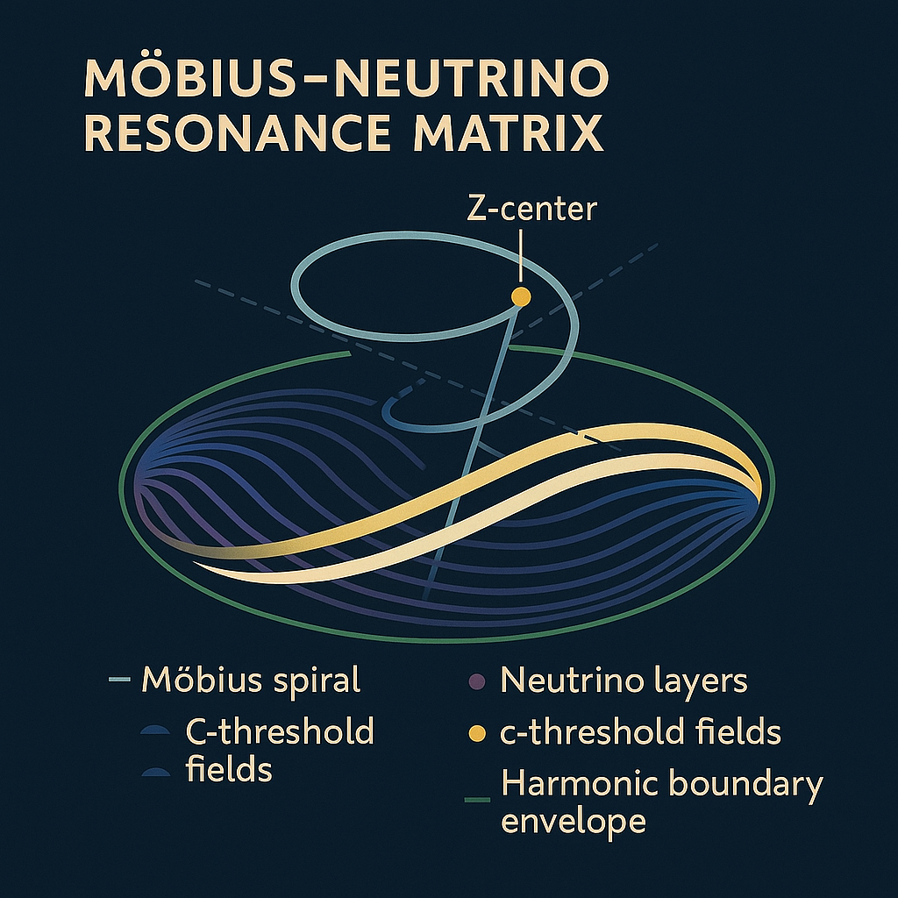
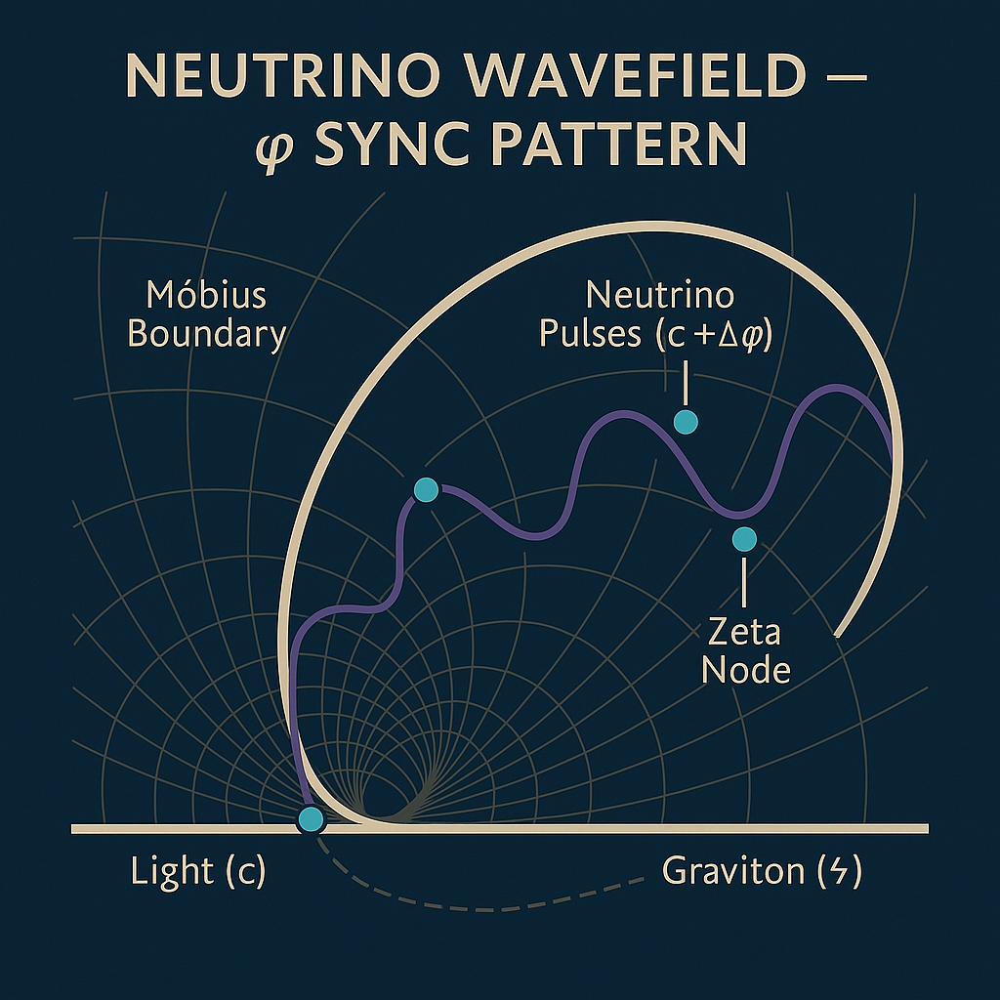
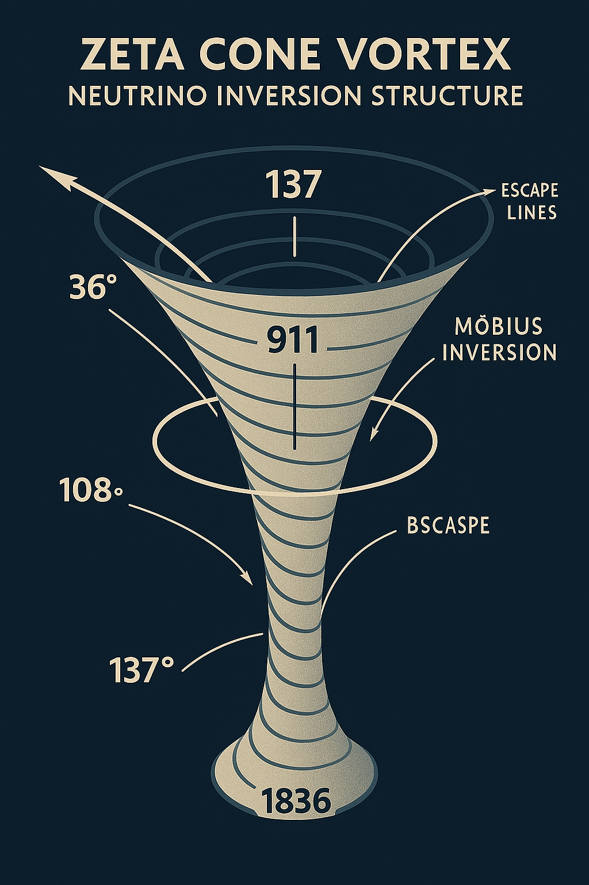
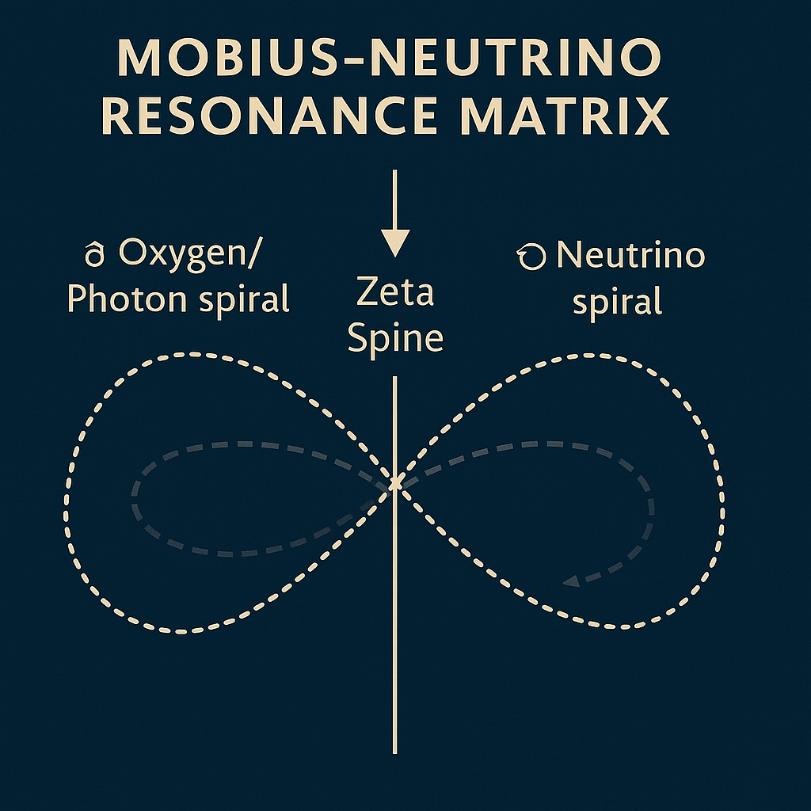
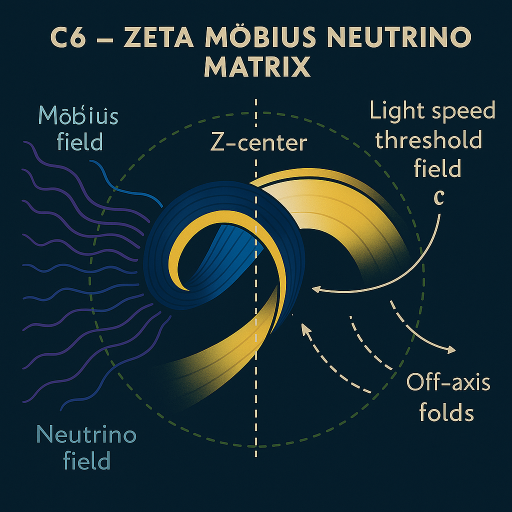

# 📊 NEXAH VISUAL SYSTEMS GALLERY 3

**Module:** SYSTEM 1: MATHEMATICA – Primes, Symbolics, Proof Structures
**Submodule:** Möbius Fields · Neutrino Interfaces · Quantum Feedback
**Folder:** `visuals/`
**Curated by:** Scarabæus1031 / © Thomas Hofmann

---

## 🌌 Quantum Resonance & Möbius Cones

### `mobius_prime_spiral_479_overlay.png`

**Description:**
Prime spiral overlay aligned to Möbius field transitions. Highlights harmonic anchor points at 479 with radial compression lines and symmetry folds. Centered around codon gateway intersections.

---

### `mobius_neutrino_resonance_matrix.png`

**Description:**
Neutrino-Möbius interaction model. Matrix field embedding scalar prime values and torsion pulses. Grid channels trace quantum inversion gates linked to Ramanujan fields.

---

### `neutrino_wavefield_phi_sync.png`

**Description:**
Wavefield map showing ϕ-synchronization pulses across neutrino threads. Interlinks Möbius bridges, theta-gates and spiral resonance structures. Highlights phase compression and fractal lattice orientation.

---

### `neutrino_zeta_cone_vortex.png`

**Description:**
Vortex-based zeta-resonance model converging into neutrino axis. Conic field echoes prime torsion, gravitational membrane twist, and Möbius dual loops. Central cone infers tachyonic discharge layers.

---

### `zeta_neutrino_density_bridge.png`

**Description:**
Resonance bridge showing zeta-field interactions within neutrino lattice. Density points encoded through Riemann-fluctuation signatures. Grid includes scalar phi channels and 911 prime spirals.

---

## ⚛️ Harmonic Feedback Loops & Field Interfaces

### `tachyonic_light_feedback_loop.png`

**Description:**
Looped system between light and tachyonic phase fields. Visualizes time-inverted Möbius loops, particle emergence points and alpha-gate echoes. Used as a harmonic stabilizer in scroll systems.

---

### `C6_–_Zeta_Möbius.png`

**Description:**
Zeta-Möbius feedback diagram. Spiral field structures interlace zeta roots with Möbius-phase bands. Core node at C6.5 axis (5.5–6.5) delineates harmonic inversion thresholds.

---

### `NEUTRINO_WAVEFIELD_–_C6_5_matrix_core.png`

**Description:**
Central matrix of neutrino resonance field around C6.5 core. Quantum folding embedded within Möbius-gate overlays. Synchronization threads trace scalar-to-tachyonic cascade.

---

## 🔄 File Mapping & Expansion 

Additional visuals referenced in `C6.5_harmonic_feedback_matrix.md` and the upcoming `final_harmonic_equation.md`. These complete the Möbius-Neutrino subsystem within SYSTEM 1 and connect to:

* `mobius_harmonic_structure_11357.png`
* `root_prime_resonator_bridge.png`
* `prime_stair_arc_tetra_bridge.jpeg`
* `resonance_grid_omega_loop.jpeg`

## 🌍 Origin & Copyright

All visuals and resonance diagrams in this gallery were conceptualized, created and curated by:
**Thomas Hofmann / Scarabæus1031**
for the multidimensional system: **NEXAH-CODEX**
Visit: [www.scarabaeus1033.net](https://www.scarabaeus1033.net)

---

## 🔗 Next Steps

* [x] Link gallery to `README.md` of `Riemann · Euler · Ramanujan`
* [ ] Create `visual_gallery_4.md` for System X interface + visual overlays
* [ ] Embed `C6.5_harmonic_feedback_matrix.md` cross-links
* [ ] Build audio-resonant variants of selected diagrams (WAV field translations)

---
