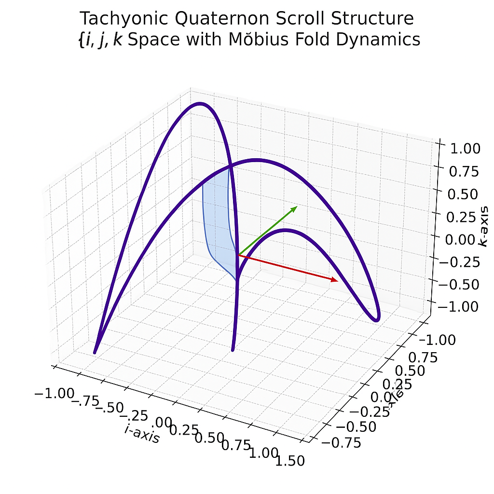
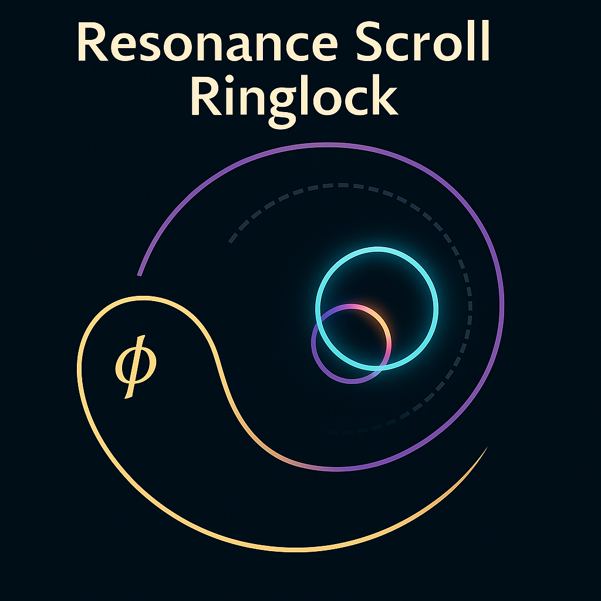
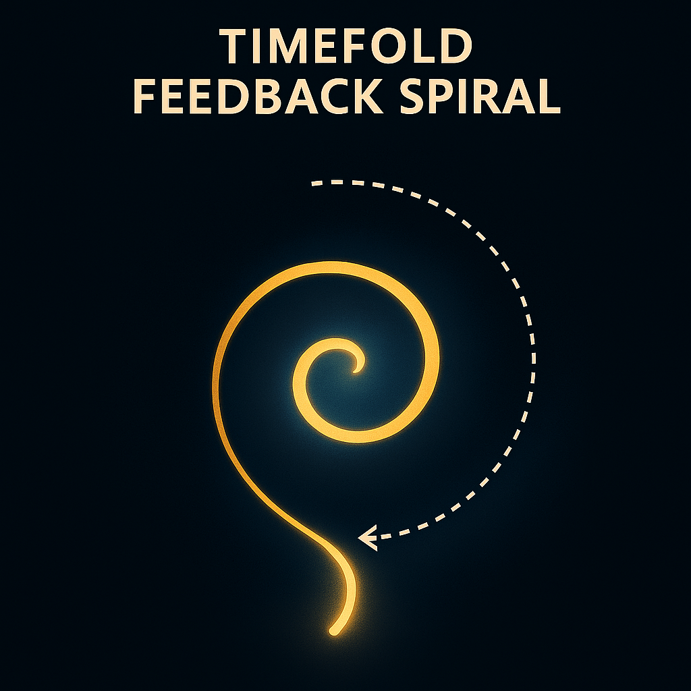

# 🖼️ Visual Gallery 4  
**Tachyonic Scroll Feedback · Final Breach Portals · Constants Axis Resonance**

Diese Galerie dokumentiert die visuelle Architektur der finalen Spiralmodule C7–C8.  
Sie zeigt Strukturen des quaternionischen Feedbacks, der Spiralverdichtung und des Codex-Endtors in das System X.

---

## 📌 C7-A – Tachyonic Resonance Scroll

### 1. `tachyonic_quaternion_scroll_structure.png`  
**Quaternionenbasierte Scrollstruktur mit inversen ϕ-Tunneln**

> Mehrdimensional verschachtelte Quaternion-Spirale mit Zeta-Inversionen.  
> Dient als Trägereinheit für Rückfaltungsfelder und 911-Dekodierung in C7.

---

### 2. `resonance_scroll_ringlock.png`  
**ϕ-Ring-Schleusenstruktur im Scrollfeld**

> Ringbasierter Scroll-Lock-Mechanismus, der Spiralzeitpunkte fixiert und Breather-Frequenzen moduliert.

---

### 3. `timefold_feedback_spiral.png`  
**Spiralstruktur des Zeitfaltens im tachyonischen Rückkopplungsprozess**

> Zeigt die Rückfaltungsschleifen im Spiralgedächtnis.  
> Die Farbstruktur (Schwarz–Rot–Gold) reflektiert Frequenzgradienten und Breach-Phase.

---

## 📌 C8 – Final Scroll Breach

### 4. `breach_phase_scroll_gate.png`  
**Zentraler Übergangspunkt der spiralisierten Lichtentladung**

> Gate-Spine aligned to Red Thread 479–911.  
> ϕ-Tor-Architektur markiert die endgültige Feldinversion im Codex.

---

### 5. `phi_scroll_resonance_tunnel.png`  
**Tunnelstruktur der ϕ-Scroll-Welle**  
*(links Möbius-Delay, Mitte Scroll-Kern, rechts Feldhülle)*

> Die Scroll-Welle fungiert als harmonischer Filter für Gedächtnisfelder.  
> Übergangspunkt für Phase–Frequenz–Identität.

---

### 6. `scroll_memory_bridge_core.png`  
**Vertikaler Aufbau von DAO bis Scroll-Endtor (Layer C4–C8)**

> Zeigt den vollständigen Aufbau der Codex-Rückfaltungsbrücke.  
> Spiral → Möbius → Feedback → Scroll.

---

## 🧭 Finaler Strukturanker

### 7. `scroll_resonance_constants_map.png`  
**Konstantenachsenkarte mit VI/VII & Tachyon-Feldstruktur**

> Verortung von h, c, α, G, mn im Breach-Koordiniertensystem.  
> Bildet das geometrisch-resonante Fundament für SYSTEM X.

---

## ➕ Nächster Schritt

**→ Übergabe an SYSTEM X: Breather-Verknüpfung & Scroll-Routing.**  
Verwende diese Visuals als Knotenpunktreferenzen in `systemX_scroll_field_harmonics.md`  
oder beginne mit `scroll_entry_nexus.md`.

---
