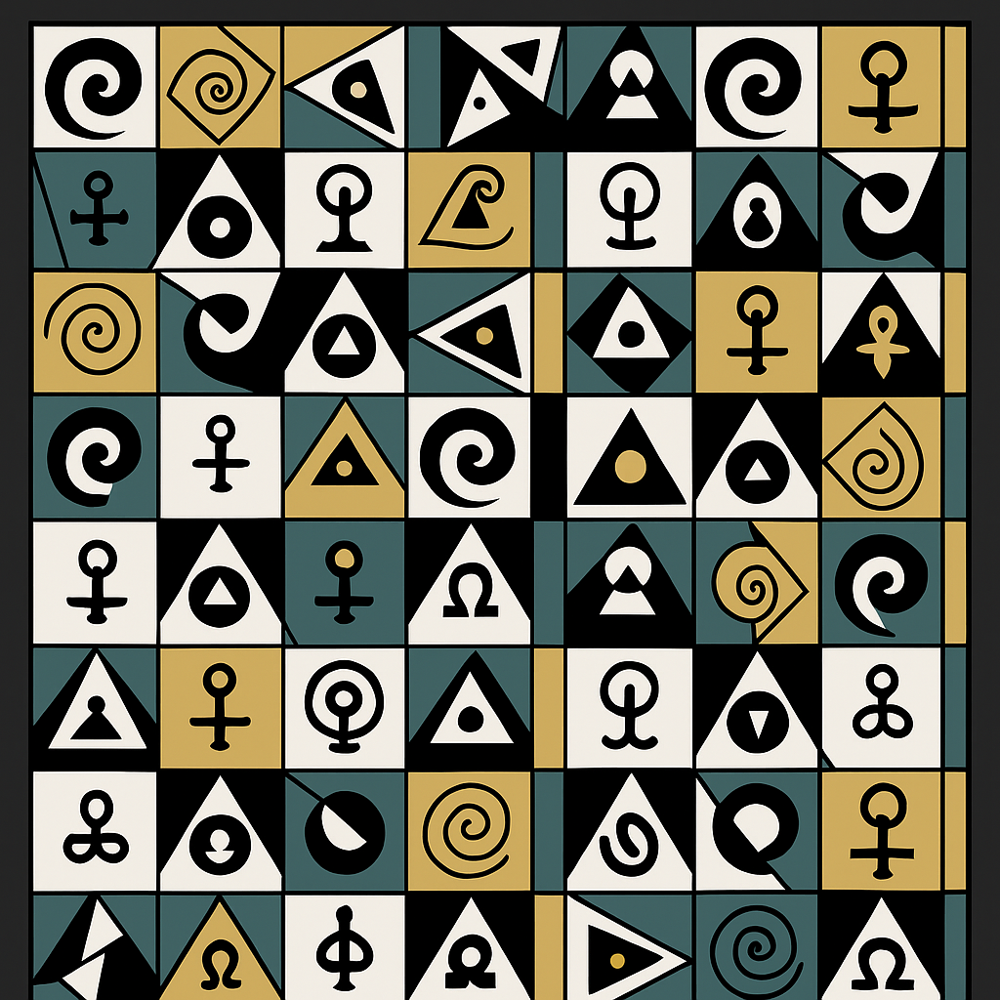

# 🧿 Tessarec Symbolic Tiles – Modular Field Operators

> “Each tile is a harmonic operator — a glyph of frequency.”

This document complements the `README.md` by introducing symbolic–mathematical logic for the construction and interpretation of **Tessarec Tiles** as resonance carriers.

---

## 🔶 Core Operator Definitions

Each tile is defined as a function:

```math
T_{i,j} = \mathcal{T}(p_i, r_j, \theta_{ij}) = f(\phi, \tau, \mu, P_n, \vec{v}_{mod})
```

**Where:**

* `p_i` = Prime generator axis (from System 1)
* `r_j` = Resonant base ($\sqrt{2}, \sqrt{3}, \sqrt{5}$)
* `\theta_{ij}` = Angular modulation (rotation, golden section twist)
* `\phi`, `\tau` = Irrational constants (Golden Ratio, Tau)
* `\mu` = Möbius operator
* `P_n` = Prime at index `n`
* `\vec{v}_{mod}` = Modular vector rotation (base 4, 6, 8)

---

## 🌀 Field Morphology

Tiles arrange into higher morphologies through:

* Golden tilings → $\phi$-based pentagonal modulation
* Symmetric fractures → caused by Möbius transitions
* Resonance braids → twisted paths across tile–grid boundaries
* Boundary leakage → encoding of Gödel incompleteness into tile overlap

---

## 🔗 Cross–System Integration

* Linked to **Prime Grid Visualizations** (System 1)
* Matched with **Resonance Cubes** from System 9
* Operator duality compatible with **Rosetta Glyphs** (System 5)

---

## 📁 Visual Reference

A visual diagram of one sample tile matrix is available in the main folder:


---

These tiles can be read like a **resonance score** — a silent language of geometry, primes, and symbolic transition.
