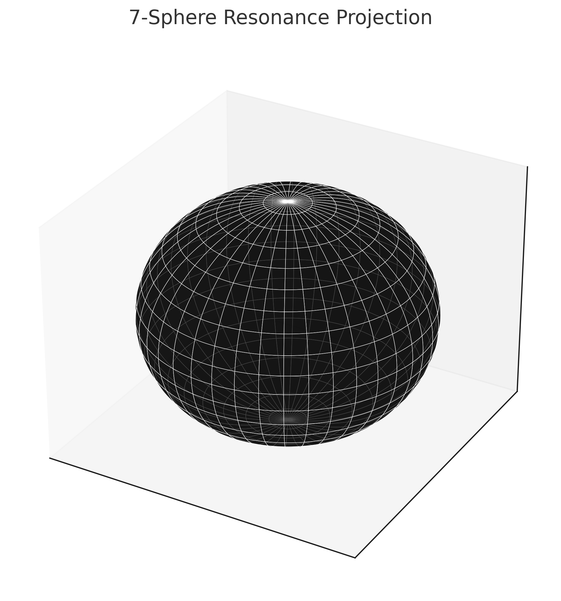
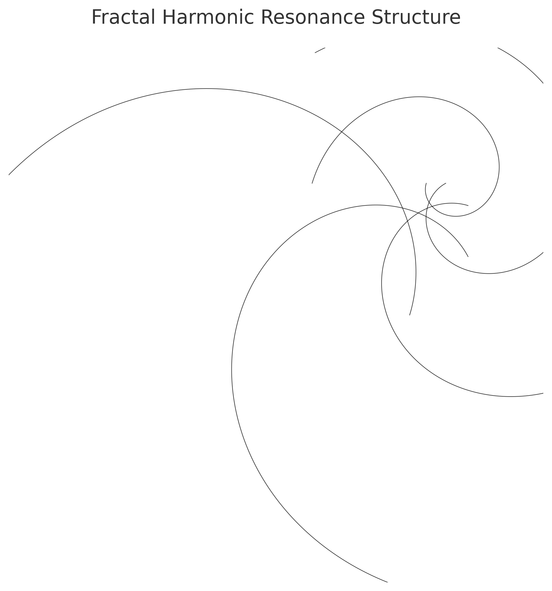

# Visual Gallery — Universal Constants Resonance Theory (UCRT)

Welcome to the **Visual Resonance Gallery** of the **UCRT** module.

This collection of diagrams and graphical models illustrates the harmonic structures, resonance grids, and self-similar patterns foundational to the Universal Constants Resonance Theory.

---

## Visual Collection

### Golden Ratio Resonance Pattern

**Description**:
Fibonacci spirals and logarithmic growth patterns showcasing the fundamental $\varphi$-based resonance fields, illustrating self-similar harmonic structures that pervade natural and cosmic systems.

---

### 7-Sphere Resonance Projection

**Description**:
Visualization of 7D symmetries and octonionic structures. This projection reflects higher-dimensional resonance frameworks relevant in string theory and advanced cosmological models.

---

### Pi and Tau Cycle Animation

**Description**:
Dynamic visualization of full-cycle $2\pi$ rotations and fundamental harmonic oscillations. Highlights the periodic nature of resonance cycles foundational to both quantum mechanics and cosmology.

---

### Root-Based Quasi-Periodic Mesh

**Description**:
Mesh patterns modulated by $\sqrt{2}$, $\sqrt{5}$, and $\sqrt{7}$, capturing incommensurable harmonics. Demonstrates stable quasi-periodic structures emerging from irrational ratios.

---

### Universal Resonance Field Map

**Description**:
Composite resonance map integrating $\varphi$, $\pi$, $\tau$, and root-based modulations. A holistic view of the interconnected harmonic grids structuring the universe.

---

### Fractal Harmonic Resonance Structure

**Description**:
Recursive self-similar harmonic field structures built upon golden spiral principles, showcasing how resonance recurs across scales in fractal geometries.

---

## Notes

* All visuals are located in the `/visuals/` subfolder:

`/SYSTEM 1: 🔷 MATHEMATICA – Primes, Symbolics, Proof Structures/Universal Constants Resonance Theory (UCRT)/visuals/`

* Visuals are continuously updated as the theoretical framework evolves.
* All diagrams are designed to reflect the harmonic foundations of UCRT.

---

$\boxed{\text{More Visuals Coming Soon}}$
