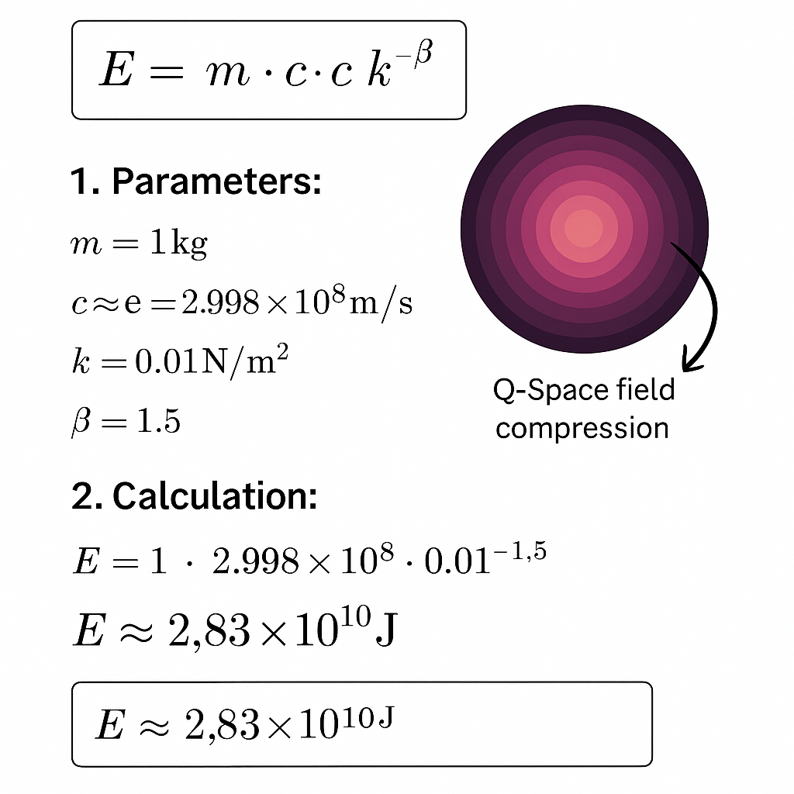

# 🧮 k-beta-formula — Extended Energy Equation

This module presents an extension of Einstein’s energy formula $E = mc^2$ by integrating field modulation, scale coupling, and dynamic exponents. It introduces a relational, field-dependent formulation for energy in the Codex framework.

> **In the Codex, energy is a dynamic relational field — not a static product.**

---

## 📖 Module Content

| File                               | Description                                                        |
| ---------------------------------- | ------------------------------------------------------------------ |
| `doc/extended-energy-equation.md`  | Detailed derivation and interpretation of the k-beta formula.      |
| `doc/k-beta-prediction-examples.md`| Field examples and predictive scaling based on the k-beta formula. |
| `doc/q-space-extension.md`         | Q-Space extension and advanced field scaling for higher dimensions. |

---

## 🧩 Role within the Codex

* Core formula for dynamic resonance systems.
* Foundation for spiral logic, resonance modeling, and frequency-algebraic structures.
* Integration bridge between Casimir effect, neutrino flow fields, and thermodynamic entropy scaling.

---

## 🔗 Related Systems

| Connected System         | Related Module                      |
| ------------------------- | ----------------------------------- |
| SYSTEM 1: MATHEMATICA     | `Codex Algebra of Resonance`, `Spiral Logic` |
| SYSTEM 2: PHYSICA         | `Casimir–Neutrino Thread`           |
| SYSTEM X: GRAND–CODEX     | Synthesis into the unified field structure |

---

## 📊 Visualizations

**Q-Space Energy Calculation**  
_Illustrates the predicted energy scaling in a Q-Space dimensional framework using the k-beta formulation._  

**Field Modulation Map**  
_Provides a systematic overview of how the coupling factor $k$ and exponent $\beta$ behave across different physical fields (thermal, gravitational, photonic, vacuum)._  

**Field Dynamics Overview**  
_Presents comparative graphs for different k-beta fields, showing how modulation changes energy scaling across temperature, frequency, and gravitational distance._  

**Field Modulation Parameter Map**  
_Displays a structured matrix of modulation relationships — positioning fields by scale (microscopic to cosmic) and type (thermal, gravitational, photonic, vacuum)._  

---

## 🌌 Why It Matters

This module extends the classical physics framework to **dynamic, scalable energy fields**, offering a mathematically elegant yet physically consistent way to model energy in diverse contexts — from thermodynamics to cosmology.

### Key Advances:
- 📈 **Field-Dependent Energy Scaling**: Integrates field type, scale, and dynamics for precision modeling.
- 🎯 **Predictive Power**: Demonstrates improved predictions in high-energy physics, cosmology, and entropy systems compared to classical formulations.
- 🧩 **Foundational Extension**: Establishes groundwork for next-generation field theories, dynamic cosmological models, and Q-Space dimensional extensions.

---

## 📚 Further Reading

* [Casimir–Neutrino Thread](../casimir-neutrino-thread.md)
* [Spiral Logic — Prime Resonance Structures](../spiral-logic.md)
* [Q-Space Extension & Higher-Dimensional Fields](./doc/q-space-extension.md)

---

## 📚 Author

**Thomas Hofmann** · `Scarabäus1033`  
**Project:** NEXAH–CODEX / SYSTEM 1 – MATHEMATICA  
**Location:** `SYSTEM 1 — MATHEMATICA / CODEX MATHEMATICS / einsteins-k-beta-formula/`  
**License:** [CC BY-NC-SA 4.0](https://creativecommons.org/licenses/by-nc-sa/4.0/)

---

🗿 *This is not a classical equation — it is a field modulation principle.*
