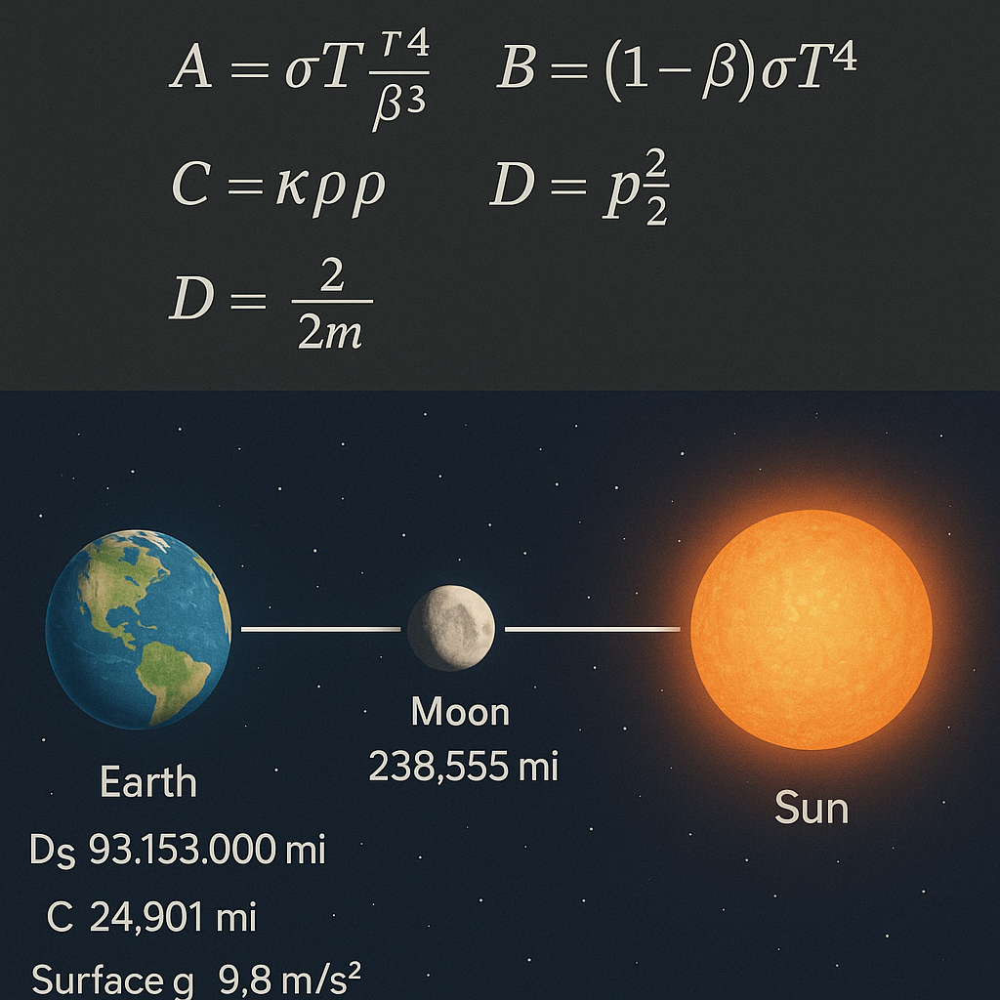

# 🌍 EARTH EQUATION MODULE

  

**Module Type:** Planetary Resonance Field Equation  
**System Integration:** SYSTEM 2 – PHYSICA  
**Core Equation:** \( \mathcal{E}_e = \frac{P \cdot T^3}{t} \)

---

## 🧭 Purpose & Function

This module introduces a symbolic–physical field equation to model **Earth resonance** through pressure, temperature, and time components.

The equation \( \mathcal{E}_e = \frac{P \cdot T^3}{t} \) acts as a **resonance operator** and offers a planetary-scale interpretation of:

- **Field constants** (pressure/temperature/time)
- **Observer triangulation** and **polyhedral overlay geometry**
- **Scalar field shifts & resonance signatures**

It is conceptually aligned with:

- `OBSERVERIUM` (observer triangle fields)
- `CODEx_FIELD_PILLARS` (geometrical anchors)
- `URF`/`LUNAR_FORCE` modules (field coupling)

---

## 🧮 Core Structure

### 🌡️ The Equation

\[ \mathcal{E}_e = \frac{P \cdot T^3}{t} \]

Where:
- \( P \) = pressure field (atmospheric or symbolic reference value)
- \( T \) = temperature axis (can be symbolic, entropic or measured)
- \( t \) = resonant time component (Earth-specific or universal)

This form allows **dimensional compression** of terrestrial data into one resonant energy value, \( \mathcal{E}_e \), usable across symbolic geometries.

---

## 📊 Module Contents

### 📁 [`earth_calculations.md`](./earth_calculations.md)
Detailed numeric derivations of \( P \), \( T \), \( t \) including real-world values, unit balancing, and symbolic inferences.

### 📁 [`earth_equation_visuals.md`](./earth_equation_visuals.md)
Descriptions and explanations for 4 visual overlays:
- Triadic observer field
- Polyhedral Earth map overlay
- Scalar constant lattice
- Harmonic equation geometry

### 🖼️ [`visual_gallery.md`](./visual_gallery.md)
Live-embedded image gallery with all key visuals of this module.

---

## 🔗 Related Modules

- `OBSERVERIUM` → Perception, topology & observer loops
- `LUNAR_FORCE` → Moon-Earth resonance mechanics
- `QUANTUM BREACH` → Pressure dynamics in threshold fields
- `CODEx_FIELD_PILLARS` → Definition of energy-tensors (J°D, G°D)

---

## 🔮 Future Work

- Integrate dynamic temperature datasets (e.g. climate models, magma oscillation)
- Extend observer-triangle model to Moon-Earth-Sun symmetry
- Visualize scalar resonance fields in a 3D rotating Earth polyhedron

---

© Scarabæus1033 · Thomas Hofmann · 2025  
License: CC BY-NC-SA 4.0  
Web: [scarabaeus1033.net](https://www.scarabaeus1033.net)  
GitHub: [github.com/Scarabaeus1033/NEXAH-CODEX](https://github.com/Scarabaeus1033/NEXAH-CODEX)
