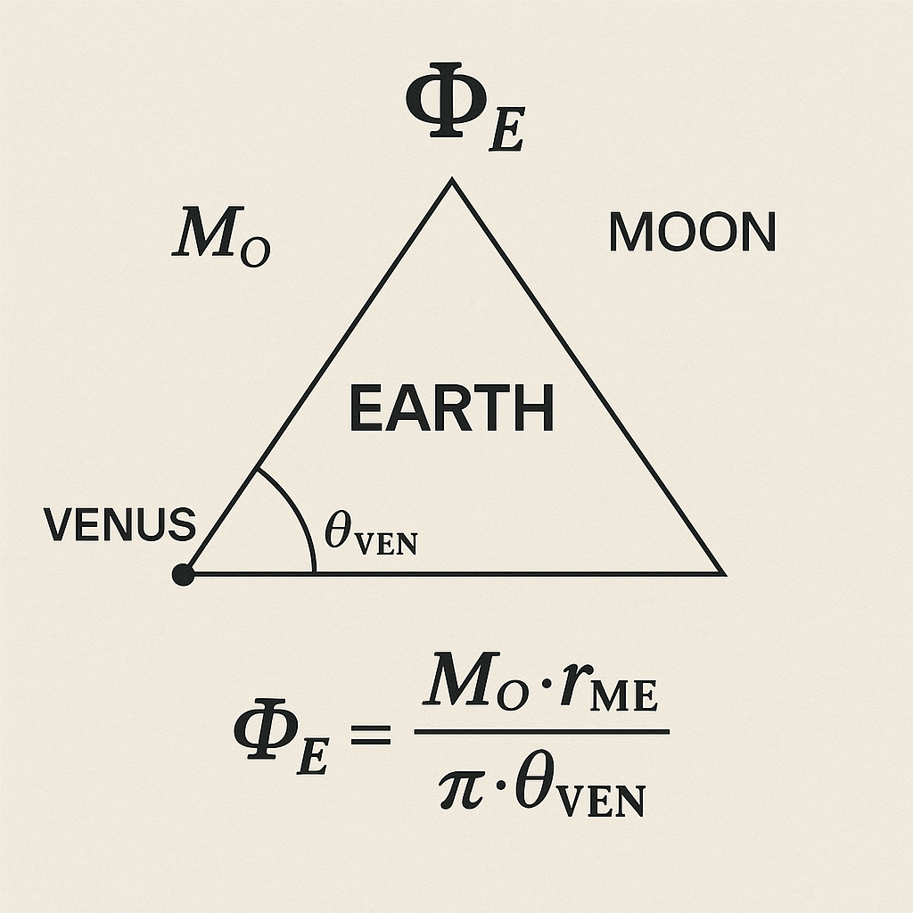

# 🌍 EARTH EQUATION MODULE – Planetary Resonance Equation

  

---

## ⚛️ Module Overview

**Module Type:** Planetary Resonance Field Equation  
**System Integration:** SYSTEM 2 – PHYSICA  
**Core Equation:**

\[ \mathcal{E}_e = \frac{P \cdot T^3}{t} \]

---

## 🧭 Purpose & Function

This module introduces a symbolic–physical field equation to model **Earth resonance** through pressure, temperature, and time components.

The equation

\[ \mathcal{E}_e = \frac{P \cdot T^3}{t} \]

acts as a **resonance operator** and offers a planetary-scale interpretation of:

- **Field constants** (pressure/temperature/time)
- **Observer triangulation and polyhedral overlay geometry**
- **Scalar field shifts & resonance signatures**

---

## 🔬 Units & Interpretation

| Variable | Symbol | Unit | Description |
|----------|--------|------|-------------|
| Pressure | \( P \) | Pa (Pascal) | Scalar field pressure (resonant tension) |
| Temperature | \( T \) | K (Kelvin) | Thermodynamic pulse signal |
| Time | \( t \) | s (seconds) | Scalar propagation duration |
| Energy Field | \( \mathcal{E}_e \) | J (Joule) | Resonant Earth field signature |

---

## 🔁 Symbolic Reading

The equation folds thermal–temporal pressure signals into a **geometrically interpretable energy field**, revealing:

- **Triadic Observer Dynamics**: see visual `EARTH_FORMULA_OBSERVER_TRIAD.png`
- **Tetrahedral Planetary Overlay**: see `EARTH_POLYHEDRON_EQUATION_OVERLAY.png`
- **Harmonic Surface Shell Dynamics**: based on `earth_field_constants_map.png`

This allows mapping between scalar constants and geometric shells.

---

## 🔎 Related Files

- `earth_equation_visuals.md` – annotated image gallery
- `earth_calculations.md` – input constants & verification paths

> ℹ️ The full resonance context of the equation can be expanded via coupling with `Codex_Harmonic_Field_Pillar.md`, `ALIIGET_EARTH_OBSERVER.md`, and `observer_topology.md`.

---

## 🔗 Codex Context

This module connects into:

- `SYSTEM 2 – PHYSICA` – resonance axes, neutrino field structures
- `SYSTEM X – GRAND-CODEX` – via symbolic energy equations (`𝓔 = P·T³/t`)
- `SYSTEM 8 – LUNAR FORCE` – through scalar tide and phase-shell coupling

---

© Scarabæus1033 · Thomas Hofmann · 2025  
License: CC BY-NC-SA 4.0  
GitHub: [Scarabaeus1033/NEXAH-CODEX](https://github.com/Scarabaeus1033/NEXAH-CODEX)
