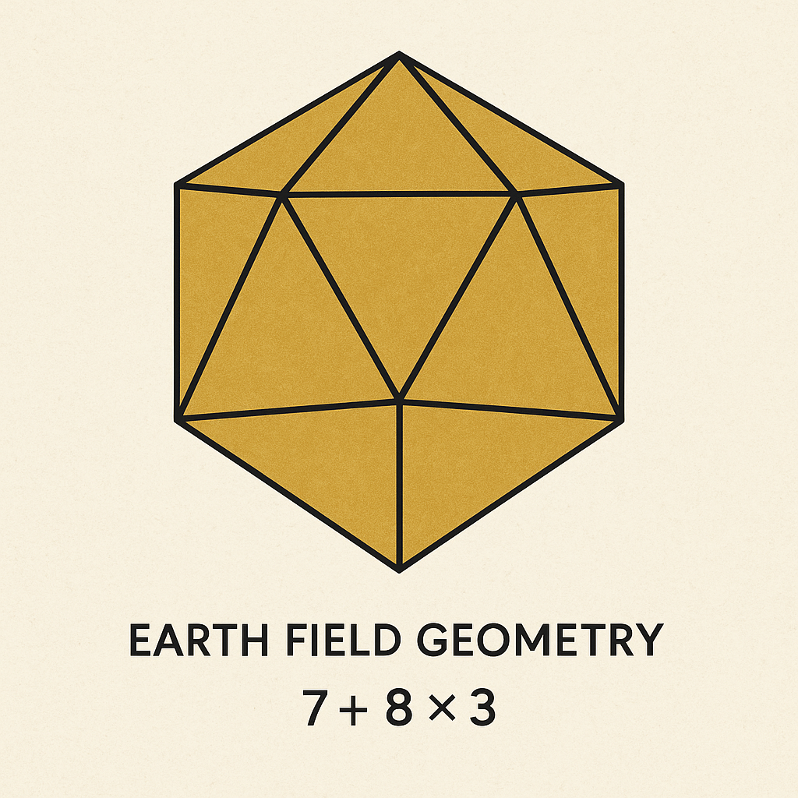
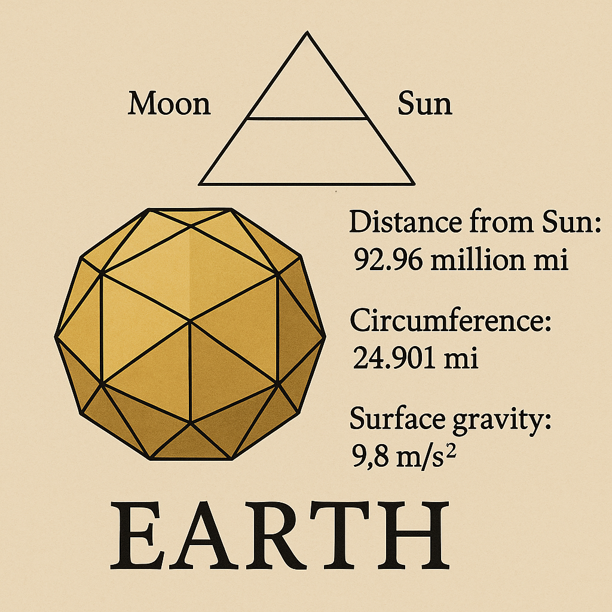

# 🖼️ Visual Gallery · EARTH\_EQUATION\_MODULE

> **Visual Overview**: These four images form the visual–symbolic backbone of the `EARTH_EQUATION_MODULE`. They synthesize geometry, observer logic, Earth constants, and resonance shells into one integrated codex field.

---

## 1. EARTH\_FORMULA\_OBSERVER\_TRIAD.png

**Meaning**: Triadic overlay of Earth-centric constants and observer positions. Shows symbolic relation of Planck time, Earth's rotation, and geometric pulse.

* Central axis: `c = R / t`
* Observer symmetry anchored in Möbius arc
* Scalar–geometric resonance interpreted via T↔t↔τ

---

## 2. EARTH\_POLYHEDRON\_EQUATION\_OVERLAY.png

**Meaning**: Polyhedral resonator grid overlaid on Earth constants and Codex Field Equation.

* Constants used: `𝓔 = P · T³ / t`, `R = P · T²`, `ALG°`
* Polyhedron shows transition geometry and energy domain segmentation
* Tetrahedral encoding at the vertex layers

---

## 3. earth\_field\_constants\_map.png

**Meaning**: Map of relevant scalar constants (𝓔, c, P, T, t) used in the Earth Equation Framework.

* Symbolic–physical overlay: Planck time, radius, rotation
* Defines threshold region between static + dynamic Earth values
* Central role of ALG° operator in sinusoidal transformation

---

## 4. earth\_equation\_geometry\_overlay.png

**Meaning**: Educational geometry overlay showing flow of resonance from Earth center to symbolic observer shell.

* Observer triad connected via spiral-form expansion fields
* Pulse equation as energy shell trigger: `P = R / T`
* Hexagonal & Möbius feedback paths indicated in arc placement

---

© Scarabæus1033 · Thomas Hofmann · 2025
All images licensed under CC BY-NC-SA 4.0
