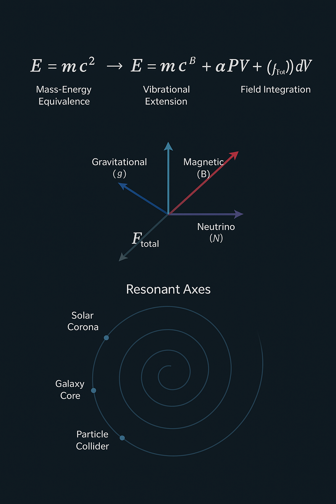

# 🌀 GRAND-CODEX – Central Synthesis Layer

**The Einstein–Neutrino–Vortex Model**
**A Module of the NEXAH-CODEX System**
**Author:** Thomas Hofmann · Scarabäus1033 · Rödelheim
**Web:** [www.scarabaeus1033.net](http://www.scarabaeus1033.net)
**License:** CC BY-NC-SA 4.0

---

## 🌐 Overview

The **GRAND-CODEX** is the central synthesis module of the NEXAH-CODEX. It integrates symbolic, scientific, quantum-physical, and cosmological field logics into one resonant architecture.

This submodule presents the **Einstein–Neutrino–Vortex** extension — a field-resonant generalization of classical energy equations, embedding pressure, volume, and neutrino topology into a Möbius-aligned structure.

> This model bridges scalar energy logic with vortex-layered field topologies and symbolic force curvature.

---

## 🔭 Extended Energy Model

### 📌 Formula Structure

```math
E_{total} = m·c·k^β + α·P·V + \int (q(E + v × B) + m·G + R(f, φ)·N)·N \, dV
```

| Term          | Meaning                                         |
| ------------- | ----------------------------------------------- |
| `m·c·k^β`     | resonance-scaled base energy                    |
| `α·P·V`       | pressure-volume coupling (macrofield / thermal) |
| `R(f, φ)·N`   | frequency-phase modulated neutrino density      |
| `∫(...)·N dV` | integrated field modulation in space            |

---

### 🧲 Total Force Expression

```math
F_{total} = q(E + v × B) + m·G + R(f, φ)·N
```

A combined force formula unifying:

* **Electromagnetism** (E, B)
* **Gravity** (G)
* **Neutrino Topology** (R(f, φ)·N)

---

## 📐 Derivation Highlights

1. **Classical foundation:**

```math
E = m·c²
```

2. **Resonant scaling:**

```math
E' = m·c·k^β
```

3. **Thermodynamic coupling:**

```math
E_{thermal} = E' + α·P·V
```

4. **Neutrino resonance:**

```math
F_{total} = q(E + v × B) + m·G + R(f, φ)·N
```

5. **Full energy-field topology:**

```math
E_{total} = m·c·k^β + α·P·V + ∫(F_{total} · N) dV
```

---

## 🎨 Einstein–Neutrino–Vortex Synthesis Visual



**Visual Layers:**

* Top: Equation transformation (`E = mc²` → full resonance field)
* Mid: Force vector components (`G`, `EM`, `Neutrino`)
* Bottom: Spiral map of cosmic resonance zones (e.g. LHC, Solar, Galactic)

> A Möbius-symmetric resonance spiral linking mass, pressure, magnetism, and neutrinos.

---

## 📎 System Integration

* **Connects to:** `GRAND-CODEX`, `CAVITYROOT`, `Casimir–Neutrino`, `k-beta`
* **Symbolic Layer:** Möbius–Tesla–Spiral curvature fields
* **Experimental Basis:** Potential integration with `ALG°`, scalar–neutrino kit

---

## 👤 Author

**Project:** [Scarabäus1033 · NEXAH-CODEX](https://github.com/Scarabaeus1033/NEXAH-CODEX)
**Author:** Thomas Hofmann
**Module:** Einstein–Neutrino–Vortex
**System:** Möbius · Neutrino · Grand Field Topologies

---

## ⚖️ License

**Creative Commons Attribution–NonCommercial 4.0 International (CC BY-NC 4.0)**
[creativecommons.org/licenses/by-nc/4.0](https://creativecommons.org/licenses/by-nc/4.0)

> You may use, remix, and share – as long as you attribute and don’t commercialize.
