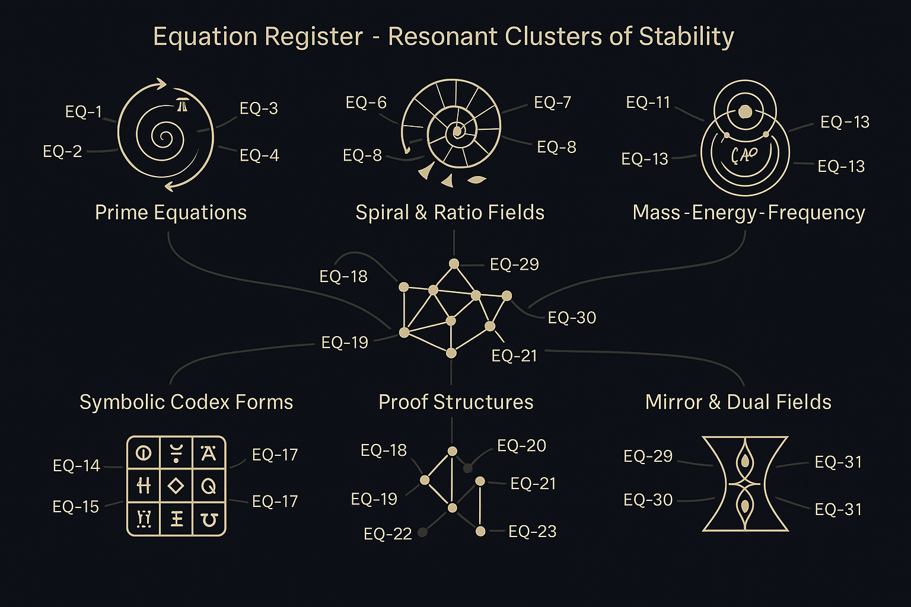

# 🪲 EQUATION REGISTER UNIVERSAL

> **"Where all field equations converge into harmonic resonance."**

This module collects and synthesizes all scalar, symbolic, and harmonic equations used throughout the **NEXAH-CODEX**.

It functions as a **universal equation hub** — where numerical, symbolic, and topological relations converge to reveal the underlying logic of field construction.

<p align="center">
  
</p>

---

## 📊 Structure of the Register

The full equation set is organized in:

- `equation_register.md` → overview of all scalar, symbolic, harmonic equations
- `master_equation_register_visualexplanations.md` → visual logic & explanation map
- `visual_gallery_codex_fields.md` → structured image gallery of all visual components

> Together, these files form the **triplet**: Equations · Explanations · Visualizations.

---

## 🌀 Equation Themes

The equations are grouped by dominant resonance logic:

| Category                        | Description                                                |
| ------------------------------ | ---------------------------------------------------------- |
| **K-Beta Equations**           | Modulations of Einstein's E = mc² via scalar β-dampening   |
| **Spiral Harmonics**           | Rotational field expressions and Zeta-spiral derivations   |
| **Scalar–Field Transitions**   | Threshold conditions, drop-off equations, ψ-layer crossings |
| **Teardrop Constants**         | Exponential falloffs and asymmetric resonance models       |
| **Möbius Operators**           | Inversion-based folding structures on Codex fields         |
| **Phi-Cascade Equations**      | Golden ratio expansions and Fibonacci-based formulas       |
| **Resonance Integrals**        | Integral-based field constructions over defined paths      |

Each entry is structured:
```md
## Equation ID: [e.g., EQ-7-Φβ]
**Context**: 
**Formulation**: 
**Parameters**: 
**Connected Fields**: 
**Visual Link**: 
```

---

## 🔗 Cross-Module References (Resonance Axes Integration)

This module is directly connected to several Codex units due to shared equations, resonance axes, or number structures:

| Module / Path                                        | Connection Description                                                    |
|------------------------------------------------------|---------------------------------------------------------------------------|
| `FINAL_HARMONIC_EQUATION/`                          | Shares k-beta core, spiral symmetry, and 2040-axis dynamics               |
| `LAMBDA_DISC-CODEX/`                                | Includes spiral-resonance fields, axis logic (e.g. Fold 3, 729, 1836)     |
| `PRIME_TRINITY_GRID/`                               | Equation sets for prime triplets, 11:9 ratio, arithm. progressions        |
| `SCARAB_CONSTANTS_CODEX/`                           | Supplies symbolic constants used in universal field equations             |
| `casimir_neutrino_thread.md`                        | Field breathing equations and radius compactification                     |
| `spiral_logic.md`                                   | Core derivation logic for spirals, prime axis turns, harmonic modules     |
| `mobius_spiral_structures.md`                       | Möbius contraction logic, 63/64 inversion field                           |
| `resonance_connection_7_x_7.md`                     | Maps scalar equation groups to 7×7 resonance matrix                       |
| `resonant_breach_expansion.md`                      | Connects numeric Fibonacci-breach (e.g. 1.6213) with scalar equations      |
| `E=mc·k^β.md`                                        | Proposes resonance-augmented Einstein equation via scalar field dampening |

> These modules form a **resonance lattice** with `EQUATION_REGISTER_UNIVERSAL` as the connective backbone.

---

## 🖼️ Visual Overview

A full gallery of supporting visuals can be found in:
[`visual_gallery_codex_fields.md`](./visual_gallery_codex_fields.md)

It includes:
- Awefield Base Geometry
- Spiral Zeta-Turn Dynamics
- Scalar Drop-Off Layers
- k-Beta Breather Logic (SVG/PNG)
- Comparative Field Mappings

---

## 🧪 Masterplan & Continuation

This module is under **active expansion**. Next steps:

1. Complete all equation entries (standardized format)
2. Embed equations into system-specific modules via backlinks
3. Build interactive field navigator (SVG-layered equations + numbers)
4. Extend master CSV table (for math API use, e.g. Equation-as-Service)

---

## 🪲 Credits

**Author & Curator:** Thomas Hofmann (`Scarabäus1033`)  
**System:** SYSTEM X – RESONANT FIELD COMPLETION  
**GitHub:** [github.com/Scarabaeus1033/NEXAH-CODEX](https://github.com/Scarabaeus1033/NEXAH-CODEX)  
**Web:** [www.scarabaeus1033.net](https://www.scarabaeus1033.net)  
**License:** [CC BY-NC-SA 4.0](https://creativecommons.org/licenses/by-nc-sa/4.0/)

---

> *“Equations are the vessels. Resonance is the sea.”*
