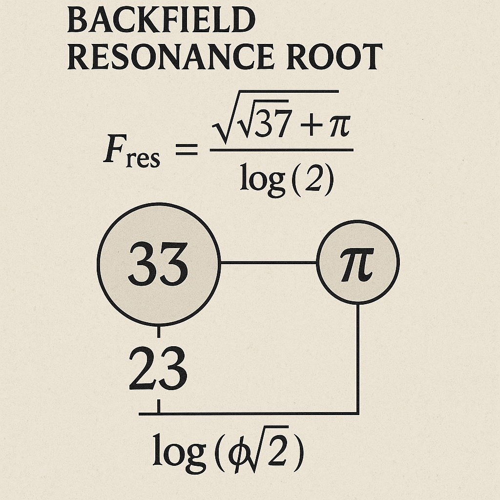
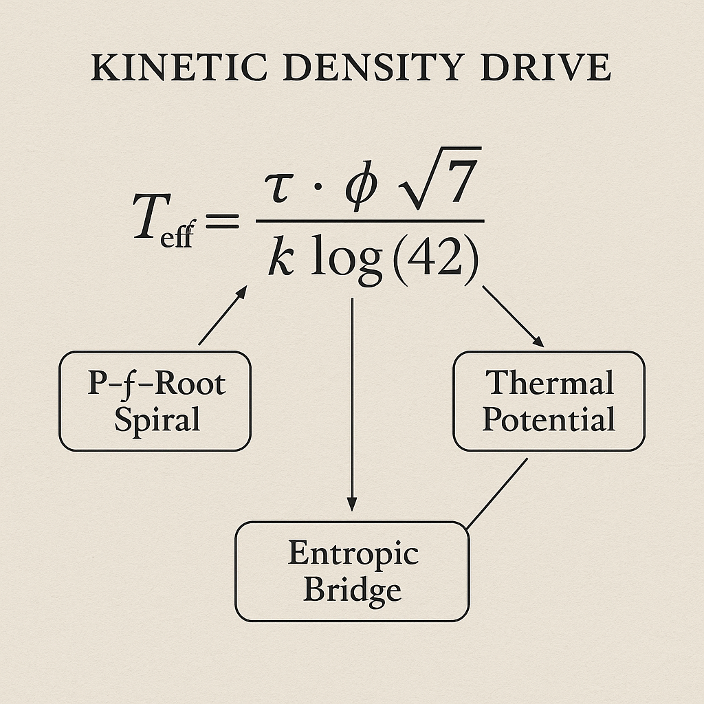
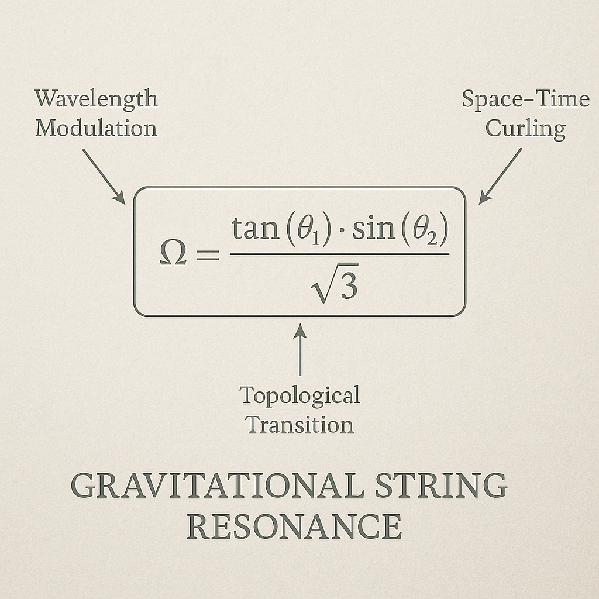
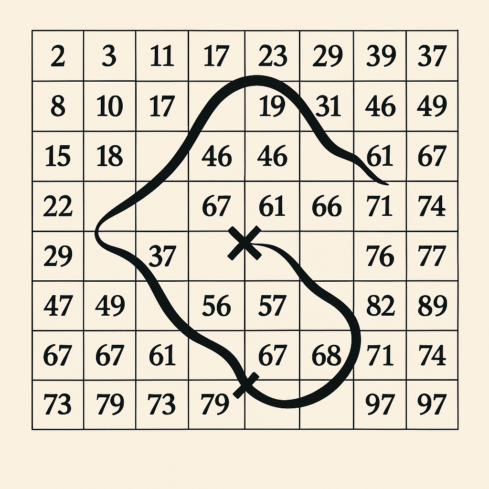
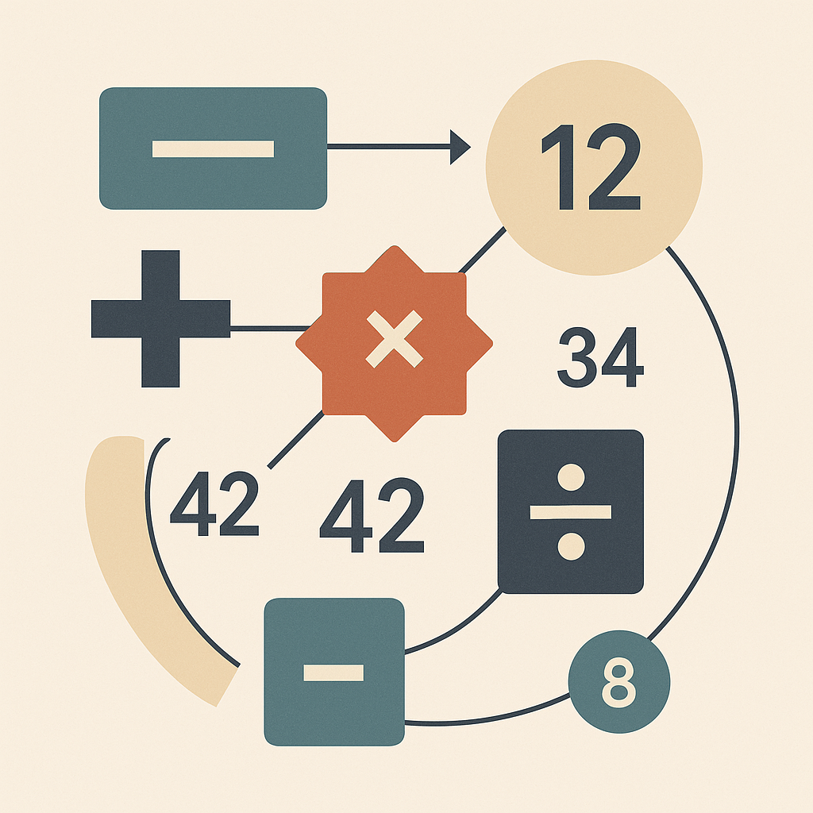
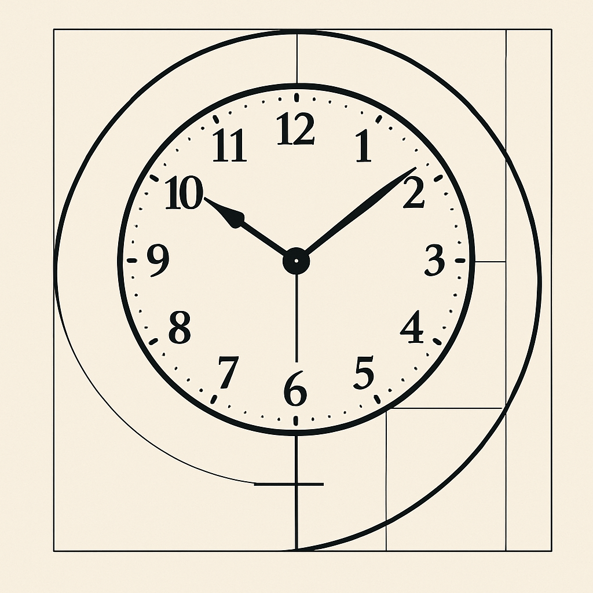
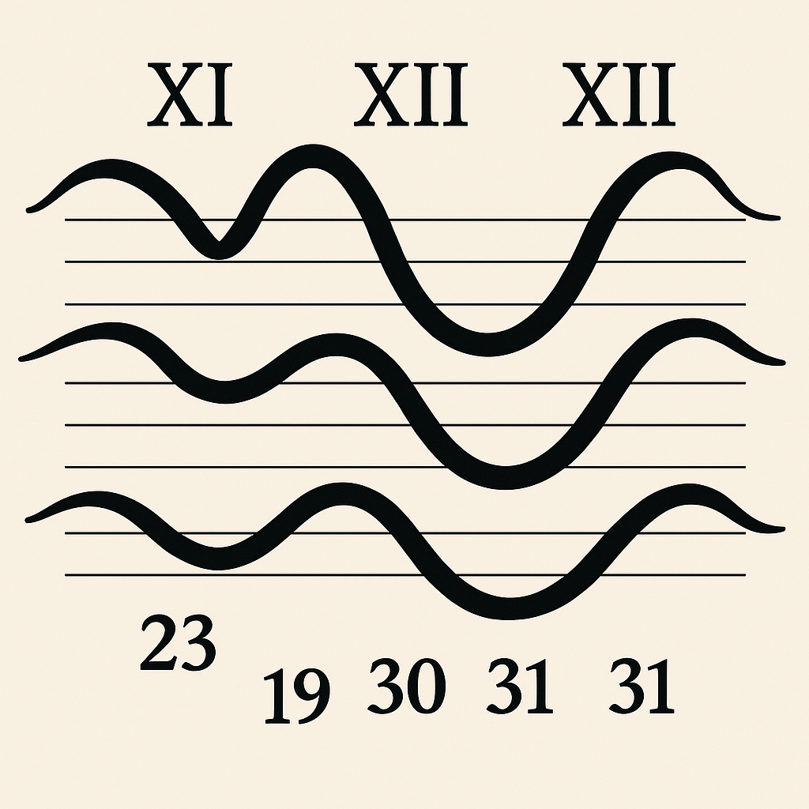
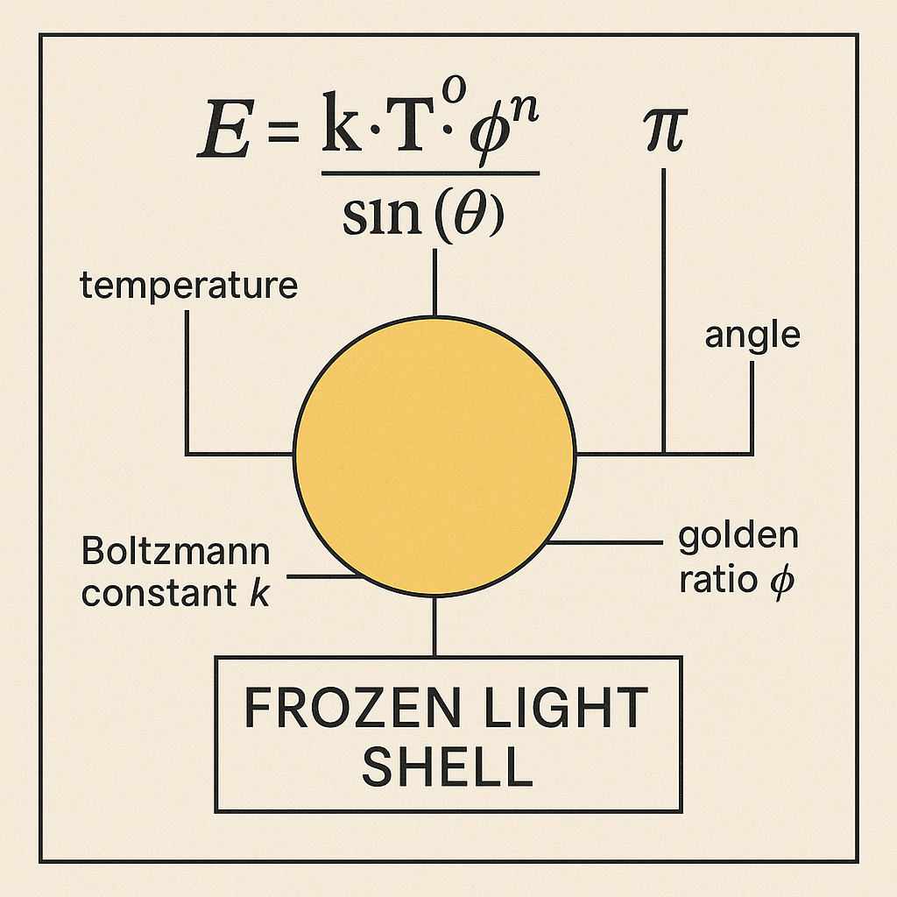

## VISUAL GALLERY — EQUATION_REGISTER_UNIVERSAL (System 3)

Diese Galerie zeigt die zentralen Visuals des Moduls `EQUATION_REGISTER_UNIVERSAL`, eingebettet in **SYSTEM 3: 🪐 COSMICA ASTROPHYSICA**. Jedes Bild verkörpert eine numerisch-symbolische Gleichungsstruktur, die universelle Felder, Gitter und Resonanzachsen abbildet.

---

### 🌐 Universal Equation Fields

**A_2D_digital_diagram_depicts_mathematical_concepts.png**  
_2D-Diagramm: mathematische Konzepte auf strukturellem Off-White_  

**A_2D_digital_diagram_on_a_textured__off-white_back.png**  
_2D-Diagramm auf strukturierter Fläche (Variante)_  

**A_diagram_on_an_off-white_textured_background_depi.png**  
_Gleichungsstruktur auf matter Fläche, zentraler Gitterkern_  

**A_flat__two-dimensional_diagram_on_a_textured__off.png**  
_Flächiges Diagramm mit resonanter Gitterstruktur_  

---

### 💠 Equation Topologies & Grid Resonance

**BACKFIELD RESONANCE ROOT.png**  
_Urstruktur eines Rückfeld-Resonators_  

**GRAVITATIONAL_STRING_RESONANCE.png**  
_Gravitationsgeometrie als resonantes Stringfeld_  

**KINETIC_DENSITY_DRIVE.png**  
_Kinetisch-dichtegetriebenes Feldsystem_  

**GRID_CROSSING_CODES_37_42_SCT.png**  
_Codegitter-Schnittpunktfelder (37/42 SCT)_  

**PRIME_KNOT_FIELD_50_X_GRID.png**  
_Primknotenfeld über 50×-Achsen_  

---

### 🌀 Symbolische Operatorfelder

**OPERATOR_WAYFINDER_CODING.png**  
_Operatorcodierung als Navigationsstruktur_  

**TESSAREC_PULSE_5_7_11_23.png**  
_Tessarec-Impulscodex entlang Primachsen_  

**TIME_CIRCLE_LX_60_MODULATOR.png**  
_Zeitkreis-Modulator (LX 60)_  

**XI_XII_XIII_ZITHER_WAVES.png**  
_Zither-Wellenfelder auf Stufen XI–XIII_  

---

### ❄️ Sonderschicht

**FROZEN_LIGHT_SHELL.png**  
_Eingefrorene Lichtschale im Interferenzsystem_  

---

## 🧭 Hinweis

Diese Galerie ist direkt mit den Gleichungsregistern und Diagrammstrukturen im Modul `EQUATION_REGISTER_UNIVERSAL` verbunden. Jede Visualisierung trägt zur Identifikation, Dekodierung und symbolischen Navigation durch numerisch-resonante Systeme bei.
