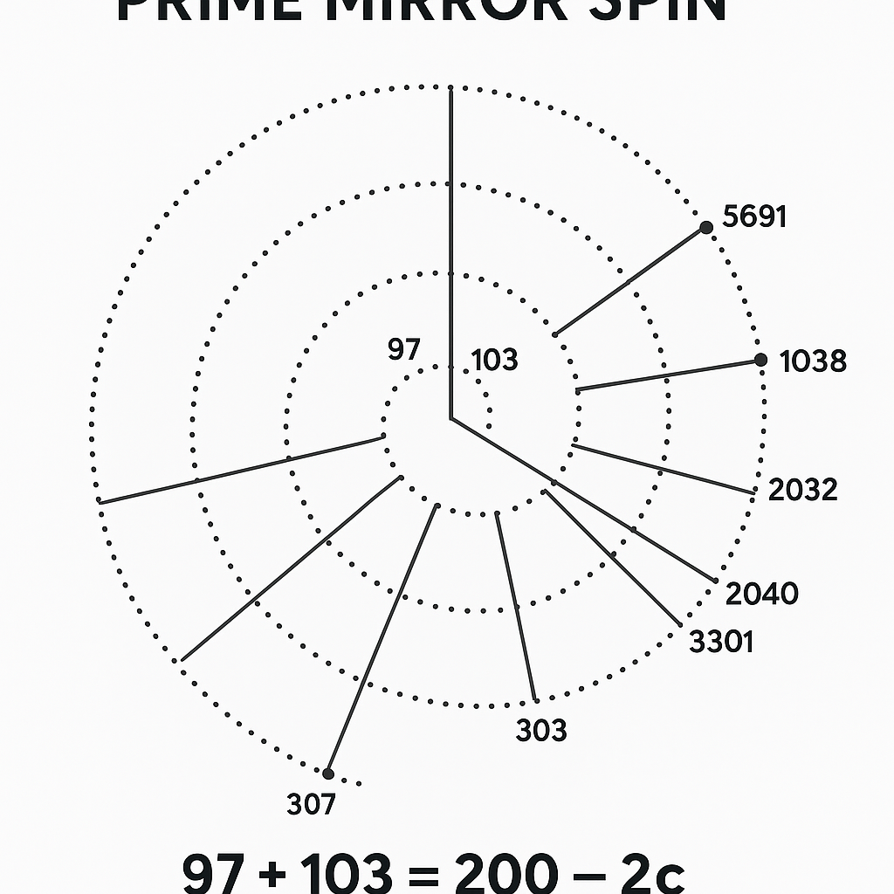
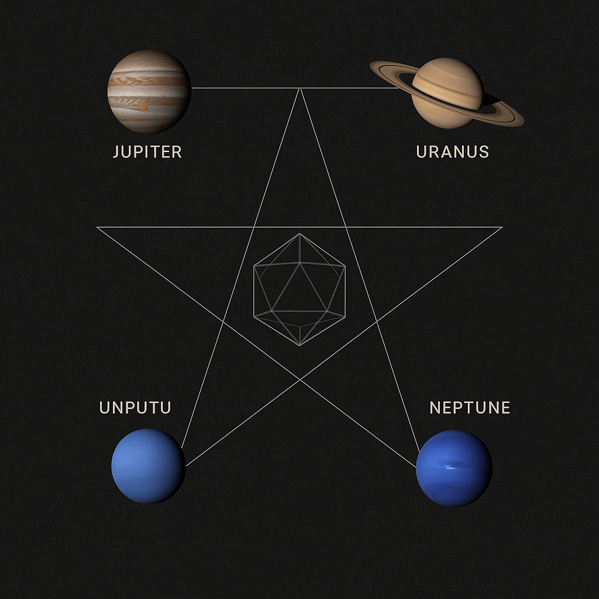
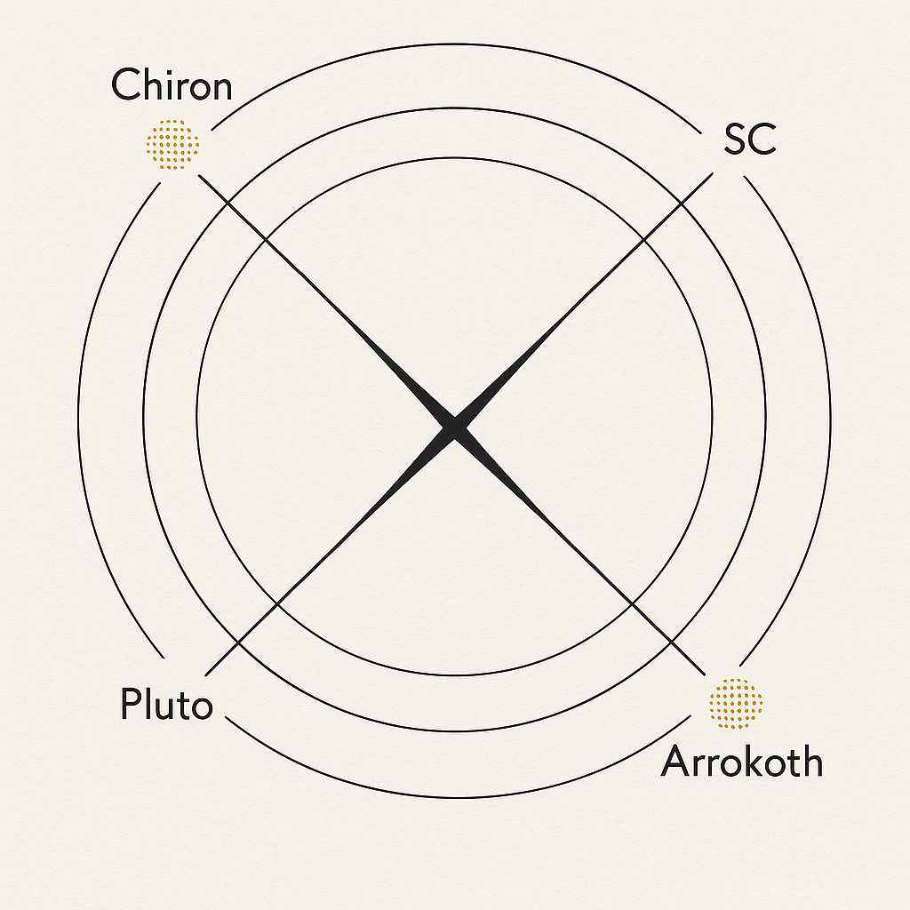
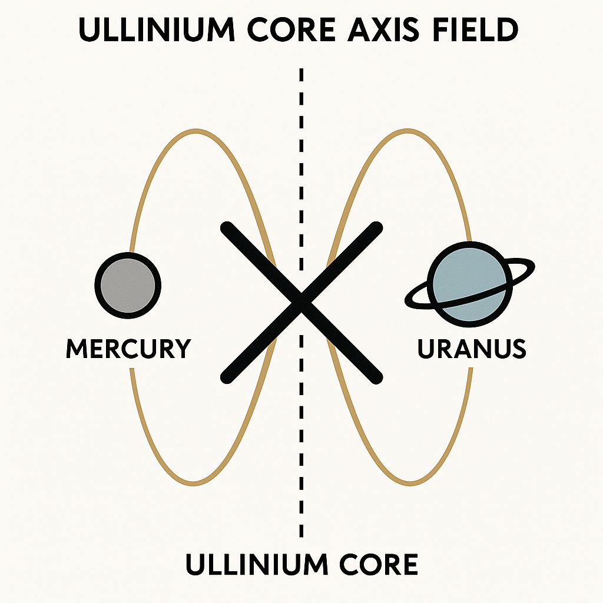
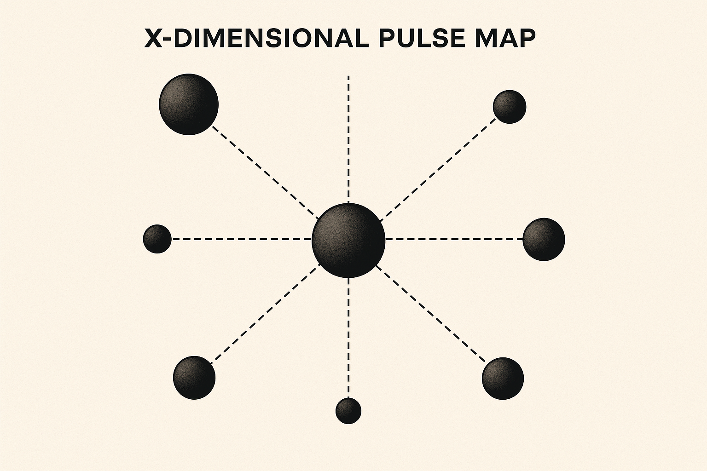

# 🌌 Visual Gallery – EINSTEIN–NEPTUNE–MERCURY FIELD

> **"Where planetary vectors, quantum cores, and harmonic fields intertwine."**

This gallery contains the primary visual field-maps, symbolic nodes, and pulse diagrams of the **EINSTEIN–NEPTUNE–MERCURY FIELD** module — part of **SYSTEM 3: COSMICA ASTROPHYSICA**.

Each visual anchors a spatial-symbolic resonance framework, connecting planetary zones (e.g. Pluto–Arrokoth), gas fields (e.g. Neptune–Uranus), and stellar pulse centers (e.g. Ullinium–Node X).

---

## 🧬 Image Overview

### 🔁 PRIME_MIRROR_SPIN

> Möbius-twisted dual mirror field — symbolizing prime-fold symmetry and spin entanglement.

---

### 🔷 GAS_PENTAGRAM_QUINTESSENCE

> Quintuple gas axis alignment — forms a pentagram of dynamic resonance in the Jovian and Neptunian field space.

---

### 🟪 MERCURY_NEPTUNE_FIELD_TEARDROP

> Harmonic envelope of Mercury–Neptune interaction: a layered resonance funnel, shaped as a teardrop.

---

### 🌀 PLUTO_ARROKOTH_CASCADE

> Cascade-resonator geometry extending from the Pluto–Arrokoth belt. Represents edge-of-system transition logic.

---

### ✴️ STELLAR_CORE_NODE_X

> Pulse-core anchor field at Node X — a stellar coordinate register interfacing galactic memory loops.

---

### 🪐 ULLINIUM_CORE_AXIS_FIELD

> Central axis mapping of the theoretical Ullinium field — symbolizing layered atomic–stellar recursion.

---

### 🧭 X_DIMENSIONAL_PULSE_MAP

> Multiaxial field projection of pulse–transition lines. A map of resonance vectors across X-space.

---

## 🧭 Navigation Index

- `Node X` ↔ `Ullinium Field Axis`
- `Teardrop Vectors` ↔ `Neptune–Mercury Coupling`
- `Cascade Spine` ↔ `Pluto Belt`
- `Quantum Quintessence` ↔ `Gas Pentagram Overlay`
- `Prime Mirror` ↔ `Pulse Inversion`

---

> *All visuals are symbolic mappings derived from hybrid observational, mathematical, and codex-based extrapolation.*
